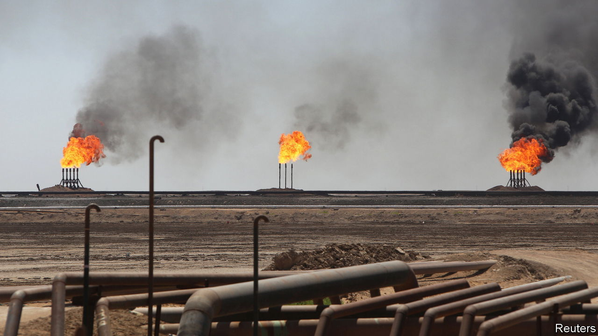
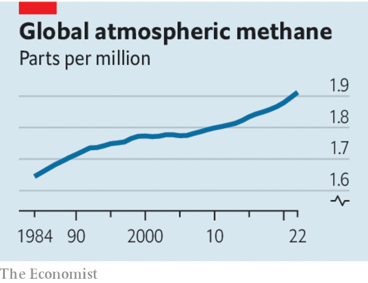

###### A planet-cooking gas

# What the world must do to tame methane 

##### The world needs a deal during COP28 to limit a nasty source of emissions 

 

> Nov 30th 2023 

Methane is a potent greenhouse gas. Over 20 years it has over 80 times the planet-cooking power of carbon dioxide, and is the culprit behind nearly 45% of warming today. Because methane is the main component of natural gas, a big chunk of man-made emissions comes from the energy industry. Yet because it is short-lived, curbing methane offers the world its best possible chance for quick progress against climate change. 

 


As cop28, the un’s climate summit, gets under way in Dubai, it is greatly encouraging, therefore, that the chances of such a deal on methane are good. Negotiators must leap at a rare opportunity to strike one. 

The reason a deal looks possible is that the politics are auspicious in all the biggest markets. China has recently announced that it will start including methane in its national climate plans, a reversal of its previous stance. America will soon finalise regulations to reduce methane emissions from its huge oil and gas sector, including measures that cover leaky pipelines and storage. And the European Union has also agreed on tough methane standards, covering both domestic sources and imported fossil fuels. 

Innovations are helping, too. A range of  for monitoring methane will help spot large sources of emissions from the energy industry. Because oil and gas firms can often sell methane (rather than wastefully flaring or venting it), many investments to avoid emissions will pay for themselves. Most firms do not invest because of the hassle, higher returns on other projects, or wells’ distance from consumers. Whatever the reason, they suffer no penalty for adding needlessly to global warming.

If a global methane deal is to be more than greenwashing, therefore, it will need rigour. Methane-control seemed to take off at the UN climate summit in Glasgow two years ago, when negotiators noisily trumpeted a pledge to slash emissions by 30% by 2030. Yet the deal was voluntary, and had no enforcement mechanisms; emissions have since risen. An agreement this time round must link promises to signatories’ national climate plans and, crucially, to domestic enforcement mechanisms.

An agreement should also be ambitious and verifiable. A good target is methane-emission intensity of below 0.2% of total marketed gas by 2030, a threshold that the world’s best oil majors now manage to meet. Because methane measurement involves a hotch-potch of inconsistent methodologies, negotiators must agree on how to standardise those measurements. They must also accept mandatory third-party verification, which some state-linked firms have until now rejected. 

That points to the most important test. Any deal must include national oil companies, which account for most of the industry’s emissions. Many greens complained about the United Arab Emirates (UAE), one of the world’s biggest petrostates, being given the responsibility for hosting the world’s annual climate summit. Now is the UAE’s chance to humble its critics by bringing a hitherto recalcitrant oil industry to the negotiating table. An even better outcome would be for the UAE to secure opec’s participation in enforcing a methane agreement. 

A deal that meets these tests will not solve the methane problem altogether. Other anthropogenic sources, such as belching cows and rice paddies, will eventually need to be tackled, too. And recent studies suggest that global warming may be accelerating the rate at which tropical wetlands emit methane—a potentially huge problem. But an agreement that starts to curb this pernicious greenhouse gas is within reach. It could turn out to be even more important than COP28 delegates realise. ■


