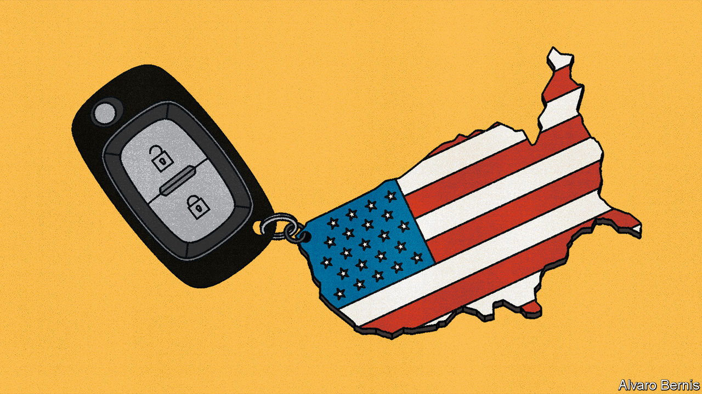

###### On cars in America, Spain, Indian whisky, “King Lear”, Belgium, dinner etiquette

# Letters to the editor 

##### A selection of correspondence 

 

> Nov 30th 2023 


Here in my car

You praised some benefits of America’s addiction to cars (, November 11th). Cars and the extensive road network in America have always been about culture as well as mobility. Principles such as freedom, independence and autonomy are reflected in the scale, character and abundance of the infrastructure. Unlike much of Europe, where small cars were designed to accommodate intimate existing streets, America paved its roads and later built its communities around cars. Americans drive larger vehicles than the rest of the world, in part because wide American roads allow for such largesse. With their disjointed urban design, American suburbs can be characterised as a space without place. Roads and the associated infrastructure, such as large shopping malls, calcify a car lifestyle.

The self-driving revolution will have an impact on this culture, especially in the North American suburb. Make the car do the driving and the expanded cabin space has significant implications for the behaviour of drivers, who will be free to work, play and perhaps enjoy a drive-through meal with a knife and fork in their cars. In an autonomous-burb, cars will function more like small buildings on the move. 

This will have profound implications on the suburban cultural landscape that should be considered alongside the development of self-driving technology itself. As the song goes, the only way to live is in cars, but now innovation will change how we do so. 

Alex Yuen

Lecturer in urban design

Harvard University Graduate School of Design


During his four-plus decades in power, Robert Moses, New York’s controversial master builder, constructed a vast array of public works and became, in the words of Robert Caro, “perhaps the single most influential seminal thinker” in 20th-century urban planning. Urban planners from across the country frequently sought his consultation, and his vision of a city that was traversable by cars, criss-crossed by roads and highways and parkways ultimately influenced the designs of countless others.

AUBREY PERONA


I was surprised that your article disregarded the basic externalities of cars. The lower housing costs of the suburbs are achieved at great personal cost, both in terms of the dollars that go towards owning and operating a car and because of the cost of time. You neglected the burden that America’s car addiction places on individuals, particularly those on low incomes. On average, car expenses stack up to $1,000 a month. That is a huge cost for most families’ budgets. The farther out you live the more likely you are to own more than one car. Our car-driving landscape often makes that cost unavoidable (going to a supermarket for example). 

Then there are the environmental costs, in terms of air and water pollution, that our car dependence creates. As the impact of urban heat islands increases because of climate change, we are once again seeing the costs forced on families, who now pay for more air conditioning, updates to their homes and medical costs associated with increased temperatures. 

There is a better way. Our communities should be constructed for people instead of cars. Giving people choices about how to get around is the foundation of communities that are safe, healthy and economically secure. 

Earl Blumenauer

Representative for Oregon’s 3rd congressional district

 

Many cities with a car-friendly suburban footprint like Los Angeles have effectively run out of space for single unit housing. This deficit in supply caused prices to rise to the point that people can no longer afford to live there. Moreover, our roads may be 27% faster than our foreign counterparts, but our cities are 72% larger. This road infrastructure also comes at a direct expense to every other form of transportation. Rail, bus, biking and walking all require a certain degree of density that is incompatible with suburbia. And while the average American household may have two cars, what does that mean for those who can’t afford the car payment, taxes, gas, and insurance that comes with owning a car? 

The costs of our car culture come in the form of more expensive housing, less vibrant public spaces, dispersed public resources, and a more polluted environment. Weaning this addiction would alleviate many of these ailments.

WYN DOBBS

Resident physician

Johns Hopkins Hospital


 


The return of Pedro Sánchez

You underestimate the extent to which the deals that Pedro Sánchez has struck with other parties to return as prime minister of Spain threaten the rule of law (“”, November 18th). A parliamentary commission will not only investigate the supposedly politically motivated criminal prosecutions against separatists, but will also supervise the judges’ application of Mr Sánchez’s amnesty law. That is not just “a big concession” to Junts per Catalunya, the main separatist party in Catalonia, but a recognition that Spain is not a full democracy (which it is in all main international indicators) and a denial of the judiciary’s independence. The agreements also single out the constitutional court as the source of the conflict, which is another attack on an independent institution. 

Also, there is no “renunciation of unilateral action” in the agreement. Although the ruling Socialist party rejects unilateralism, the separatists maintain the legitimacy of their illegal and unilateral actions and could repeat them in the future. The deals also state that in Catalonia a “popular and parliamentary” legitimacy coexisted with the constitutional legitimacy, which is tantamount to declaring that a majority in parliament is not subject to the constitution. 

The rule of law, the independence of the judiciary and the equality of citizens should not be the price to pay for keeping Mr Sánchez in power. 

Segismundo Alvarez

President

Fundación Hay Derecho


 


A profitable liquor

Your article on the boom in Indian-made whisky gave three reasons for its success: more middle-class consumers, greater acceptance of alcohol and growing confidence in domestically produced goods (“”, November 18th). However you skipped over the most elementary factor. Whisky imported to India bears duty of 150% and the domestic stuff can sell at the same price. This means that whisky produced in India has margins that would raise anyone’s spirits. 

Stuart King


 


The theme of love

The stoic remarks of Edgar in “King Lear” arising from his father’s laddish indiscretions and the horrible suffering that resulted from them are often taken as the bleak moral of the play (, November 4th). But tragedy is never that neat. Lear’s shockingly narcissistic remark to his beloved daughter, “better thou hadst not been born than not to have pleased me better”, leads him on a painful path that teaches him how to love unconditionally. Perhaps the intense grief of the last scene overwhelms this fact for some audiences. We are urged to love. It’s all you need in the end.

Michael McCabe


 


Belgian influencers

There is some irony in citing Belgium as an example of the fading outsize influence of small states in the European Union (, November 11th). Since adopting the reforms of the rotating presidency that the column mentioned, two of the three presidents of the European Council have been, well, Belgian prime ministers (Herman Van Rompuy 2009-2014 and Charles Michel since 2019).

Raphaël Schröder


 


Pressure at the dinner table

In discussing the world of Jilly Cooper’s novels, passing comment was made on advice in the Debrett’s guide to etiquette on how to deal with choking on food when at Royal, Diplomatic and Formal Occasions: “do it as discreetly as possible” (“”, November 4th). Unfortunately, this somewhat risky approach to good manners goes back a long way. In 1601 Tycho Brahe, a Danish astronomer, was at a royal dinner in Prague and, as the evening progressed and the wine flowed, he found himself with a painfully full bladder. Etiquette decreed that he should not leave the table before his host so he sat compliantly until his bladder finally burst for want of relief. He died a few days later.

Michael Laggan


