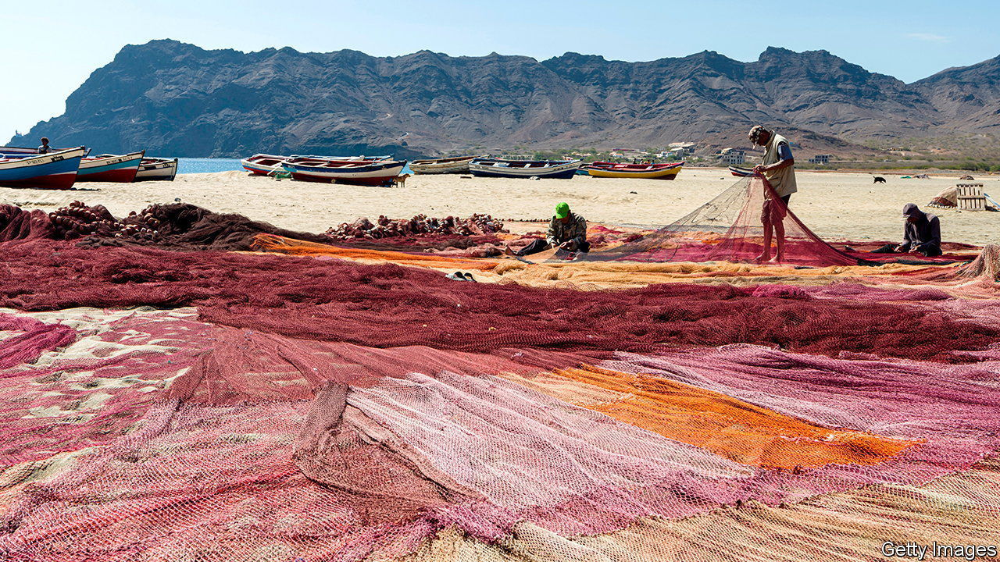

###### Climate finance (2)

# African leaders want debt relief for climate action 

##### They are grappling with two crises at once 

 

> Nov 30th 2023 

Cape Verde, a volcanic archipelago off the west coast of Africa, is not in fact a cape, and only in the rainy season is it particularly green. It is vulnerable to rising sea levels, acidifying oceans and erratic weather, and this may explain why it struck a debt-for-climate deal with Portugal this year. Initially Portugal will write off €12m ($13m) of debt. The money saved will be invested in projects like renewable energy and desalination plants. If all goes well, then the entire €140m (some 6% of GDP) that Cape Verde owes its former coloniser will be forgiven on similar terms.

The search for new finance is top of the agenda for African delegates gathering in the United Arab Emirates for COP28, the UN’s annual climate jamboree, which started on November 30th. Sub-Saharan Africa needs to spend 2.4% of its GDP a year adapting to a warming world, the UN reckons. But many countries are already weighed down by debt and austerity. “Do you pay the debt, and you have nothing left to invest in climate?” asks Claver Gatete, a former Rwandan finance minister who now heads the UN Economic Commission for Africa (UNECA).

At the Africa Climate Summit held in Nairobi in September, the first of its kind in Africa, heads of state called for global financial reform and a “comprehensive and systemic response to the incipient debt crisis”. They also suggested a ten-year moratorium on interest payments to allow for spending on adaptation even as global rates rise, along with pauses of debt servicing when natural disasters strike.

Another idea is to swap debt for climate action, thus killing two birds with one stone. The UNECA is advising African countries on how to negotiate agreements. Portugal is not the only creditor that is willing. This year Germany struck debt-forgiveness deals with Kenya and Egypt, worth €60m and €54m respectively, in return for green investments. Such bilateral swaps are straightforward but tend to be small, because just a quarter of African debt is owed to other governments.

More ambitious swaps involve third parties, such as environmental groups, raising money to buy back debt from private investors. “We don’t have to reinvent capitalism…to be able to do more of these transactions today,” says Slav Gatchev of the Nature Conservancy, an American NGO, which has designed deals to protect biodiversity (rather than climate per se). It recently helped Gabon refinance $500m of debt at lower interest rates, with the savings pledged to a fund for marine conservation. A military junta overthrew Gabon’s government three weeks after the deal, but has made the first payment towards the project all the same.

The International Institute for Environment and Development, a British research group, argues that swaps could be part of a debt-relief programme for countries in financial trouble, much like the debt cancellations of the early 2000s. These have the potential to raise $73bn for climate and nature in sub-Saharan Africa alone. Global power-brokers are more cautious. The IMF and World Bank are interested in swaps but climate policy is “not part of their DNA”, says Jean-Paul Adam, who was finance minister of the Seychelles when it arranged a $21.6m debt-for-nature deal in 2015. Credit-rating agencies may consider swaps a form of default, depending on how they are structured.

For all their intuitive appeal, swaps are a cumbersome way to invest in protecting the climate. They take years to arrange and often require costly monitoring to ensure commitments are met. Last year the African Development Bank reported that swaps had dealt with $3.7bn of debt worldwide since Bolivia signed the first debt-for-nature deal in 1987, but only around $1.5bn was directed at the environment. Swaps are also too small to make much difference in a debt crisis, where countries generally need to get as many creditors as they can around the table.

Neither a borrower or polluter be

It would be simpler to solve problems one by one: by first arranging comprehensive debt relief for the countries that need it, then by giving generous climate grants all round. But neither measure is forthcoming. Debt talks are tangled in the demands of competing creditors. Promises of climate finance by rich countries have been slow to materialise. African leaders will keep calling for an overhaul of the world’s financial architecture. In the meantime, they will take what they can get. ■


