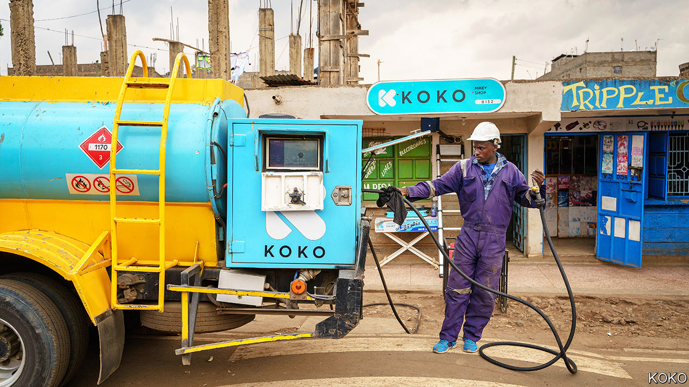
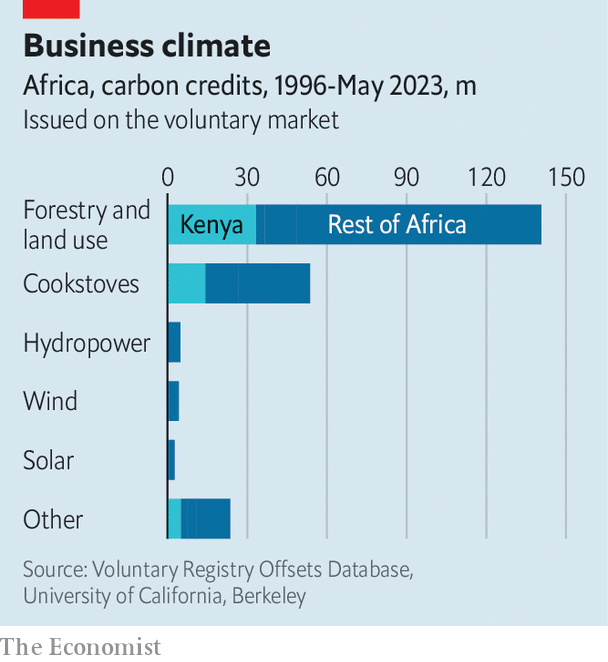

###### Climate finance (1)

# Could carbon credits be Africa’s next big export? 

##### African leaders are eyeing carbon markets as a source of scarce capital 

 

> Nov 30th 2023 

In her small house in Nairobi, Kenya’s capital, Rose Muthoni shows off her snazzy blue stove. Until recently she was one of the roughly 80% of sub-Saharan Africans who use firewood or charcoal for cooking. When burned, these forms of biomass release greenhouse gases and unhealthy pollutants; Ms Muthoni thinks charcoal contributed to the death of one of her children. Her new stove, made by KOKO, a Kenyan startup, uses bioethanol—a cleaner and safer fuel. 

“It is very economical,” adds Ms Muthoni. She spends about 600 Kenyan shillings ($4) per month refilling canisters at “fuel ATMs” in shops, less than half of what she paid for charcoal. The price is the result of a virtuous cycle. Since its products reduce carbon emissions, KOKO is able to generate credits that can be sold on global carbon markets. The proceeds are ploughed back into the firm, lowering retail prices for stoves and fuel. Four years after launching, KOKO is used by more than one-third of households in Nairobi. “We’re a novel type of energy utility,” argues Greg Murray, its CEO, “where carbon provides the subsidy instead of public funds.” 

KOKO hints at why there is excitement about carbon markets. The African Carbon Markets Initiative (ACMI), a UN-backed consortium, reckons that Africa uses just 2% of its annual carbon-credit potential; it aims for Africa to sell $100bn worth of credits a year by 2050. Even a fraction of that would be a boon for a continent where annual foreign direct investment has never surpassed $80bn. William Ruto, Kenya’s president, calls carbon credits an “unparalleled economic gold mine” and his country’s “next significant export”. Yet, as is often the case with Africa and its natural resources, things could go wrong.

 


Africa has taken part in carbon markets for decades, albeit on the margins. It accounted for 3% of the credits issued under the Clean Development Mechanism (CDM), the first international carbon market set up under the aegis of the UN. (A successor to the CDM was outlined in the Paris Agreement, signed at the COP climate-change summit in 2015, and negotiations are continuing at the current COP in Dubai.) Credits from African projects have also made up about a tenth of those issued on “voluntary” markets, where blue-chip firms and guilt-ridden consumers pay to “offset” their emissions. 

The benefits of carbon markets can be seen in how they have boosted cooking-fuel startups. Almost a quarter of the African carbon credits issued on voluntary markets involve such projects. More than half of the 30 companies, including KOKO, supported by the Clean Cooking Alliance, a donor-funded outfit, have used—or plan to use—carbon markets to attract finance. 

ACMI and others are keen to increase the size of Africa’s voluntary market. In September at the Africa Climate Summit in Nairobi, the United Arab Emirates (UAE) pledged to buy $450m worth of credits. The Johannesburg Stock Exchange recently launched its own voluntary marketplace.

Yet there is a much bigger prize on offer. In the Paris Agreement countries made pledges to limit their emissions, known as Nationally Determined Contributions (NDCs). Article six of that treaty in effect outlines a formal export market in carbon credits. It lets one country partially meet its NDCs by buying credits—catchily called Internationally Transferred Mitigation Outcomes (ITMOs)—issued by another. The idea is for the market to find the most efficient ways to reduce emissions while raising capital for projects to spur development in poor countries. In Africa the hope is that article six could one day make it possible for African issuers to sell into some of the largest “compliance markets” (such as California’s cap-and-trade scheme) that together are worth around $800bn per year, versus just $2bn for the voluntary offset markets. 

Several African countries are keen to take advantage of article six. Kenya has amended its climate-change law to make sure its projects adhere. Ghana and Senegal have already sold cookstove-based credits to Switzerland in a bilateral deal; notably, the price of the credits was several times higher than what projects might be expected to get via voluntary markets. Ghana is in talks with Singapore, too. Gabon has a pilot deal with South Korea; Ethiopia and Kenya with Japan. Rwanda has also recently issued ITMOs that meet article-six standards. 

Yet carbon credits are not without potential problems. The first is that under article six there must be no double counting. If Ghana, say, sells credits to Switzerland, it cannot count the corresponding emission cuts as its own NDC. Picking eligible sectors for ITMOs is increasingly part of some African governments’ economic policy-making. Ghana, for instance, will not issue ITMOs based on switching light bulbs or planting trees on smallholder plantations, as these are cheap and easy things it can do itself. It wants to issue ITMOs that raise lots of money for projects in harder areas, such as renewable energy and cooking fuel. 

The second snag is the lingering scepticism about the carbon-saving potential of credits, especially those based on forest projects. In August a study in , a journal, suggested that 94% of the credits associated with a sample of 26 projects in developing countries were not linked to real reductions in emissions. In November the CEO of the world’s largest offsetting firm, South Pole, stepped down amid accusations of “greenwashing”. The firm said it was “determined to learn from the experience”. A third problem is how much locals get the benefits from carbon credits.

All of the problems are most acute in schemes that pledge to avert deforestation. (Those based on cleaner cooking fuels are easier to measure and have obvious beneficiaries.) That helps explain the reaction in some quarters to provisional deals struck by five African countries with a carbon-credit firm run by a member of Dubai’s royal family in the UAE. Blue Carbon has signed initial agreements with Tanzania, Liberia, Zambia and Zimbabwe to manage forests across a total land area nearly as large as Britain. It may then sell ITMOs to polluting countries such as, say, the UAE. Though no deal has been formally agreed, critics call it “carbon colonialism”. 

A perennial problem is how Africa may get the most out of its natural assets. Some countries will do better than others. But in a world where many rich countries are cutting aid to Africa, China is lending less and commercial creditors demand high interest rates, African states will inevitably explore any new source of funds. Even if some of the schemes go up in smoke. ■


