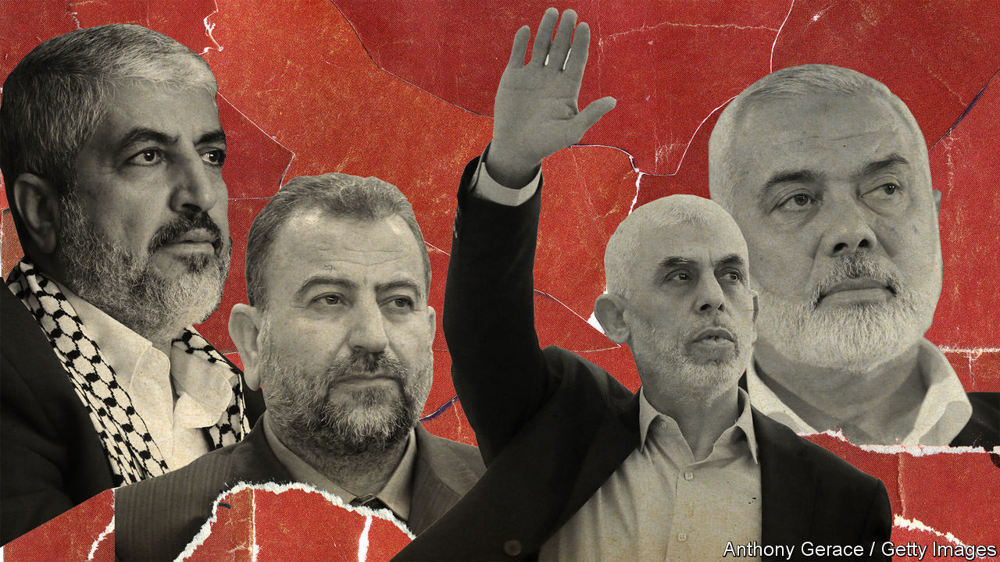
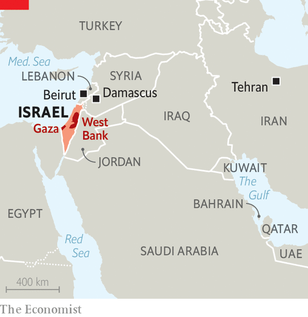

###### The war in Gaza

# Does Hamas want to keep fighting Israel or start talking peace? 

##### A high-stakes struggle is taking place within the group 

 

> Nov 30th 2023 

WHEN HAMAS smashed across the Gaza border on October 7th, killing some 1,200 Israelis and abducting around 250 more, it thrust itself into the very centre of international attention. The issue of Palestinian statehood, which had been forgotten as Arab countries established diplomatic relations with Israel under the Abraham accords, is once again seen as the key to stability across the region. Yet it seems increasingly clear that Hamas, which planned its assault down to the smallest detail, failed to anticipate Israel’s military response and had no greater goal for the following days than to barter hostages for Palestinian prisoners in Israeli jails. Almost two months into the war it started, does it have a plan?


What happens in the coming weeks and months depends mainly on how much deeper and longer Israel’s offensive goes into Gaza and how much of Hamas it is able to destroy. But it also depends on high-stakes struggles within Hamas: between a radical wing in Gaza and more moderate elements in exile in Qatar and Lebanon; between those aligned closely with Iran and its “axis of resistance” and those wanting closer ties with Arab governments; and crucially over whether to implicitly recognise Israel or to keep fighting to exterminate it. Who wins these arguments will affect whether a peace deal based on a Palestinian state alongside Israel can ever materialise.

Hamas is by no means a homogenous movement. Its most solid military and political base before the current round of fighting was in Gaza, where it is a government, a military force and a social-welfare body. But most of its top political leadership is in exile in Qatar or Lebanon. It also has a political presence and some armed cells in the West Bank and a footprint among Palestinian refugees scattered across the region. Its activities go well beyond violence—it is a social-service provider, a religious authority, and in the West Bank it discreetly provides benefits such as university scholarships and private hospitals. Knitting this together is a sprawling financial empire that brings in more than $1bn a year to pay for everything from education in Gaza to the rockets it fires at Israel. Iran has provided the group with hundreds of millions of dollars in funds as well as expertise to help build its rocket arsenal.

 


The two faces of Hamas—as a social-welfare movement and as a terrorist group—go back to its formation in 1987 as an armed offshoot of the Muslim Brotherhood, an Islamist movement that had previously been involved in charitable projects in the territories Israel captured in 1967. Its initial charter, dripping with anti-Semitic tropes blaming Jews for the French and Russian revolutions, ruled out negotiations and called for the destruction of Israel. By 1993 it was sending suicide-bombers against Israelis. When later that year the Palestine Liberation Organisation (PLO) under Yasser Arafat signed the Oslo accords, recognising Israel and suspending its armed struggle, Hamas set about undermining the deal with a bombing campaign.

When Israel withdrew its forces and dismantled Jewish settlements in Gaza in 2005, Hamas proclaimed this as a victory for armed struggle. So, it seems, did many voters who gave Hamas a majority of the seats in parliamentary elections the following year. This appeared to moderate Hamas, at least for a while. It formed a government of the Palestinian Authority (PA), which it had previously rejected as a creation of the Oslo accords, and named Ismail Haniyeh (pictured, top right) the prime minister of Palestine. 

Yet Israel withheld taxes it collected for the PA and Fatah, the party headed by Mahmoud Abbas, the PA’s president, struggled with it for control of the security forces. In 2007 Hamas seized control of Gaza and set up a separate administration. Israel imposed an even tighter blockade on Gaza, restricting imports and allowing only a trickle of people to cross into or out of the territory. The result has been poverty and misery for the roughly 2.2m people who now live in Gaza. Fighting between Israel and Hamas has regularly erupted.

The division of Palestinians into two camps suited Binyamin Netanyahu, Israel’s prime minister, who has long obstructed the creation of a Palestinian state. With Hamas in power in Gaza and an enfeebled PA under Fatah in the West Bank, he could argue that Israel had “no partner for peace”. Others in the region played along with this, particularly Egypt under President Abdel-Fattah al-Sisi, who has viciously repressed the Muslim Brotherhood at home. 

After Hamas unexpectedly found itself responsible for governing Gaza and shunned by some states in the region, moderate factions within the group began to push for a change in its policies. Khaled Meshal (pictured, top left), previously the head of the group’s political wing in exile, had been trying to align the group with Sunni Arab states in the region and break it away from its alliance with Iran and Syria. In 2012 he moved the Hamas headquarters out of Damascus, Syria’s capital, after President Bashar al-Assad had massacred Sunni rebels and violently repressed the Muslim Brotherhood. In 2017 Mr Meshal pushed through a new Hamas charter, dropping much of the previous one’s anti-Semitic language. Above all, it endorsed a Palestinian state inside the territories Israel conquered in 1967—that is Gaza, East Jerusalem and the West Bank—though it stopped short of recognising Israel.

But Mr Meshal was supplanted by a more radical and pro-Iranian camp that emerged largely from Hamas’s military command to assume the group’s political leadership. It espoused a vision of a Palestinian state stretching “from the river to the sea”, says Baraa Nizar Rayan, a writer with close ties to the movement, based in Qatar. Influential in this faction are Yahya Sinwar, its political and military leader in Gaza, and Saleh al-Arouri, Hamas’s representative in Beirut who previously commanded the Qassam Brigades, Hamas’s armed wing (both pictured bottom right and left respectively). Mr Sinwar had signed up to to the new charter, but became more extreme after it failed to lead to a political settlement with Israel, Hamas people say. The attack on October 7th marked the ascendancy of the extremists. “It has proved that the only language Israel understands is force,” argues Azzam Tamimi, a sympathetic historian. “Peacemaking with Israel gets them nowhere.” 

Much will depend on what happens next with Israel’s military operation to destroy Hamas and kill its leaders. As  went to press, Israel  in exchange for the release of more hostages. But Hamas will be able to buy no more than a day or two before it has traded all the children and female civilians it holds hostage. 

Officials of other governments in the region and experts think Hamas will try to keep on bargaining. It might offer to exchange male hostages (whom it defines as prisoners of war regardless of whether under humanitarian law they are soldiers or non-combatants) for high-profile Palestinian prisoners. It may also propose a long-term ceasefire, or , in which it agrees not to attack Israel from Gaza, perhaps for at least ten years.

Beef up the bad guys

A full ceasefire now would let Hamas claim victory, which would probably strengthen its hardliners, including Mr Sinwar, and give Hamas greater sway over Palestinian politics in the West Bank. “Any scenario that makes it possible for Hamas with any credibility to claim victory will make it possible for them to take over the Palestinian national movement without having to knock on anyone’s door,” says Salam Fayyad, a former prime minister of the PA. A stronger Hamas, particularly if it is emboldened by its attacks on Israel, would make progress towards a two-state solution impossible for the foreseeable future, given its dedication to violence and Israel’s distrust of it. 

It is still more likely that Israel will resume its assault on Gaza once the truce is over. Israel reckons it has killed about 4,000 Hamas fighters in Gaza and killed or captured about 1,000 more in Israel. It says it has “seriously hit” about half the group’s regional battalions in Gaza and killed the top Hamas commander in northern Gaza, three other senior commanders and dozens of battalion and company commanders. Israeli officials say that before the truce started on November 24th, Hamas’s ability to command and control its forces in northern Gaza had completely broken down. But it may well have used the lull to rebuild its command structure and some of its rocket-launchers. 

The moment the truce is over, the Israel Defence Forces (IDF) plans to focus on the parts of northern Gaza it hasn’t yet entered, especially the district of Shuja’iyya. It also aims to start limited ground operations in southern Gaza with the intention of cutting off Khan Younis, a major city in the south, possibly also entering Gaza from close to the border with Egypt. 

Israel will probably keep trying to capture or kill Hamas’s leaders in Gaza, particularly Mr Sinwar, Muhammad Deif, who commands the Qassam Brigades, and Marwan Issa, his deputy, who is seen as a more skilled tactician. Yet many Hamas-watchers insist that it will survive the loss of its top leaders. “Deif and Sinwar have written themselves off,” says a Western spook. “Every day they survive is credit…money in the bank for other people to spend.” 

Others note that although Israel assassinated a number of Hamas leaders in the 1990s and 2000s, it failed to halt the movement’s growth. Even if it is militarily diminished, Hamas will probably retain much influence in Gaza. It might be nigh-impossible to govern the strip without a measure of its acquiescence. 

Yet there are also signs that Israel’s ferocious retaliation may be eroding support for Hamas among ordinary Gazans furious at the destruction Mr Sinwar has brought down upon them and their homes. The militant wing aligned with Mr Sinwar may also be weakening. By contrast, Hamas appears to have gained support in the West Bank, through winning the release of Palestinian prisoners from Israeli jails as part of the hostage bargain.

With Mr Sinwar and many of the group’s military leaders in Gaza hiding in tunnels out of sight of Israel’s drones, Hamas’s leaders in exile, such as Khaled Meshal and its top man, Mr Haniyeh, both of whom advocated the charter’s revision in 2017, are growing in importance, says an Arab diplomat. Husam Badran, a senior Hamas politician in Qatar, acknowledges that “the state of Israel exists”, adding that ”the missing state is Palestine”. In effect, Hamas offers “de facto recognition (of Israel) but not de jure,” says Qusay Hamed, a Palestinian expert on the movement.

There is huge demand among Palestinians for a government that again unites Gaza and the West Bank. Several Hamas men have held talks with other Palestinian leaders, including one of Mr Abbas’s ambitious rivals in Fatah, Muhammad Dahlan, whom Hamas chased out of Gaza in 2007. The 88-year-old Mr Abbas is firmly against a reconciliation with Hamas, but he is in the twilight of his rule. 

If much is left of Hamas after the war, its “resistance” may grant it greater legitimacy among Palestinians than other parties such as Fatah. For that to mean something, it would have to stop being a spoiler of peace. It is not yet clear, perhaps even to Hamas itself, whether it is ready to take that step, and if does whether it would be accepted by Israel. ■

