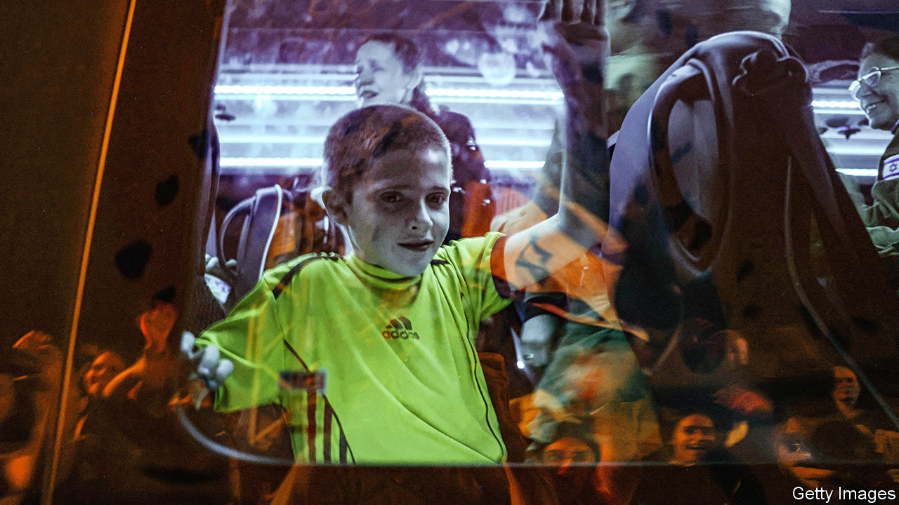

###### All quiet on the Gaza front

# Israel’s truce with Hamas is drawing to a close 

##### A grand bargain and ceasefire seem unlikely 

 

> Nov 30th 2023 

ALMOST A WEEK after the guns fell silent in Gaza on November 24th, the respite offered to the territory’s 2.2m people and the celebration of Israelis at the return of hostages appeared to be coming to an end. As  went to press on November 30th the truce was on a knife edge. 


About two hours before fighting was due to resume at 7am local time, Hamas said Israel had rejected an offer for it to return seven female and child hostages along with the bodies of three more. Israel had previously said it would only extend the truce by 24 hours for every ten live captives. About an hour before the deadline they reached a deal when Hamas added one more name and Israel agreed to credit it with another two after the release of 12 hostages the day before.

The exuberant scenes at the return of hostages and Palestinian prisoners held by Israel were the result of hard-nosed, cold negotiations that took place mainly in Doha, the Qatari capital, in a deal brokered by Hamas’s Qatari patrons. Hamas refuses to disclose whether hostages are alive or dead, save for a nightly list of those to be released the next evening. For every Israeli returned, three Palestinian women and minors, most of them accused of violence or terrorism, would be freed. 

Talk has since turned to the possibility of more deals for the release of the roughly 160 hostages still held in Gaza. A grand bargain has been aired whereby they could all be set free in return for Israel emptying its jails of thousands of Palestinian prisoners and agreeing to a long-term ceasefire. Israeli officials have been quick to quash these rumours. Their priority is to secure the release of the remaining children and civilian women, but they expect Hamas to demand a far higher price for the freeing of other categories of hostages: elderly men; male civilians of military age who are considered “combatants” by Hamas; and actual soldiers, male and female. They also worry that Hamas will try to drag out negotiations in order to extend the truce without giving anything in return. 

The Israel Defence Forces (IDF) reckons that half of Hamas’s 24 battalions have been severely hit, with many of them losing their commanders and headquarters, both above and below the ground. The IDF has captured around 80% of the built-up area in the northern sector of Gaza and says it has found around 800 tunnel-shafts, half of which its forces have already destroyed. Military officials also say the IDF has achieved a key aim of capturing areas that hosted over half of Hamas’s rocket-launchers. This had sharply decreased rocket attacks on Israeli towns before the truce. 

It is notoriously difficult to count bodies during a war, especially since so many Hamas fighters are underground, but Israeli intelligence reckons that around 5,000 Hamas fighters have been killed so far in Gaza and Israel. Along with those wounded and captured, around a quarter of Hamas’s fighting force may have been eliminated. This is a big blow to Hamas, but not enough to prevent it from returning to power in Gaza once Israel leaves. The group’s leader there, Yahya Sinwar, and his chief military commanders, Muhammad Deif and Marwan Issa, are believed to be holed up in their home town of Khan Younis in southern Gaza.

As soon as the truce ends, the IDF will have two immediate priorities: to continue destroying tunnels and Hamas’s structures in the area it already militarily controls; and to enter the remaining Hamas strongholds elsewhere in Gaza. Though Israel expects stiff opposition from Hamas’s remaining fighters, it will have two big advantages in the north. The area it will be attacking is almost entirely empty of civilians, who have fled south. This will allow the IDF to use its massive advantage in firepower, both from the air and its artillery, to help armoured columns smash through Hamas’s defences. 

Things will be tougher when Israel starts an expected second stage of its ground campaign in southern Gaza. The area is crammed with about 2m people, many of them displaced from the north, meaning Israel will have to be more restrained in its use of firepower and armour. It is already under pressure from its main ally, America, to inflict fewer civilian casualties than it did before the ceasefire, when more than 15,000 people were killed, according to the Hamas-run authorities. Antony Blinken, America’s secretary of state, was due to meet Israel’s war cabinet on November 30th to repeat this advice and to urge Israel to let more aid into Gaza. He also wants Israel to think about who will control Gaza once the fighting is over. 

Israeli officers admit that tackling Hamas in the south will be “more challenging” and talk of conducting a “mobile” offensive there. This would probably mean taking on the main southern Hamas strongholds in stages with smaller forces. This might reduce civilian casualties, but it would also prolong the war, further sapping international support for Israel. 

There is also talk, not in public for now because of the objections of the far-right politicians in Binyamin Netanyahu’s ruling coalition, of Israel facilitating the flow of humanitarian aid into Gaza. Since October 7th Israel has not allowed aid to go through its own territory. Instead, supply convoys have taken a circuitous route through Egypt to an Israeli security checkpoint and then back into Egypt before entering Gaza through the crossing at Rafah. 

Israel’s security establishment is aware that letting in more aid is another way of increasing legitimacy for the military campaign in foreign eyes. Officials have privately said that they are working on re-opening the Kerem Shalom crossing, where most of Gaza’s imports arrived from Israel before this war. But the trauma still felt keenly by many Israelis after the massacre of October 7th and the stories emerging of hostages being maltreated will not make them keen to aid Gazans. ■

