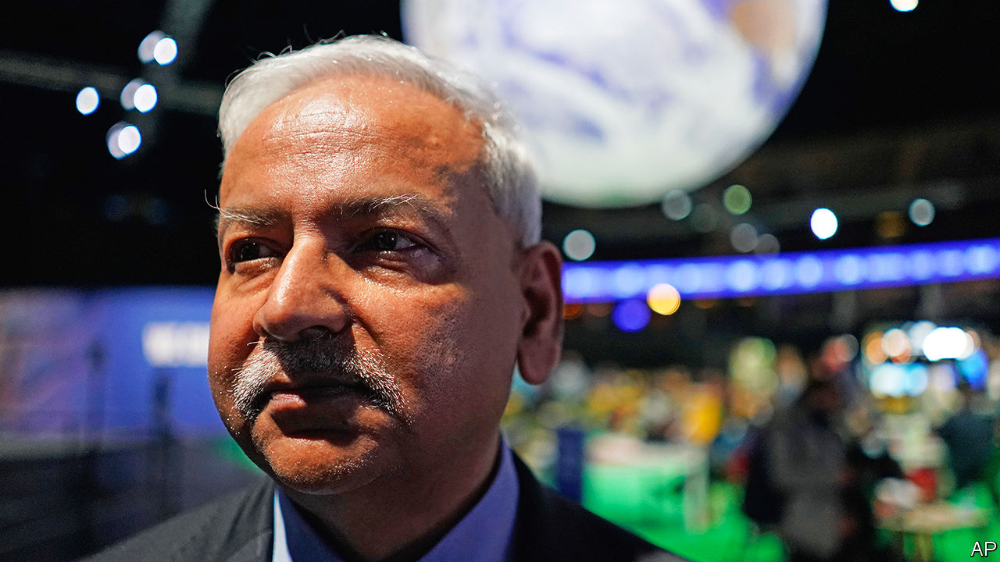

###### Adapt or die

# Saleemul Huq lobbied ceaselessly to make poor countries heard 

##### The biologist and climate activist died on October 28th, aged 71 

 

> Nov 29th 2023 

At every COP meeting up to the present one in Dubai, he would be there. A COP junkie, he called himself. He would set himself up in a good strategic spot, near the entrance or on a prominent sofa, arm himself with coffee, cigarettes and his permanently pinging phone, and draw a crowd. This was his “mobile office” where he could waylay useful people, listen patiently to delegates, students and petitioners and embrace old friends. If he was not in his “office”, colleagues said, it was because he was everywhere. 

Saleemul Huq was not there as a negotiator. He had fine credentials, including director of the International Centre for Climate Change and Development and director of climate research at the International Institute for Environment and Development; but behind all that lay an ardent agitator. It was he who instructed delegates from the least-developed countries to “Tell it like it is!”—to tell the rich countries, the no-holds-barred historical polluters, that the loss and damage they had caused had to be paid for; and that adaptation to climate change, rather than mere mitigation, should now be everyone’s aim. 

He had been banging this drum for almost three decades. In that time the world had passed, like a frog in heating water, from drowsiness to boiling point, and still no efficiently organised global fund had been set up to compensate the farmers whose land had been flooded by sea-level rise or whose homes had been shattered by storms. He saw such ragged figures every day in Dhaka, camping and sleeping in the streets. If refugees from war deserved global sympathy, so did these, displaced by climate.

At the Paris conference in 2015 the richer countries had reaffirmed a pledge, made at Copenhagen six years earlier, to give $100bn a year towards a fund to mitigate climate change in the worst-affected places. Article 9 of the Paris agreement definitively accepted the words “loss and damage”. They were hard fought-for, but he insisted. There was no great rush to put the promised money into the pot; at COP26, in Glasgow in 2021, only the Scots chipped in with £1m. The next year, at Sharm El-Sheikh, a specific fund was set up for loss and damage and the rich countries induced to pay into it. America and other rich counties kicked and screamed; he stood his ground. 

It was little enough anyway, in the cold light of day. “Loss and damage” were euphemisms for what he really wanted to say: “liability” and “compensation”. But neither Europe nor the United States would tolerate such language for a minute, let alone the devil-word “reparations”. They preferred vaguer terms they could interpret as they liked. Besides, now that they had their own climate disasters to cope with, they did not much like paying for other people’s. Sharm el-Sheikh established the principle of a fund, but it had no proper structure yet. Details were left for Dubai. He wanted to say, in his courteous way, weren’t they all in this together? What about solidarity, unity, or simply helping each other?

The attitude of higher-income countries riled him in other ways. They argued that they gave aid already. But aid was something they chose to give, or not. A pledge, by contrast, as at Copenhagen, was an obligation. The rich countries made this more palatable by giving the money as loans, which they hoped to see repaid. They were earmarked for mitigation, such as wind and solar power, which could turn a profit; not for adaptation, such as embanking a river. For polluters to loan money to their victims was immoral, Dr Huq thought. As a matter of principle, the cash should come as open-handed grants.

And grants should be for adaptation. This was his second great theme and victory: to get adaptation written into the COP treaties. Again, this met stiff resistance. But the time for mitigation alone was past. Climate change could no longer be minimised, let alone averted. It was locked in. All anyone and any country could do was to adapt and prepare as best they could. 

His own country led the way. Whipped by the cyclones that blew up from the Bay of Bengal, flooded by the mighty Ganges and Brahmaputra, Bangladesh was among the most vulnerable countries in the world. Yet in 2021, when floods drowned 170 people in wealthy Germany, the usual seasonal cyclone in Bangladesh—which might have killed 100,000 people in the past—caused only 30 deaths. And Dr Huq had been the driver of that change. 

It was not inevitable. As a child in a diplomat’s family, he might have stayed in Germany, Kenya or Indonesia, all places where he had lived and gone to school. As it was, he studied biology at Imperial College London and then, in the 1980s, left for Bangladesh. There he persuaded the government that it needed an environment department, and set up the Bangladesh Centre for Advanced Studies to be a helpful think-tank on climate. For most of his life after that, except for another spell in London and his annual three-week whirl at COP, he was in Bangladesh, studying how poor coastal communities could teach themselves, and the world, resilience.

They did extremely well. Because salt water soaked the land, they took up shrimp farming. They encouraged mangrove forests, which filtered salt and also tempered storm surges. To get enough fresh drinking water, villagers put tanks on their roofs to catch rain; for plentiful crops, despite the persistent flooding, they grew vegetables in bags or on floating bamboo mats. Shelters were built, and PA systems in the villages gave loud advance warnings. Some of this was old knowledge revived, but much came from the pressure his teams kept up on the government. About 8% of the Bangladeshi budget was now committed to helping people recover from, and adapt to, natural disasters. 

It was vital to listen to people like those, on the front line, valiantly fighting. At COP26 he brought in a Bangladeshi woman farmer to talk to delegates, female farmers being the poorest of the poor. She was heard respectfully. If only the millions of other victims of rising seas, soaring temperatures and strengthening storms could speak too, richer countries might come to recognise the true sting of “damage”, and the true weight of “loss”. ■

