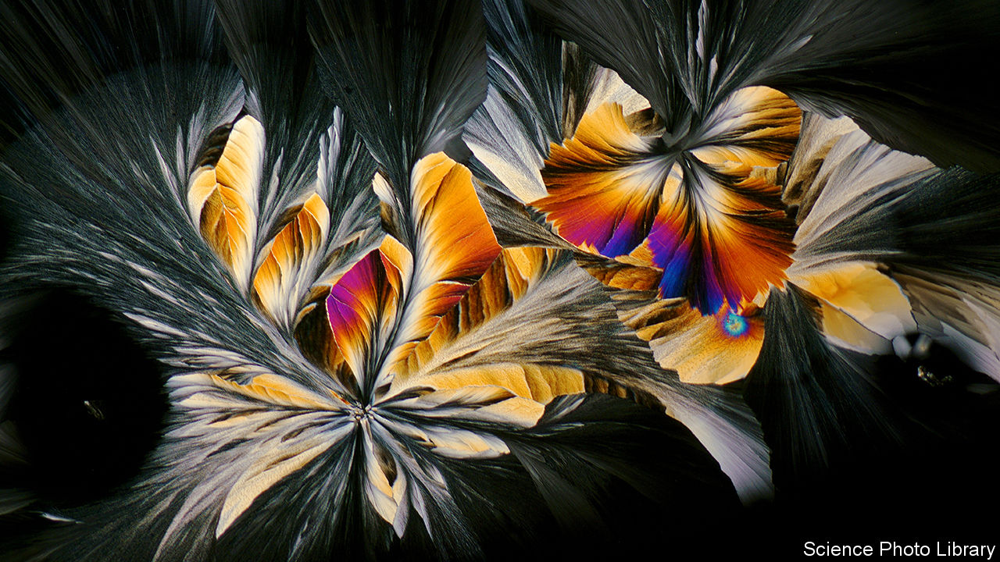

###### Crystal balls

# A Google AI has discovered 2.2m materials unknown to science 

##### Zillions of possible crystals exist. AI can help catalogue them 

 

> Nov 29th 2023 

Crystals can do all sorts of things, some more useful than others. They can separate the gullible from their money in New Age healing shops. But they can also serve as the light-harvesting layer in a solar panel, catalyse industrial reactions to make things like ammonia and nitric acid, and form the silicon used in microchips. That diversity arises from the fact that “crystal” refers to a huge family of compounds, united only by having an atomic structure made of repeating units—the 3D equivalent of tessellating tiles. 

Just how huge is highlighted by a paper published in  by Google DeepMind, an artificial-intelligence company. Scientists know of about 48,000 different crystals, each with a different chemical recipe. DeepMind has created a machine-learning tool called GNoME (Graph Networks for Materials Exploration) that can use existing libraries of chemical structures to predict new ones. It came up with 2.2m crystal structures, each new to science. 

To check the machine’s predictions, DeepMind collaborated on a second paper, also published in , with researchers at the University of California, Berkeley. They chose 58 of the predicted compounds and were able to synthesise 41 of them in a little over two weeks. The team at DeepMind say more than 700 other crystals have been produced by other groups since they began preparing their paper.

To help any other laboratories keen to investigate the computer’s bounty, the firm has made public a subset of what they think should be the 381,000 most stable structures. Among them are many thousands of crystals with structures potentially amenable to superconductivity, in which electrical currents flow with zero resistance, and several hundred potential conductors of lithium ions that could find a use in batteries. In both cases DeepMind’s work has increased the total number of candidate materials known to researchers tens of times over. 

Aron Walsh, a materials scientist at Imperial College London who was not involved in the research, says DeepMind’s work is impressive. But “this is the start of the exploration rather than the end,” he says, noting that the machine has only scratched the surface of what might be possible. In a recent paper of his own he tried to calculate how many stable crystals incorporating four chemical elements (so-called quaternaries) might be potentially manufacturable. He wound up with a conservative estimate of 32trn. For its part, GNoME looked only at crystals that form under relatively low temperatures and pressures. And crystals are only one subset of a universe of materials that includes everything from amorphous solids such as glass through to gases, gels and liquids.

Whether any of DeepMind’s 2.2m new crystals will be useful remains to be seen. Even if they do not, the techniques used to make the predictions could be valuable. Besides suggesting new crystals, AI may also shed light on as-yet-unknown rules that govern how they form. 

Ekin Dogus Cubuk at DeepMind highlights one such finding. Previously, he says, crystals made from six elements, called senaries, were thought to be vanishingly rare. But DeepMind’s AI found around 3,200 in its sample of 381,000 stable compounds. A better understanding of how crystals form, and what sorts are possible, might also save scientists curious to test how the 2.2m new materials behave from the tedious task of synthesising each one of them by hand. ■


