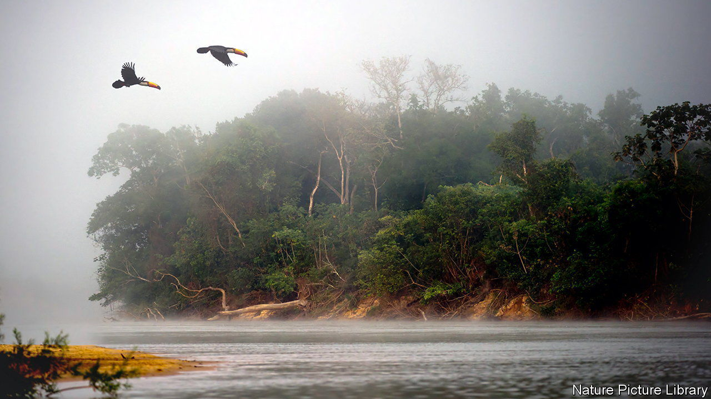

###### Termination shock?

# Do rising methane levels herald a climate feedback loop? 

##### A scientist notes ominous similarities to the ends of previous ice ages 

 

> Nov 29th 2023 

The end of an ice age is a fearsome and complex thing. Ice sheets collapse; ocean currents shift; weather patterns are thrown awry; low-lying land is inundated. Each change triggers more change, mostly in a way that makes the world warmer still. 

Such “terminations” are visible in the geological record. When ice ages end, says Euan Nisbet of Royal Holloway, University of London, a sudden rise in airborne methane levels “is the bellwether, right at the beginning of [the] changes. The melting of the ice takes thousands of years. But the atmospheric change can be…a matter of decades.” And when Dr Nisbet looks at today’s atmospheric data, he sees something that looks worryingly termination-like. 

At the end of an ice age, as the world begins to warm, its tropical wetlands spread. The microbes that live in those wetlands produce methane as a waste product, so more wetlands means more methane in the air. And because methane is itself a powerful greenhouse gas, that drives further warming in turn. Even as delegates to the COP28 climate conference consider ways to cut human , Dr Nisbet worries that the Earth’s natural systems may be churning out more and more of the gas.

Methane levels are certainly rising. Over the 40 years during which the gas’s level in the atmosphere has been monitored, it has grown by about 17%, in two distinct stages. In the first, strong annual growth slowed until, in the early 2000s, it stopped altogether. But around 2006 it began growing again—and the rate is accelerating. 

The evidence that wetlands might be to blame comes from the type of methane being emitted. Methane is made of four atoms of hydrogen atoms and one of carbon. That carbon atom can be either the “light” isotope, with six neutrons in its nucleus, or the heavy isotope, which has seven. Methane-making bacteria find the lighter sort easier to handle. The methane they produce is therefore lighter than methane from fossil fuels or forest fires, another major source of the gas. And over the past 15 years the methane in the atmosphere has indeed become lighter.

That is suggestive, but not conclusive. Accounting for the methane in the air is tricky. An academic collaboration called the Global Methane Budget (GMB) produces two tallies. One bottom-up estimate adds the emissions of all known sources. Another top-down one works backwards from the methane levels in the air and tries to calculate emissions on the ground consistent with it. In the most recent budget, published in 2020, the two approaches disagreed significantly. The total calculated from known sources was 30% higher than the number derived from the atmosphere. 

The GMB concluded that the rise in methane since 2006 was a mix of more fossil-fuel sources and more microbial ones. Many of those microbes, it suggested, might be living in landfills and the stomachs of cattle, two environments that human efforts are expanding. And methane from such sources is isotopically similar to methane that comes from wetlands.

But more recent, detailed studies which analyse the isotopic data in more detail have pushed the consensus away from farming and rubbish dumps and towards swamps. In 2021 a group of researchers analysed improved satellite and ground observations and concluded, in a paper published in  that 35% of the post-2006 increase came from wetlands. A more recent estimate by Dr Nisbet and colleagues puts the contribution at 45%. 

Those may even be underestimates. One way that methane is taken out of the atmosphere is through reactions with chlorine ions over the ocean, a process that preferentially targets the lighter sort of methane. A paper published in June suggests that interactions between dust and sea spray over the Atlantic may mean there is more chlorine out there than modellers previously thought. If so, the shift towards microbial methane sources may be even more pronounced than the lightness of the methane in the atmosphere suggests.

And it is not just rising temperatures that could boost methane production from wetlands. Records from ice cores show that, at the end of the most recent ice age, the level of carbon dioxide in the air and the lightness of atmospheric methane were closely correlated. The obvious explanation is that carbon dioxide makes plants grow more vigorously. (It is, after all, what they eat.) And faster growth means more dead vegetable matter for methane-making bacteria to eat in turn. Human-caused carbon-dioxide emissions are having a similar fertilising effect on today’s vegetation, though whether that is part of today’s methane story remains to be seen. 

More data may help clarify things. New satellite and airborne measurements should make it easier to say from whence and in what quantities the light methane is coming. Xin Lan, a carbon-cycle scientist at the University of Colorado at Boulder, and one of Dr Nisbet’s co-authors, thinks that looking at isotopes of hydrogen as well as carbon may make it possible to distinguish between methane produced by swamp microbes from that made by bugs in cow guts and landfills. Fieldwork may reveal to what extent wetland emissions are being driven by the run-off of artificial fertilisers, which can be cut more easily than climate change can be reversed. 

If those data support Dr Nisbet’s hypothesis, and a warming world really is producing more and more methane, that would raise several uncomfortable questions. Will the process accelerate? Or will something limit the growth of the wetlands? Will efforts to cut man-made methane emissions be able to counteract rising emissions of the natural sort, in a sort of climatic Red Queen’s race?

If not, and the process continues, how much methane could it add? The spike at the end of the last ice age saw methane levels rise from 400 parts per billion to 700ppb. Is it reassuring that the increase in man-made emissions from the Industrial Revolution to the turn of the century has dwarfed that, pushing levels from 700ppb to 1,800ppb? Or should one instead think of straws and camels’ backs? ■


