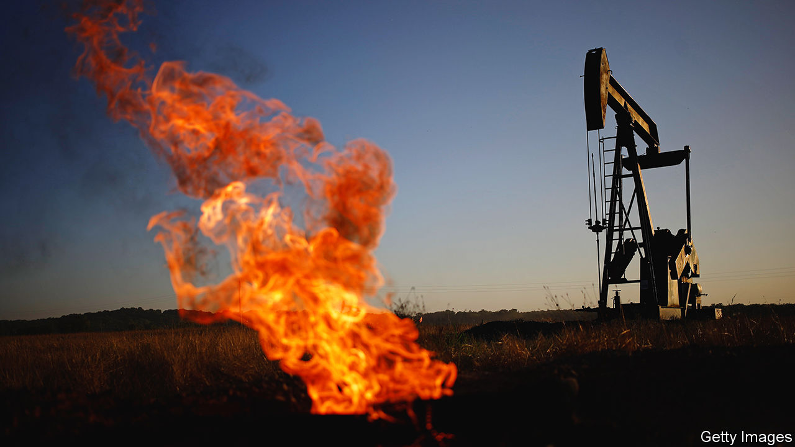
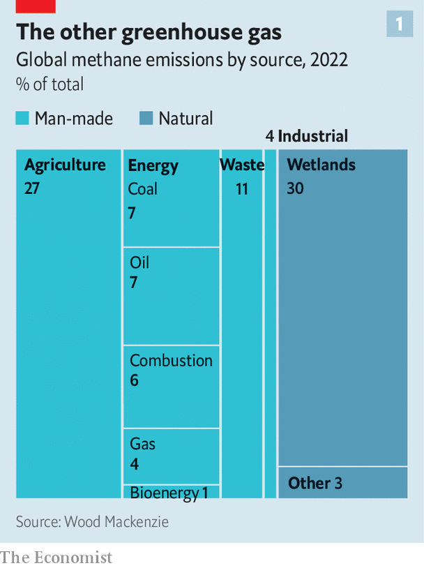
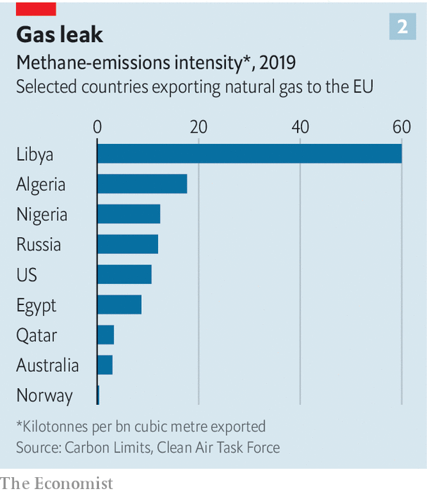

###### The other greenhouse gas

# Politics and technology are pushing oil firms to cut methane 

##### When it comes to climate change, methane is low-hanging fruit 

 

> Nov 29th 2023 

Most discussions about climate change revolve around carbon dioxide. But that is not the only greenhouse gas. As delegates gather in Dubai for the COP28 summit, an annual UN-sponsored climate chinwag, much attention will be focused on methane instead.

Unlike carbon dioxide, which lingers in the air for centuries, methane hangs around for only a decade or so. But during that time it prevents more than 80 times as much heat from escaping. Nearly 45% of the difference between the world’s temperature in the 2010s and its temperature in the second half of the 19th century was due to methane’s warming effects. Methane emissions can often be cut cheaply. But until recently few have bothered to try.

 


That is changing. Methane leaks into the air from many sources. Some, such as landfills and farming, are man-made (see chart 1). Others, such as , are natural. At COP28, though, the focus will be on oil-and-gas companies. Their methane emissions are seen as some of the lowest-hanging fruit, for three reasons. A clutch of technologies have made it easier to measure them. Politicians are increasingly keen to cut them. And that combination of pressure and possibility has begun to change minds even among oil-industry bosses. With help from America and the EU Sultan al-Jaber, COP28’s Emirati president, hopes to forge an ambitious deal on methane on the sidelines of the main talks.

To see what might be possible, look to Stavanger, a city of quaint wooden houses that is the capital of Norway’s oil-and-gas industry. The country shares the hydrocarbon-rich North Sea with Britain, Denmark and the Netherlands. Yet greenhouse-gas emissions from Norwegian oil and gas are only a third of what they are in Britain. 

In 1971 Norway’s government banned the routine “flaring”—or burning—of natural gas, which is mostly methane, from rigs in its area of the North Sea. Although burning methane turns it into carbon dioxide and water, a good deal of flared methane escape unburned, meaning the ban drove down emissions of both gases. 

Ideal gas laws

Newer rules have forced Equinor, Norway’s state-owned oil company, to continue cleaning up (see chart 2). Some of its offshore platforms receive electricity from land, removing the need to burn gas onboard to provide it. The firm is even developing dedicated offshore wind-farms to power its rigs. The International Energy Agency (IEA), a quasi-official entity, reckons that if all countries reduced the intensity of emissions to Norwegian levels, methane emissions from oil and gas extraction would fall by 90%.

 


Other countries are making belated efforts to follow suit. China, the world’s biggest methane emitter, said on November 7th that it would include the gas in its national climate plan. Coal mining, which liberates the stuff from coal seams, is the second-biggest source of Chinese methane after agriculture. Oil-and-gas production is likewise, after farming, the second-largest source of American methane. It has made regulation of the gas a priority, and has called on other countries to chip in to a global methane-reduction fund to help poor countries lower methane emissions. On November 15th the EU approved an ambitious set of standards on methane emissions covering both domestic and imported energy, which Mark Brownstein of the Environmental Defence Fund (EDF), an advocacy group, calls “a breakthrough”.

Policing such promises has been made easier by technology, says Antoine Halff, a founder of Kayrros, an environmental-intelligence firm. Methane emissions can be tracked by everything from satellites and aeroplanes to ground-based sensors, with artificial intelligence helping analyse the deluge of data. A paper published last year in  analysed data from a satellite run by the European Space Agency. It identified 1,800 “ultra emitters”—methane sources that send more than 25 tonnes per hour into the air—in 2019 and 2020. Together those added up to between 8% and 12% of the oil-and-gas industry’s total methane emissions. Most were found in just six countries—Algeria, America, Iran, Kazakhstan, Russia and Turkmenistan. 

 


That is good news, for two reasons. A few big sources are easier to tackle than lots of tiny ones. And it makes it harder for the industry to deny the scale of the problem. The IEA thinks the true quantity of methane produced by the sector might be 70% higher than the official figure.

That has helped prod big Western firms to acknowledge the need to tackle methane. Some oilmen worry about regulation. Others are eyeing nascent markets in Asia and Europe that may be willing to pay a premium for natural gas certified as having low methane emissions. A group of a dozen companies, including ExxonMobil, an American firm, and Shell, a British one, have cut the intensity of their methane emissions by half since 2017. They have used high-tech methods, such as airborne monitoring, and low-tech ones, like replacing leaky valves. Methane emissions now stand below 0.2% of the total volume of natural gas that each firm sells. 

But most methane emissions in the oil-and-gas industry come not from Big Oil but from dozens of national oil companies (NOCs) that sit on top of most of the world’s hydrocarbons. Any deal done at COP-28 will have to include such firms if it is to make much difference. Besides his job running the conference, Mr al-Jaber is the boss of ADNOC, Abu Dhabi’s NOC. He has been meeting leaders of both private sector firms and other NOCs in the run-up to the summit. According to someone involved in those meetings, he has been pressing his fellow oil bosses hard to agree to a deal.

An agreement is not certain. But there are good omens. America is keen that governments and philanthropic organisations should help poor countries make the needed investments. Big Western oil firms often run oilfields jointly with poor-country NOCs. After some reluctance, they are now thought to be ready to offer technical and financial assistance to cut methane leaks. After all, methane that is not vented or flared can be sold as fuel, helping pay for the investments needed to capture it. 

Laggards will be squeezed as monitoring technology improves. Mr Halff’s firm earlier this year used satellite data to expose big methane leaks from oil- and gas-fields in Turkmenistan. The bad publicity intensified negotiations between Turkmenistan and America on ways to plug them. And there will soon be even more eyes in the sky. The EDF has built a methane-monitoring satellite of its own. It is due to be launched next year. Soon there will be nowhere for rogue emitters to hide. ■


