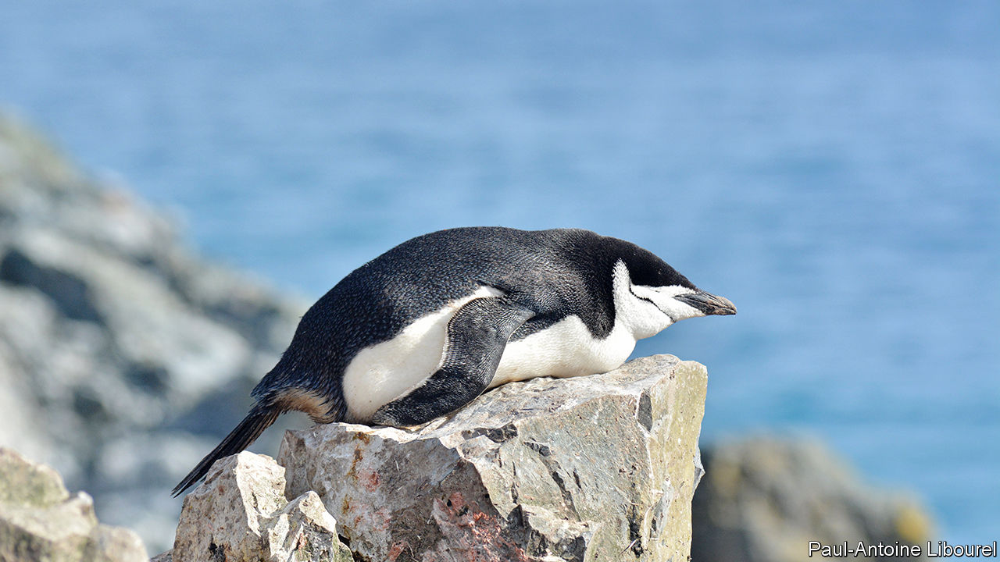

###### Forty thousand winks near the sea

# Why chinstrap penguins sleep thousands of times a day 

##### But only for four seconds at a time 

 

> Nov 30th 2023 

Sleep is a bit of an . A sleeping animal cannot look for food, defend its territory, flee from danger or find a mate. The fact that sleep is nonetheless ubiquitous among animals suggests its restorative powers are essential. So does the fact that, if laboratory animals are deprived of it for long enough, they die.

Some animals, though, try to have their cake and eat it. Dolphins and ducks can sleep with only half their brains at a time, leaving the other half alert. Now a paper in  by Paul-Antoine Libourel from the Lyon Centre for Research in Neurosciences, and Won Young Lee from the Korea Polar Research Institute, reports another ingenious dodge. Chinstrap penguins, it seems, take their sleep in the form of thousands of tiny micro-naps—or at least, they do when they are nesting.

Dr Lee and Dr Libourel were examining penguins on King George Island, just off the coast of Antarctica. Keen to conduct sleep research in the wild, rather than in the confines of a laboratory, the researchers captured 14 penguins. They fitted them with electrodes to record their brainwaves, and fixed movement sensors and GPS trackers to their bodies. Thus equipped, the penguins were released, and their brain activity was tracked remotely for ten days. In addition, some were monitored at their nests by video cameras.

Like ducks, chinstrap penguins can sleep with either their whole brain or with just one hemisphere at a time. (Data from the GPS trackers also confirmed that they can sleep in the middle of the ocean.) But whereas ducks, like most animals, sleep in long chunks, the researchers discovered that, on land, the penguins were nodding off for just a handful of seconds at a time, hundreds of times an hour. The average length of a nap was around four seconds; 72% of them lasted fewer than ten seconds.

Such micro-sleeps are not unknown. Other penguin species do something similar, although they tend to nap for much longer periods. Extremely tired humans can be prone to them, as jet-lagged executives and the parents of newborn babies can attest. But the chinstraps seem to have gone all-in on the idea. When adding up the total duration of naps, the researchers concluded that the birds were getting between 11.5 and 12 hours of sleep each day.

The researchers offer two explanations for the penguins’ staccato sleep patterns. The first is to do with external threats. Penguins often incubate their eggs alone while their partners are away foraging for food, on trips that can last for days. Colonies are menaced by brown skuas, predatory birds that will gladly snatch unattended eggs. Broken sleep may be an evolutionarily ingenious way of catching some shut-eye during long egg-guarding vigils while still remaining able to react to danger.

But that theory is complicated by another of the researchers’ findings. Birds with nests near the edge of the colony ought to be at greater risk than those in the centre. But birds on the edges of the colony seemed to enjoy longer and deeper naps than those that lived near the middle.

That leads to the second suggestion, which is to do with the penguins themselves. Penguin colonies are noisy, crowded places. And threats may come from within as well as without. Chinstrap penguins are not above stealing nesting materials from unwary neighbours, for instance. Birds in the bustling, crime-ridden centre of the colony may simply find it harder to get any shut-eye than those living in the safer, quieter suburbs. 

Choosing between those theories will require more research. (Both, of course, could prove to be true.) Nor could Drs Lee and Libourel measure how restorative the penguins’ interrupted sleep was—although brain recordings suggest the animals’ neurons were spending a few seconds in a quiescent state during each nap. That, and the fact that the birds are evidently able to incubate their young under such conditions, suggests they are getting at least something from their constant nodding-off. Humans nurturing their own newborns should take heart. ■


