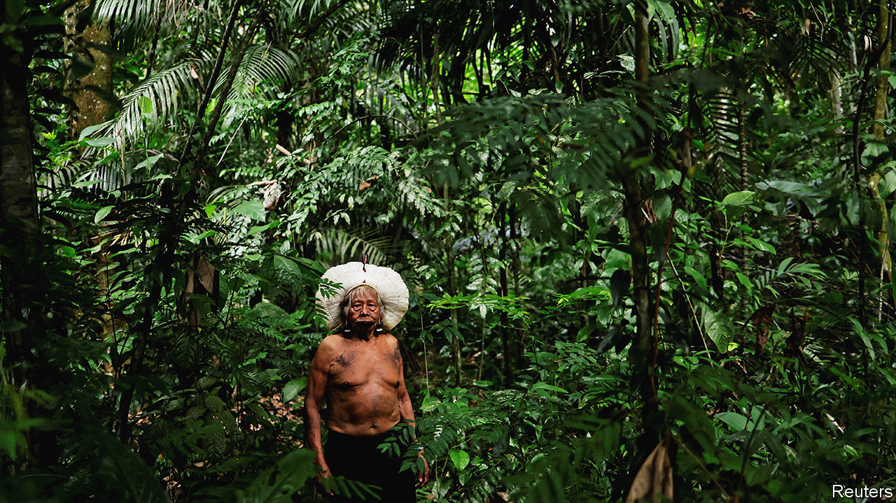
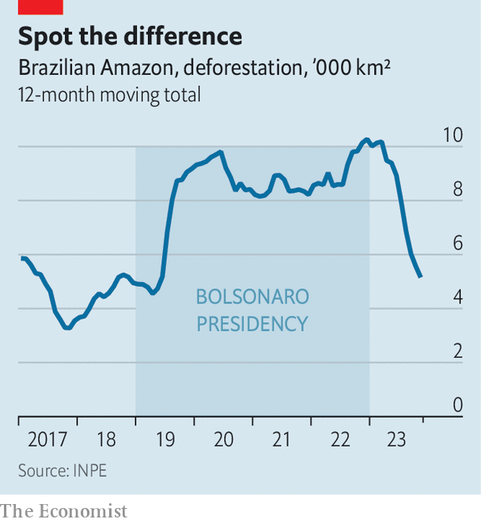
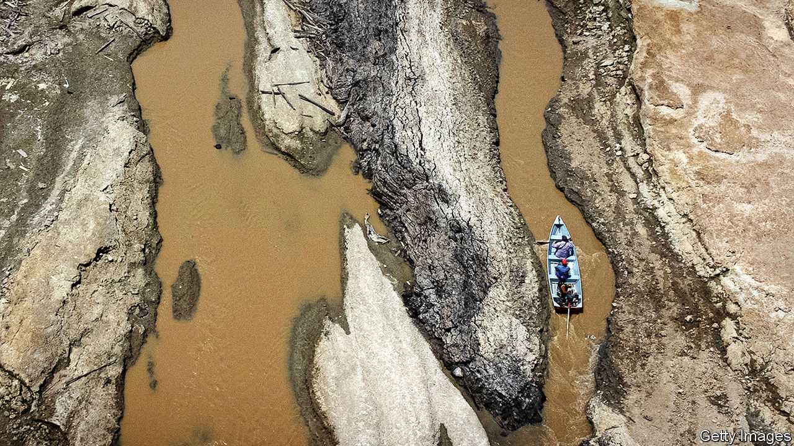

###### Dirty deeds

# To save the Amazon, Lula must work out who owns it 

##### The fight against deforestation is going better. But it needs cash, cops—and a better property register 

 

> Nov 28th 2023 

Along the Madeira river, in the heart of the rainforest, the Brazilian government has been seizing barges and blowing them up. The barges belong to  (wildcat miners) who are searching illegally for gold. They dredge up sediment from the river bed and add mercury, which forms a coating around flecks of the precious metal. Then they burn it off, leaving pure gold and emitting toxic vapour. 

Brazil’s previous president, Jair Bolsonaro, the son of a wildcat miner, made little effort to stop  from polluting the Amazonian ecosystem. Quite the opposite: by consistently backing the loggers, miners and ranchers who are destroying the rainforest, he turned Brazil into a global pariah. His successor, President Luiz Inácio Lula da Silva, is determined to save the Amazon and Brazil’s reputation. Since taking office in January he has been cracking down hard; some would say brutally. 

“They didn’t let us take any of our things away. The fridge, the stove, the beds, the fan—even the clothes. They set off the bomb with everything still inside. They destroyed everything,” says Silvina, whose children’s barge was seized in November. Agents of IBAMA, an arm of the environment ministry charged with protecting the Amazon, ignored the sobbing of women and children as they blew a poor family’s life’s savings to fragments, she fumes. 

Such muscular tactics have had an effect. “Business is bad,” says the manager of a shop selling kit to  in Humaitá, a gold-mining town. The store is almost empty. Hardly anyone browses its pumps, hard hats, plastic pipes, ropes, pulleys and spanners. Artisanal mining in the area has fallen by 70%, he estimates. “We’re terrified,” says João, owner of a barge that has not yet been blown up, a clanking, rickety wooden structure that is steadily poisoning a patch of river where pink dolphins frolic. “Lula is a bad president.”

As such angry reactions suggest, Lula’s efforts to preserve the Amazon are making a difference—as he will boast at the COP28 climate conference this week. The pace of deforestation fell by nearly 50% in the first eight months of 2023 compared with the previous year, according to satellite data from Brazil’s space-research agency, INPE. 

 


This matters. The Amazon contains 40% of the world’s remaining rainforest, and 25% of its terrestrial biodiversity. It is a , so its destruction hastens global warming. Its trees throw up 20bn tonnes of moisture a day into a “sky river”, which then waters both the forest itself and farmland across South America. 

Some 18% of the Brazilian Amazon has vanished so far. Scientists fear it may hit a tipping-point when 25% has gone: the sky river may fail and the forest will no longer be able to sustain itself. That would be a global catastrophe. So reducing the pace of deforestation, though welcome, is not enough. The chainsaws are still biting: 3,700 km (1,400 square miles) of Brazil’s rainforest vanished in the first eight months of 2023. Drought has dried up parts of its rivers, wildfires have broken records and a heatwave has imperilled trees and humans alike. 

Lula has promised to end deforestation by 2030. To succeed, he must : political, practical and economic. But most of all he must grapple with a systemic problem: . Brazil has many sensible federal rules to protect the rainforest, but they are woefully enforced. In areas that rely on mining, ranching or farming to put food on the table, state and local officials often quietly overlook environmental crimes, or issue permits for illicit activities. 

Dumping mercury is illegal, and so is most artisanal mining in the Amazon. Yet Manuel, another  whose barge was also blown up, says he has “documents for the dredger, documents for everything”. The raid that dispossessed him was illegitimate, he insists. He is probably wrong—but he may have convinced himself that he is right. In the Amazon, even the basic question of who owns what is maddeningly unclear. At least 22 federal and other government agencies can register land claims. These agencies “don’t really talk to each other”, says Brenda Brito of Imazon, an NGO. So land-grabbing is rife. By one estimate, there are overlapping claims to roughly half the registered land in Brazil (see map). 


To see what this means on the ground, consider a small village near Lábrea, a town in the west at the end of the Trans-Amazonian highway, which stretches 4,000 km from the coast to the centre of the forest. Two dozen indigenous families live in Novo Paraíso, growing tropical fruits. Their village is in a reserve, where no one is allowed to claim private ownership of the land. Yet outsiders have registered claims inside it and at others nearby. 

Marcelino Apurinã, the village  (chief), says the land-grabbing was especially bad while Mr Bolsonaro was president. Intruders started building dirt roads into the reserve. Farmers from the nearby city illegally staked out plots with posts in a buffer zone around the reserve and started to clear them. Only by appealing to FUNAI, the federal agency that protects indigenous people, were the villagers able to turn the invaders away. 

Part of the problem was political: Mr Bolsonaro encouraged land-grabbers by making it clear that he was rooting for them. As president, he kept a campaign pledge not to designate “one more centimetre” of land as indigenous. He also cut the budgets of agencies charged with protecting indigenous people. But even with Mr Bolsonaro gone, the problem is not resolved. The dodgy land claims in reserves like Mr Apurinã’s remain on the books. 

In June, when Lula relaunched a plan to save the rainforest, it included a push to regularise land titles. He vows to integrate the various land registries into a coherent system and use satellite data to spot illegal activities. This, combined with beefed-up law enforcement and economic help for residents of Amazonian states, is supposed to end deforestation by 2030. 

It is a monstrous task. In a recent report, the World Bank cites a number of distortions that make it harder. One is “undesignated land”. Roughly 42% of the Brazilian Amazon is classified either as a protected area or as an indigenous reserve. Another 29% is privately owned, with owners required to conserve 80% of the forest on their land. However 29% (1.2m km, or almost twice the area of Texas) is “undesignated”, meaning it is public land but has not been confirmed as a reserve or designated for any other purpose. Such lands are “the main deforestation hotspots”, says the bank. Some 116,000 km of undesignated terrain had been claimed as private property as of 2020, though this is not legal. 

Land tenure is weak more or less everywhere in the rainforest. Private owners often lack title deeds, even for land the government designated to them back in the 1970s (when it was a military dictatorship). This makes it tougher to enforce environmental laws, since it is often unclear who is responsible for a given slice of forest. It also invites land-grabbers to use brute force. At least 47 people were killed in rural clashes in 2022, according to the Pastoral Land Commission, another NGO.

Another distortion is a perverse system of taxes and handouts. A complicated land tax called the ITR is easy to cheat and encourages farmers to cultivate more of their land than they otherwise would, even if that means clearing forest. Farm subsidies are smaller in Brazil than in many other countries, at 0.35% of GDP, but go disproportionately to cattle ranchers in the Amazon. World Bank number-crunchers have shown that the more forested a state is, the higher the share of credit subsidies that goes to cattle-farmers. Such handouts make farmland more valuable, and so offer an incentive for people to create more of it by slashing and burning the forest. 

When states sell public forest land to private actors, they do so cheaply. On average in 2019, they charged 15% of the market rate. Even the federal government charged only 26%, according to a paper by Dr Brito and others. The state of Tocantins sold land that year for an average of about $1 a hectare, when it was worth more than $2,000. In the past, people who have illegally occupied land have been allowed, after a number of years, to obtain formal title at giveaway rates like these. This encourages small-time squatters and big ranchers to move onto unclaimed or thinly populated land, in the hope that the state will let them buy it cheaply. Many officials in the Amazon approve. An idea persists that the rainforest is a frontier to conquer: what the old military regimes called “a land without men for men without land”.

They came, they sawed, they conquered

More broadly, law enforcement is so lax that even blatant crooks often get off scot-free. You do not have to drive far along the Trans-Amazonian highway to see side tracks carved out by illegal loggers, or to smell choking clouds of smoke, where farmers are clearing new fields with flames. Eduardo Rachid, the manager of a shop in Lábrea that sells saddles, bovine medicine and other farm supplies, confirms that trade is “very busy”. Skilled farmers from neighbouring states are flocking to the area for cheap land, he says.

 


In theory, meat raised on recently deforested land cannot be sold. Certainly, supermarkets in Europe are wary of Brazilian beef. But most of it is sold in Brazil, where the illicit variety is easy to launder. A tracking system records only the last place a cow lived, so an illegal farmer can simply sell his cattle to a legal one, who then sends them to the slaughterhouse. A cattleman in Pará, a northern state, says he has no way of knowing whether the cows he buys at auction were legally raised. 

Another trick for steak-scrubbing, says a cattle-farm labourer near Lábrea who wishes to remain anonymous, is for a butcher to buy a legal cow and keep the official stamp on its skin in his freezer. He can then produce it when an inspector calls and pretend that the illegal joints he is selling are from that legal cow. 

Lula is trying to sort out some of this legal mess. Marina Silva, his environment minister, says the first step is to study all the undesignated land and work out which parts should be indigenous reserves or conservation areas. Such areas “will no longer be used for deforestation”, she told . A technical committee, whose work was frozen under Mr Bolsonaro, has gone back to work. Some 30,000 km are on the verge of being designated, she says, and another 68,000 km are being evaluated. Since January Lula has issued decrees recognising eight indigenous reserves. The ultimate goal is to integrate all the existing land registries to prevent overlaps, says Ms Silva, and to make the system transparent for everyone. 

The snag is what Ms Silva calls a “complexity” in “the willingness of states…to participate”. Some state governments are “resistant”. This is hardly surprising. The power to allocate land to people who can exploit it, against the wishes of a conservation-minded federal government, is not one that  governors will surrender without a struggle. 

Meanwhile, federal lawmakers from the rural caucus, who are friendly to farmers, loggers and miners, are trying to push through a bill that would curtail indigenous land rights. A crucial clause bars the recognition of land as indigenous if the tribes in question cannot show they were occupying it in 1988, the year Brazil’s constitution was signed. The Supreme Court ruled this clause unconstitutional, and Lula vetoed it. But Congress may yet overturn his veto. The politicians blocking reform are responding to economic forces. It is not just that big, land-hungry farmers bankroll them, although they do. It is also that the little guys who make a living by damaging the rainforest also vote. 

Manuel, the wildcat miner whose barge was blown up by federal agents, says he voted for Lula last year because he remembers the generous welfare programmes from his first term in office. It never occurred to him that a pro-worker president would shut down his business. Now he is furious. “They treat us like bandits,” he says. And “now there’s nothing to eat.”

Miners who cannot mine will find other ways to make a living. In the Amazon, opportunities are scarce. Even main roads are often unpaved, a problem Lula has suggested he will solve, despite objections from environmentalists. Locals are poorly educated. Two-thirds of ten-year-olds in the Amazon cannot read a simple sentence, compared with half in Brazil as whole. Poverty is widespread. Many of the  whose barges were destroyed went to work on farms in the rainforest, says the mine-shop manager in Humaitá. 

Mr Apurinã, the indigenous chief, seems to offer an example of how people can live sustainably in the forest. His village grows açai, bananas, pineapples that make exquisite juice and cupuaçu, a fruit that is used in posh cosmetics. A charity has taught them not to monocrop. Once a week they sell forest products in town. But it is hard work, for modest rewards, in ominously rising temperatures. “You used to be able to work all day. Now you can only work for half the day, because the sun is stronger,” he says. Being near a town, the villagers are aware of manufactured luxuries. Mr Apurinã sports an impressive head-dress of parrots’ feathers and a necklace with a jaguar’s tooth on it. But he also appreciates the comfort of a cotton T-shirt, the practicality of gumboots and the convenience of plastic bottles. He is content to live a hybrid lifestyle, largely traditional but trading with the modern world. 

What’s the alternative?

However, not every indigenous Brazilian feels this way. “Lots of them” have gone to work on big farms, says Mr Apurinã. He estimates that people in his village make around 50-60 reais ($10-12) a day. Big farms pay 80-100. Some indigenous folk “want to make money quickly”, he says. Growing your own crops takes time. When you work for someone else, by contrast, “the boss can always give you money straight away.” The lure of quick cash impels some locals to accept jobs that are illegal. A farmer hired dozens of men with chainsaws and paid them fat wages to clear a swathe of rainforest, says a local driver. Drought has made fishing harder, says Jean, a fisherman, so lots of people from his neighbourhood have gone to work in the new pastures that are being carved out of the forest. 

The value to the world of preserving the Amazon is immense. Estimates vary widely, but even a conservative one from the World Bank puts it at $317bn a year, seven times more than the value that can be extracted from the rainforest by logging, farming and mining. However, the benefits of conservation are spread all over the world, whereas the profits from deforestation go directly to the men organising the chainsaw gangs, with benefits spilling over to local economies. Changing those incentives will require both external financing and smart ways of doling out the cash. 

Lula wants foreigners to contribute. On November 13th his finance ministry issued $2bn of green bonds. A donor-backed Amazon Fund has raised $1.3bn. “This is very little in the face of the need, but it is a pioneering instrument,” says Ms Silva. At the COP this week, Lula is sure to ask for more. 

The battle to save the Amazon is a balancing act. Ugly compromises are inevitable. If Lula pushes too hard, he may provoke a backlash and lose the next election to a logger-hugging opponent. But if he does not push hard enough, the goal of ending deforestation by 2030 will remain out of reach. ■


