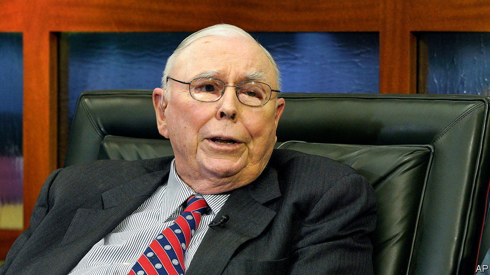
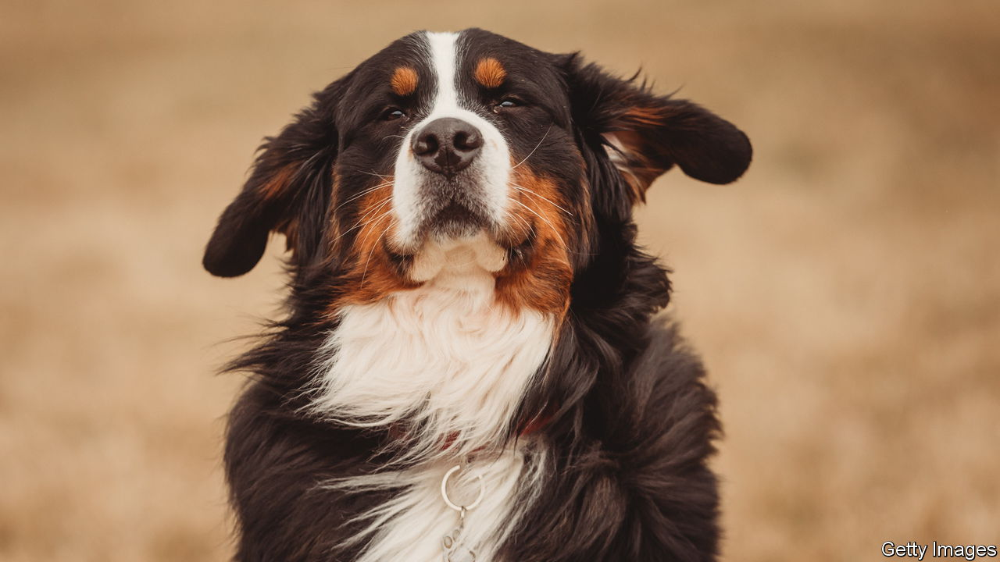

###### The world this week

# Business 

#####  

 

> Nov 30th 2023 

Tributes were paid to , who died aged 99. Mr Munger was Warren Buffett’s long-standing partner at Berkshire Hathaway. Their friendship stretched back to Mr Buffett’s first investments in the 1950s. Mr Munger joined the holding company’s board in 1978. Mr Buffett credited Mr Munger with breaking “my cigar-butt habits” and driving company strategy, once telling shareholders that he was merely the contractor while Mr Munger was the architect of the business’s growth. 

The sun shines for Shein

, a fast-fashion retailer, has filed for an initial public offering in America, according to reports. Shein’s cheap clothing range is hugely popular; its sales are comparable to those of H&amp;M and Zara. America is its biggest market and Shein’s website is almost as in demand as Amazon’s among teenagers. The company was founded in China but now has its headquarters in Singapore. That might smooth the process for what could be the biggest stockmarket flotation of a Chinese-origin firm since Didi Global’s ill-fated IPO in 2021. 

, the Chinese company that owns TikTok, is reportedly pulling out of the mobile-gaming business. Its Nuverse division accounts for only a fraction of its revenues and is being wound down. 

 grew in October by 1.4%, year on year, the first increase since April 2022. Shipments to mainland China were up by 5.6%, which was taken as an optimistic sign that regional trade is on the road to recovery. 

The annual inflation rate dropped to 2.4% in November from 2.9% in November. That puts more pressure on the European Central Bank to hold interest rates steady, if not cut them. Before November’s figure was released Christine Lagarde, the president of the ECB, said that “This is not the time to start declaring victory” against inflation, as there was considerable uncertainty about future movements in prices. 

Tesla prepared the first deliveries of its long-delayed . Initial orders for the vehicle were placed before the start of the pandemic but production has been plagued with problems. Elon Musk has described the SUV as a “badass, futuristic armoured personnel carrier” and “intentionally an insane technology bandwagon”. Tesla doesn’t expect to make a profit from it for at least 18 months. 

 and AESC, its battery-making partner, are investing another £2bn ($2.5bn) making electric cars and batteries in Sunderland, a deprived city in England’s north-east. The investment includes a new gigafactory. The news was welcomed by the British government, which has made more money available to support battery manufacturing. The factories will add 20 gigawatt hours of battery capacity annually by 2030. 

, Britain’s biggest chain of chemists, sold its £4.8bn ($6.1bn) pension scheme to Legal &amp; General, a financial-services firm. The deal opens the way for a potential sale of Boots by its owner, Walgreens Boots Alliance. The American company tried, and failed, to sell the business last year. 

The European Union’s antitrust commissioner lodged a formal objection against  proposed acquisition of , claiming the deal “may restrict competition in the market for robot vacuum cleaners”. Amazon announced the takeover in August 2022. America’s Federal Trade Commission, which launched a wide-ranging antitrust lawsuit against Amazon in September, is also investigating the proposal. 

Another potential tech takeover also received a setback when Britain’s Competition and Markets Authority decided that  offer to buy , an online service used by designers to develop apps and websites, could harm the digital-design industry. Adobe has offered $20bn for Figma. Critics of the deal claim the software giant is trying to squash a potential rival. 

Pet project

 


America’s Food and Drug Administration accepted a “reasonable expectation of effectiveness” application from Loyal, a firm in San Francisco, for its candidate. This is the first time the administration has officially recognised the possibility that a drug intended for any species might have general lifespan-extending properties.

A record summer helped propel  to its first annual pre-tax profit since the start of the pandemic. It has reinstated its shareholder dividend, making it one of the first big European airlines to do so.

Saudi Arabia’s sovereign-wealth fund is buying a 10% stake in . Ferrovial, an infrastructure company, is selling its 25% holding in the airport. Ardian, a French private-equity firm, is buying the other 15%. 

A Virgin Atlantic 787 made the world’s first commercial flight powered completely by . The plane burned a fuel blend that was 88% waste fat (from cooking oils and food scraps) and 12% synthetic kerosene made from plant sugars. The aircraft flew from London to New York. It did emit carbon, though the emissions over the fuel’s life cycle were 70% lower than those that power a regular flight. Greens contend that the only way to reach climate targets is to fly less. 

