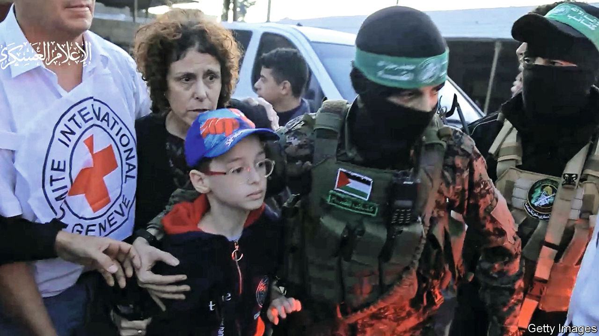
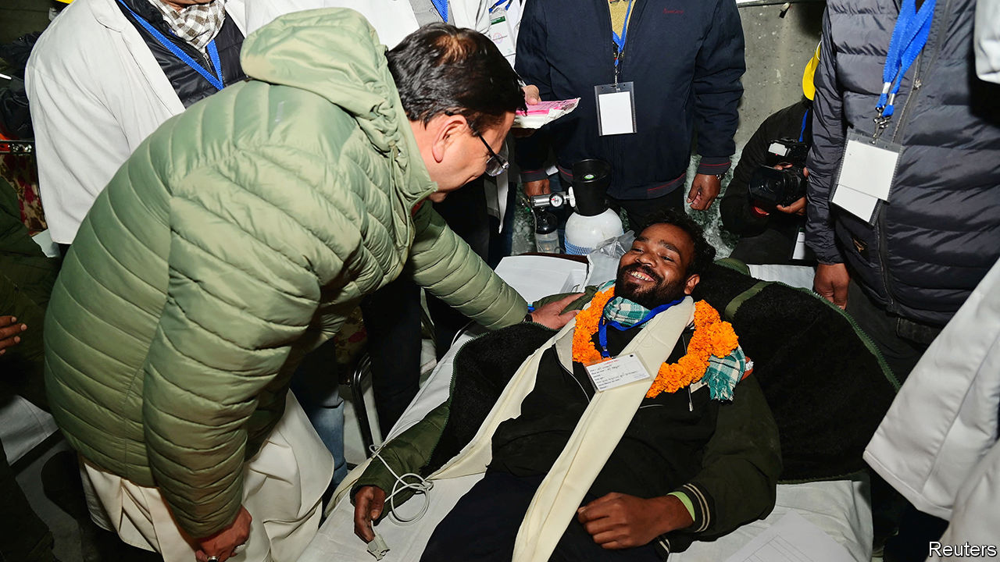

###### The world this week

# Politics 

#####  

 

> Nov 30th 2023 

Antony Blinken, America’s secretary of state, went to to press for more extensions to the ceasefire in Gaza. Under the truce  has released Israeli hostages in exchange for Palestinian prisoners in Israel. During the week William Burns, the director of the CIA, and David Barnea, the head of Mossad, Israel’s intelligence agency, went to Doha to hold talks with the Qatari prime minister and Egyptian officials about the hostages. The Americans want Israel to prolong the ceasefire. Israel’s government is insisting that the war against Hamas must resume soon. 

The annual climate summit convened by the UN got under way in Dubai.  is being attended by 70,000 climate advocates, diplomats and journalists, though Joe Biden is skipping this one (he attended the previous two COPs as America’s president). The three main battles at the 12-day gathering are cracking down on methane emissions, reaching a deal on climate finance and finding a path to end the use of fossil fuels. 

An attack on a prison in Freetown, the capital of , killed 20 people, including 13 soldiers, and freed 1,890 inmates. The country’s information officer described the assault as a failed coup directed by bodyguards loyal to the former president. 

Volodymyr Zelensky said his government would reform the system for mobilising troops in . The president did not disclose details, but the recruitment process has been plagued by draft evasion and corruption. Ukraine said that Russia was , and had carried out its biggest drone assault on Kyiv since the start of the war. Meanwhile, the wife of Ukraine’s military intelligence chief was poisoned. 

 shut its entire border with  for two weeks to stop what it claims is an organised attempt by Russia to ferry illegal migrants across the frontier. The Finnish prime minister, Petteri Orpo, described it as “Russia’s influence operation”.

Negotiations began in the to form a new government after the election victory of the far-right Party for Freedom (pvv), led by Geert Wilders. Mr Wilders is trying to determine which parties will enlist in a coalition, a tricky task given that the mainstream conservative party has ruled out joining him in government, though it has suggested it would support a centre-right cabinet. 

 prime minister, Leo Varadkar, said he would tighten the country’s laws against incitement to hatred “and hatred in general”. He was responding to a rare spate of rioting in Dublin that was sparked by the non-fatal stabbing of three children and a school assistant by a man of Algerian origin. 

Dead government walking

The Polish president, Andrzej Duda, swore in a new government formed by the Law and Justice (PiS) party. The government is expected to last just two weeks. PiS won a minority of seats in  recent election. A coalition led by Donald Tusk, a former prime minister, gained the most seats and will vote the government down when it presents its plans to parliament. Mr Duda hails from the PiS.

Downing Street became embroiled in a diplomatic row when it cancelled a meeting between Rishi Sunak, the British prime minister, and his Greek counterpart, Kyriakos Mitsotakis, claiming that Mr Mitsotakis had broken a promise not to raise the thorny issue of the  in public during his visit. The Greeks denied that he had made such a promise. 

Tens of thousands of people marched in against antisemitism, the city’s biggest demonstration in support of Jewish people since 1936. The previous day another large protest was held calling for a ceasefire in Gaza. 

Mass demonstrations took place across  to protest against violence against women. The murder of a college student by her former boyfriend has brought the issue to the fore in a country where 105 women have been murdered this year, more than half at the hands of a current or former partner. 

Prosecutors in  charged an Indian national with trying to arrange the assassination in New York of a leading proponent of a separate state for Sikhs in. The reported target, Gurpatwant Singh Pannun, is one of the leaders of the Khalistan movement. Mr Pannun describes himself as a dual American-Canadian citizen. Two months ago Canada claimed that Indian agents had murdered a Sikh separatist in Vancouver. 

 


All 41  who were trapped in a tunnel in the Indian state of Uttarakhand were rescued. They had been cut off for 17 days when the tunnel, part of a construction project connecting four holy Hindu sites, collapsed. 

 new right-wing government said it would overturn a ban on smoking introduced by the previous left-wing administration. The ban was the first in the world to outlaw gradually the sale of tobacco products to future generations, starting with anyone born after 2008. The law was due to come into force next year. The government has suggested it needs the revenue from tobacco sales to fund tax cuts.

The government of the  is to restart peace talks with the country’s communist rebels, six years after negotiations were abandoned. Norway is facilitating the talks to end a conflict that has lasted five decades and killed 40,000 people.

A 48-year-old man was charged with the attempted murder of three students of  descent in the town of Burlington, Vermont. Two of them were wearing a , a Palestinian headdress, when they were shot. 

An illiberal college education

The  was sued by the Brandeis Centre, a Jewish watchdog, for an alleged “long-standing, unchecked spread of antisemitism” on Berkeley’s campus. The centre says that since the October 7th terrorist attack in Israel, antisemitism “has run rampant at the school.” It is the most prominent such claim to be filed against an American college so far. Three Jewish students lodged a legal complaint against New York University in early November. 

Almost 50,000 Americans killed themselves last year, according to preliminary statistics. At 14.3 per 100,000 people the  rate was the highest since 1941. Men accounted for almost 80% of the deaths. 

, one of the world’s most powerful statesmen during the 20th century, . Mr Kissinger fled Nazi Germany to become America’s top diplomat and one of the architects of foreign policy on Vietnam and the cold war. In a recent interview he said that Hamas’s terrorist assault on Israel and Russia’s war in Ukraine were a “fundamental attack on the international system.”

