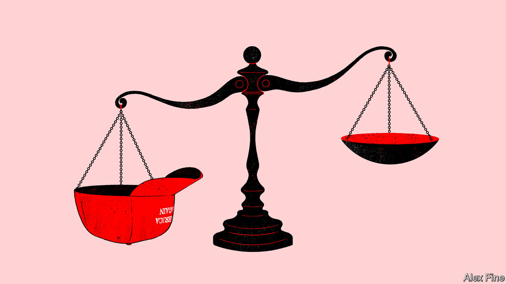

###### Trumpier than thou

# A MAGA court in New Orleans is shaping the Supreme Court’s agenda 

##### The Fifth Circuit Court of Appeals makes SCOTUS look moderate by comparison 

 

> Nov 30th 2023 

IN THE 1990s Joseph Overton came up with a metaphor for the spectrum of tolerable political views. Taking positions not found within the “Overton window”, he warned, puts you outside the bounds of acceptable opinion. But the centre does not hold: an idea seen as beyond the pale today might appear within the frame tomorrow. And as the zone shifts, positions that were once on the fringes of acceptability become more palatable.

Overton applied his aperture to politicians, not to courts. But 20 years after the libertarian think-tanker’s death in a plane crash, the Overton window is an apt way to understand the most enduring (and evolving) impact of Donald Trump’s presidency: the federal judiciary’s sharp right turn.

The 6-3 conservative majority on America’s highest court, forged by the three justices Mr Trump appointed between 2017 and 2020, is only part of the story. The 45th president seated 27% of all active judges on federal district courts—the 94 trial courts that dot America. He also replaced 30% of judges on America’s 13 circuit courts of appeal. Unlike the Supreme Court, which picks its cases (and in recent years has heard just 60 or so per term), circuit courts are obliged to review, with few exceptions, district-court decisions that the losing party seeks to appeal. These cases number in the tens of thousands annually. 

Since only a tiny fraction of circuit-court decisions reach the Supreme Court, the mid-level players in America’s judiciary exercise tremendous power. Often three-judge appellate panels have the final word in the region of the country where they have jurisdiction. By managing to invert the ideological make-up of several circuit courts—including the previously liberal-dominated Ninth Circuit, which covers California and eight other western states—Mr Trump pushed the law to the right in large swathes of America.

Nowhere is Mr Trump’s thumbprint on the judiciary deeper than in the Fifth Circuit Court of Appeals, the tribunal based in New Orleans that handles appeals from Louisiana, Mississippi and Texas. Active Republican appointees outnumber their Democratic-tapped colleagues by 12 to four. Half of that supermajority was named by Mr Trump. In case after case, Fifth Circuit judges have situated themselves well to the right of the Supreme Court. Some of Mr Trump’s appointees seem bent on ripping the Overton window out of its casement and, in the estimation of Melissa Murray, a law professor at New York University, installing “Overton French doors”.

Of the 45 cases the Supreme Court has agreed to hear thus far for the term that began in October, nine arise from the Fifth Circuit—more than from any other federal appeals court. Raffi Melkonian, a lawyer who practises in Texas and clerked for a Fifth Circuit judge, said he did not remember the court being “constantly in the spotlight” before. Today’s court is “definitely more aggressive” and now frequently “gets the attention of the Supreme Court”, aided by cases reaching it from similarly confrontational judges in district courts.

Steve Vladeck, a law professor at the University of Texas at Austin, says that cases coming up from the Fifth Circuit are not only numerous but also “ideologically charged”. He notes that President Joe Biden’s administration is a party in six of them this term. 

The Supreme Court, more often than not, is clipping the Fifth Circuit’s wings. According to Adam Feldman, who compiles statistics on the courts, Fifth Circuit rulings were reversed 15 times (and affirmed only seven times) between 2019 and 2022. Of the nine decisions the Supreme Court reviewed in its previous term, it reached the same conclusion as the Fifth Circuit only twice and rebuffed its reasoning in cases involving immigration, student-loan forgiveness and Native American rights, among others. Mr Vladeck points out that the court has been no friend to the Fifth Circuit on the emergency or “shadow” docket, either—citing recent orders involving social-media moderation and mifepristone, an abortion medication.

The justices unwrapped another novel Fifth Circuit package on November 29th in  The SEC is constitutionally deficient in three ways, the appeals court found, and has too much power to punish alleged fraudsters. In contrast to their apparent disagreement with the Fifth Circuit in other cases, the six conservative justices sounded sceptical of how the SEC exercises its authority in Wednesday’s oral argument.  may be one prominent case in which the Supreme Court agrees with their junior peers in New Orleans. 

Still, Ms Murray, Mr Melkonian and Mr Vladeck suspect that several of the highest-profile cases on this term’s docket may not go the Fifth Circuit’s way. A deep challenge to the Consumer Financial Protection Bureau, which three Trump-chosen judges blessed last year, did not seem to attract majority support among the justices at the oral argument in October. 

The über-conservative judges in New Orleans may be disappointed in how their recent gun-rights ruling fares at the Supreme Court, too. In  the justices are considering whether the Fifth Circuit was right to strike down a firearms ban for domestic abusers who are subject to restraining orders. Few if any justices seemed amenable to such a conclusion on November 7th. But Judge James Ho, a Trump appointee, made an unusual supplemental appeal to the high court on November 17th. In a case having nothing to do with the right to bear arms, Mr Ho wrote a concurring opinion to note that the dispute “reminded” him of . He proceeded to recapitulate his position in an apparent last-ditch effort to encourage his higher-ups to stick to their guns.

For Mr Melkonian, “the interesting question is what the Fifth Circuit will make of these reversals over time.” The more bombastic jurists like Judge Ho and Judge Kyle Duncan (who seemed to enjoy the brouhaha when he was shouted down last spring at an event at Stanford Law School) show no sign of being chastened. Mr Vladeck speculates that by “embracing extreme legal arguments and repeating right-wing rhetoric and talking-points” they are “all-but auditioning for a promotion during the next Republican administration” should Supreme Court vacancies arise.

But the conservative justices also stand to benefit from outlier rulings floating up from the Fifth Circuit, Ms Murray reckons. The Supreme Court may be “hailed as heroes” for slapping down some radical positions. But by sometimes endorsing those theories, or only narrowly reversing them (as the court did in an abortion case in 2020), the justices can “move the law subtly to the right” thanks to the Fifth Circuit’s boldness. The outside-the-box rulings and rhetoric of Mr Trump’s most MAGA judges, she says, are the “muscle” that facilitates the more genteel Supreme Court’s steady rightward march. ■


