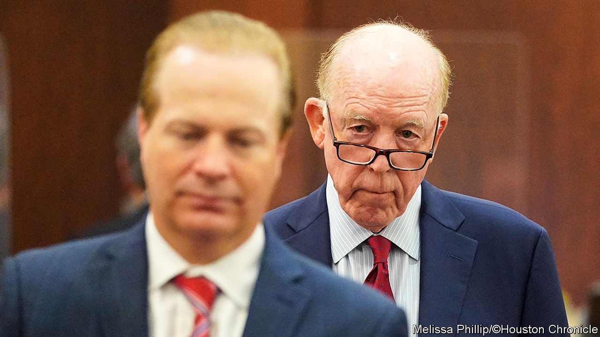

###### An affordable dare act

# A key part of Obamacare is in jeopardy 

##### A God-fearing Texas tycoon is challenging it 

 

> Nov 30th 2023 

Political mega-donors are an eccentric lot, but even among them Steven Hotze stands out. The Houston doctor got rich by hawking hormone therapies for all sorts of ills. Motivated by outlandish beliefs—birth control makes women less attractive to men and homosexual activists are “termites” who nibble away at society, to name but two—he used his money to buoy Bible-thumping politicians. When Congress passed the Affordable Care Act in 2010, to expand health-insurance coverage, the hormone magnate filed lawsuits against it and released a pop-techno song, “God Fearing Texans Stop Obamacare”. 

Not long ago repealing Obamacare was a rallying call of the Republican Party, which lamented that premiums had risen and forcing Americans to buy coverage or pay a penalty was unjust. Yet despite more than 2,000 court challenges the law stayed mostly intact. In the three years to 2016 the number of uninsured Americans dropped from 44m to 27m. When Donald Trump took office and Republicans controlled Congress, lawmakers failed to nix Obamacare. On November 25th Mr Trump threatened to try to scrap it in a second term. Members of his party rebuffed him: most have given up. The Republican front-runner and Mr Hotze have not.

In 2020 Mr Hotze’s company challenged part of the law that requires health insurers to pay for preventive care. The plaintiffs’ argument in is twofold. First, they say the panel of experts that chooses which services must be covered is unconstitutional because its members are not appointed by Congress. Second, they claim that forcing insurers to pay for medicines like contraceptives and pre-exposure prophylaxis, an HIV pill, violates their religious rights. 

A judge in northern Texas ruled in their favour last March. The federal government appealed and the case is now pending in the Fifth Circuit, the most conservative appeals court in America. Legal experts expect it to end up in the Supreme Court. 

If the preventive-care provision is struck down, as many as 152m Americans could have to pay for check-ups and medicines they now get free. Screenings for anxiety and depression, all sorts of cancers and sexually transmitted diseases would probably require copayment. So would counselling for domestic violence and alcoholism. 

According to a Morning Consult poll, at least two in five Americans would forgo preventive services if they had to pay. A study from Yale University found that removing the requirement would lead to 2,000 more HIV infections each year. Democratic states are hustling to codify the requirement for insurers to cover preventive care into state law.■


