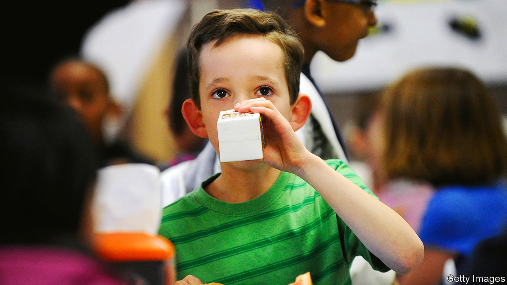

###### A full-fat fiasco

# A national milk-carton shortage sours America’s dairy industry 

##### Who’s to blame for an embarrassing packaging problem? 

 

> Nov 30th 2023 

“THEY KEPT saying, ‘oh, it’s going to be coming’,” remembers Scott Stoner of Cream-O-Land, a dairy supplier. It was early September, just as many schools in America’s north-east were reopening after the summer break. He had not received deliveries of milk cartons. He quickly used up all his stock. 

Cream-O-Land and many other dairy processors have run out of, or have a severe shortage of, half-pint (237ml) and 4oz cartons. Milk itself is not lacking. The problem is with the size of cartons used by care homes, hospitals, prisons, cruise ships and schools. 

School districts are scrambling. Federal regulations created by the Department of Agriculture (USDA) require milk to be offered at school during breakfast and lunch. Programmes that go back to the 1950s were designed to improve children’s nutrition. For some pupils, school is the only place they receive dairy food. Districts are reimbursed for each half-pint of milk offered to pupils at low or no cost. They also provide a handy outlet for agricultural surpluses. Milk can arrive in schools as quickly as 72 hours after leaving the farm. 

Because of the carton shortage the USDA and many states have loosened their requirements. Schools can now serve milk out of jugs. Districts are stocking up on cups and lids. Some schools are offering juice. 

Suppliers are exploring alternatives, too. Mr Stoner is experimenting with suppliers which do not usually make milk cartons. Ensuring the container is properly sealed is proving tricky. He is researching milk bags, already available in Florida, but worries about children playing with them and spilling milk. Meanwhile he is delivering milk in cartons from competitors, with their logos. 

Chris Tague, a New York lawmaker, called the packaging shortage a “national crisis”. Farmers are worried how the supply-chain problems might affect milk prices. Chuck Schumer, the Senate majority leader from New York, has called for an investigation into the shortage. “Feds can’t skim this problem,” he said. 

Why the shortage? Cream-O-Land’s carton supplier, Pactiv Evergreen, which calls itself the market leader, blames higher-than-usual demand. Dairies use the summer to stock up. This supposedly did not happen this year. Dairies disagree, seeing no changes in demand or inventory. Other packaging firms are busy because Pactiv Evergreen’s customers are begging for cartons. 

To fix things, Pactiv Evergreen says it has upped its output. It has also resurrected a defunct generic brand and will use its design for all cartons, rather than interrupting the line to change logos. This should speed production and increase capacity by 10%. Shipments are expected to begin in early December. 

The shortage may sour customers’ already declining interest in cow milk. Plant-based varieties—such as almond milk—are taking space in the dairy aisle. In each of the past five years the milk-carton market has shrunk. No use crying over that. ■


