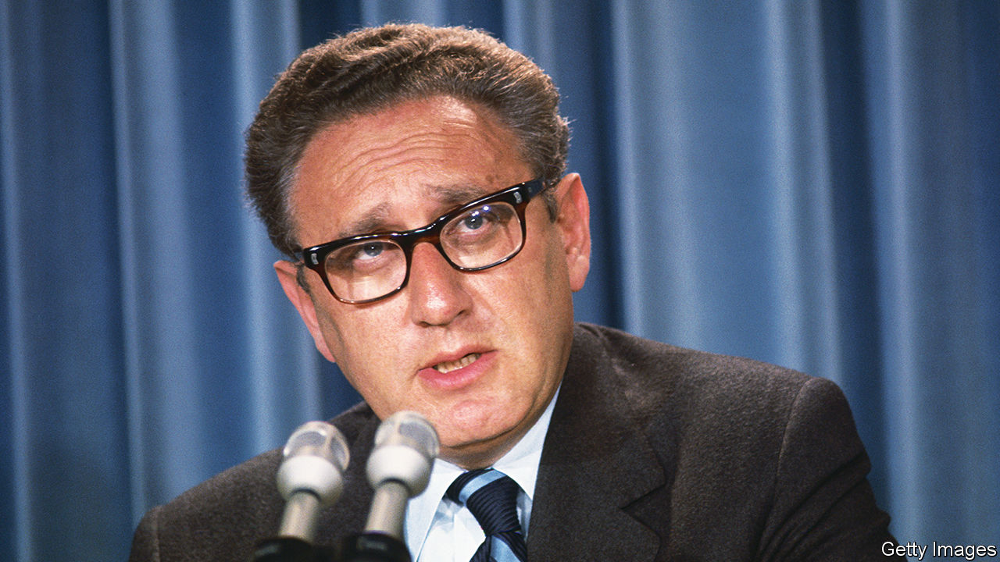

###### Super K

# Henry Kissinger never quite belonged where he wanted to be 

##### The doyen of American statecraft died on November 29th, aged 100 

 

> Nov 30th 2023 

Early in june 1970, soon after America had invaded Cambodia,  secretly visited Brian McDonnell, a 27-year-old peacenik he had spotted in Lafayette Park opposite the White House. It was one of his many efforts that year to persuade his younger critics that they should give war a chance.

As with so many others, he failed with Brian, but they stayed in touch. While Richard Nixon sulked in the West Wing, his national security adviser and the long-haired activist would meet from time to time to talk about the war and the philosophy of Kant, struggling,  wrote, “to fashion at least a temporary bridge across the mutual incomprehension”. He never lost the belief that he could win over his critics. And not just the movers and shakers, but also those far from the cover of  and out of range of the Oval Office microphones. By arguing and arguing some more, he was asserting that he belonged and that he counted.


He had started as an outcast, growing up in pre-war Germany among people who despised and rejected him for being a Jew. The Nazis sacked his father from the public high school in Fürth, near Nuremberg. His mother was the first to grasp that the “Hitler State” held no future for her children. In 1938, 15-year-old Heinz, as he was then, fled to America with his family. He never shed the accent; his voice, like gravel in a goldfish-bowl, added deeply to his seriousness. But his younger brother Walter learned to speak like a regular American, claiming later to be “the Kissinger who listens”.

Even his detractors admitted he had a brilliant mind. His undergraduate thesis was so profuse, at 383 pages, that it supposedly led Harvard to introduce the “Kissinger rule”, limiting students to less than half that length. His doctorate examined how diplomacy sustained stability in Europe for the best part of a century after Napoleon’s defeat. When he entered Nixon’s administration 15 years later, the insights he had gained from studying Castlereagh and Metternich would help him grapple with the roiling ambitions of the United States and the Soviet Union.

His style was to work outside the official machinery of the State Department and the foreign service, which he thought had sapped American diplomacy of its vigour and creativity. “Back-channels” with the Russians, the Chinese and just about everyone else suited Nixon’s taste for conspiracy. And they suited his own yearning to be at the centre of the action, pulling the strings. 

Of course, deception played a useful part, in big matters as well as small. When his team grumbled that they had no dining privileges at the White House, he let them think it was all the chief of staff’s fault. In fact, it was his own idea. He didn’t want his people forging links over lunch with useful contacts outside the National Security Council. Although he was too clever to lie outright, he led people astray. Shimon Peres, an Israeli sparring partner, admiringly called him “the most devious man I have ever met”. 

Never did he fall into Castlereagh’s trap of losing his self-belief. He cut ties for a while with Walter Isaacson over his wretched book, with its psychologising and its cheap gibe that Dr K surely felt that even his own three-volume autobiography did not quite do justice to his achievements. 

Plenty of aides may have left his service, but many stayed loyal because on the most important questions of the day he was not only penetrating, but he also let them have their say. And nowhere did he face more questions than the realignment of American foreign policy amid the ruins of the Vietnam war. 

By 1972, America was vulnerable: humiliated abroad and divided at home. His answer was to exploit growing antagonism between the Soviet Union and China to create a new equilibrium in which each looked to America to bolster its position. Later, he shuttled between Egypt and Israel to supplant the Soviet Union with America in the Middle East. It was a piece of statecraft worthy of his 19th-century heroes. He had put America back in the driving-seat just when everything was against it.

What thanks did he get? The doubters and intellectuals said he had sacrificed America’s principles and over a million lives. He had fought on in Vietnam and taken the war to Cambodia and Laos for the sake of American “credibility”. He had blessed a Pakistani genocide in what became Bangladesh, because Pakistan was helping him with China. He had plotted coups and assassinations in Chile and an insurgency in Angola, because he thought countries would fall like dominoes to Soviet plots. When he won the Nobel peace prize in 1973, Christopher Hitchens, a British journalist, said he should have been tried for war crimes—and the charge stuck.

Triangle man

He was comforted that this was the minority view. Magazines and tv hosts laughed at his jokes and feted him as “Nixon’s secret agent” and “the Super Secretary”. He took pains to be photographed with beautiful women. If anyone belonged in the pantheon of Washington power-brokers, it was the boy from Fürth.

Despite his relentless efforts, though, the criticism endured. It was bad enough that the left condemned him as immoral, but the right came to see his desire to engage with China and Russia as suspicious, un-American, values-free realpolitik. None of them grasped that his overriding goal was to avoid at any cost a world war like the one that had driven him out of Germany. 

And so that burst of diplomacy in 1969-77 was the only time he served in government. No Kissingerian foreign-policy machinery remained when he left. He went on to make a fortune and was everyone’s idea of an elder statesman. In China he became a superstar. In his late 90s he collaborated on books about the qualities of leadership and about the dangers of artificial intelligence, which he worried would be the end of the Enlightenment. It was as if he now saw himself as the wise guardian of human civilisation. But in the innermost sanctum of American power, where he most craved to be, he never again quite belonged. ■


