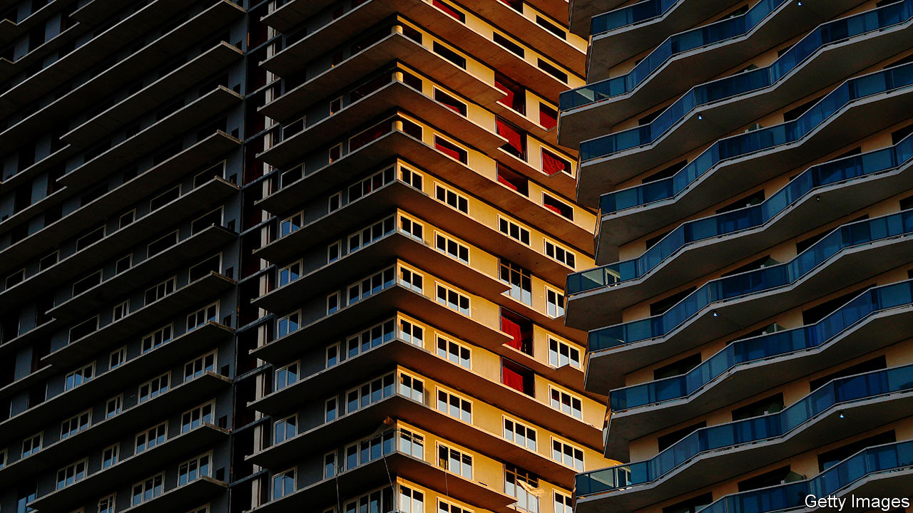
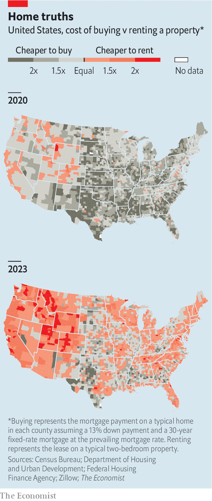

###### Chasing the American dream

# Is it cheaper to rent or buy property? 

##### We crunch the house-price data across every American county—and make a surprising finding 

 

> Nov 30th 2023 

For years new homebuyers in America have enjoyed lower housing costs than renters. Between 2011 and 2020 the monthly mortgage payment on a typical home was 12% lower than the rental for a similar property (assuming a deposit of 13%, the current national average). A steady rise in home values, worth roughly 7% a year over the past decade, also ensured that buyers built equity in their homes. But, as our maps below show, today the choice between buying and renting looks different.

 


Blame high house prices and soaring mortgage rates. Since 2020 nominal house prices have climbed by roughly 40%, while the average 30-year fixed-rate mortgage rose from 3.1% to 7.3%. Nominal mortgage payments have more than doubled since 2020; rents have risen by only about 20%. By our calculations, for 89% of Americans renting a two-bedroom place is now cheaper than buying a comparable property. Three years ago the figure was 16%.

Our calculations do not cover long-term potential costs and benefits, such as outlays on maintenance, the asset value of a home once a mortgage has been paid off, or the opportunity cost of investing in a deposit for a house rather than, say, the stockmarket. But they do show how the relative costs of buying and renting have been upended in much of America. To restore the ownership advantage that prevailed in the 2010s would require dramatic shifts in market conditions: house prices would have to tumble by one-third, average mortgage rates would have to fall to 3.2% or rental costs rise by at least 50%.

None of these outcomes seems likely. House prices are not expected to crash: Goldman Sachs, a bank, forecasts that they will appreciate by 1.9% in 2024 and 2.8% in 2025. Mortgages are expected to stay pricey, too. Goldman predicts that 30-year mortgage rates will dip, but not by much: to 7.1% by the end of 2024 and 6.6% by the end of 2025. Rents, meanwhile, seem unlikely to climb much, owing to a glut of newly built apartments and weak demand.

Even in the few markets where homes still look relatively cheap—such as Baltimore, Philadelphia and the Bronx, in New York City—most homeowners are reluctant to sell. Nearly all have locked in mortgage rates that are much lower than those available to new borrowers. More than four in five existing mortgage-holders pay an interest rate under 5%, according to Torsten Slok of Apollo, a private-equity firm. So market conditions seem likely to put off millions of potential buyers and sellers of houses. For many, renting will increasingly look like the affordable option. ■


