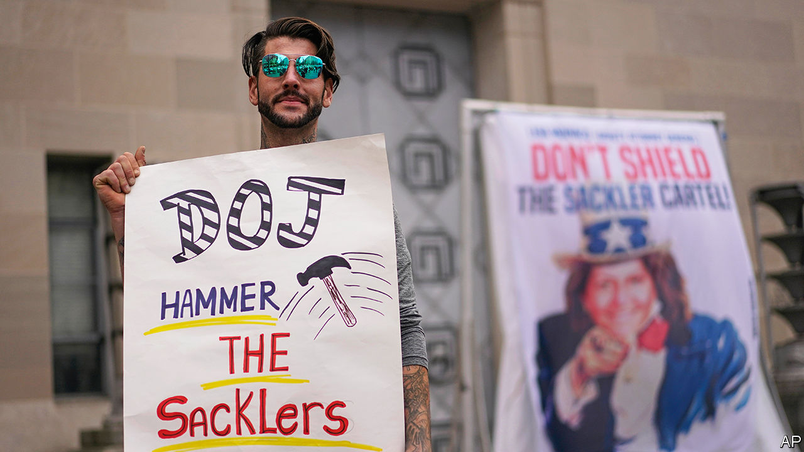

###### The opioid-maker controversy

# The Supreme Court may toss out Purdue Pharma’s bankruptcy settlement 

##### The deal is a case study in unsavoury trade-offs 

 

> Nov 30th 2023 

FORTY YEARS ago Owen Fiss, a legal scholar, wrote an article called “Against settlement”, about lawsuits’ social purpose. Big civil disputes of public import, he argued, are about more than money damages. Rather, they present a chance for collective reckoning: airing harms, assigning fault, upholding values. Trials render judgments about conduct. Private settlements, by contrast, might buy peace while leaving justice undone. 

The trade-offs between accountability and money are at the heart of how to handle the firm that helped spawn America’s opioid epidemic, as well as its former owners: Purdue Pharma and the Sackler family. On December 4th the Supreme Court will consider whether a bankruptcy settlement resolving claims against Purdue and the Sacklers, hashed out over several years, can go ahead. Abbe Gluck, a professor at Yale Law School, and her colleagues note that the case addresses the very conflicts raised in “Against settlement”: justice or compensation for some victims of America’s opioid crisis, which still claims 80,000 lives a year. 

In 1996 Purdue began selling OxyContin, a highly addictive opioid painkiller that it advertised as safe. Even as concerns grew about abuse of the drug, the firm downplayed them and marketed it aggressively, turning OxyContin into America’s most prescribed branded narcotic pain-reliever. By the early 2000s lawsuits against Purdue were piling up. 

The Sacklers expected that they too would be named as defendants. About ten served as directors or officers of the firm, out of dozens of family members who collectively owned it. Between 2008 and 2016 they upped Purdue’s distributions to family trusts and holding companies, draining about $11bn from the firm—in what one family member described as “more of a smart milking programme than a growth programme”. In 2019 the drugmaker, then worth an estimated $1.8bn, filed for bankruptcy. At the time claims against it and the Sacklers were put at more than $40trn.

That halted thousands of lawsuits against Purdue and the Sacklers, and brought them to the negotiating table with claimants—states, tribes, hospitals and individuals. The Sacklers offered around $6bn (up from $4.3bn initially), in exchange for immunity from Purdue-related civil liability. The provision is known as a non-debtor release, since the Sacklers did not declare bankruptcy themselves. They also agreed to relinquish ownership of Purdue and put its future profits towards opioid abatement. 

All 50 states approved the settlement. So did 96% of the individual claimants who voted. But less than half voted. Controversially, the deal binds holdouts, both objectors and abstainers, who will not be able to go after the Sacklers in court for, say, negligence or fraud. The Sacklers deny wrongdoing related to Purdue and have promised to fight all claims if the settlement falls apart. (The release does not shield them from criminal liability.)

The US bankruptcy trustee, a watchdog within the Justice Department, sued to void the deal. It argues that the release violates holdouts’ due-process rights and that the bankruptcy court lacked the power to grant it. In August the Supreme Court froze the settlement. The justices may toss it out and bar non-debtor releases in cases other than asbestos bankruptcies, for which Congress expressly allowed them.

Critics of the settlement dislike its coercive quid pro quo. The Sacklers, they argue, should be sued until verdicts compel them to file for bankruptcy, which would ultimately unlock more money for claimants. It is illegal for debtors to siphon funds from a bankruptcy estate before filing: some allege that the family’s withdrawals from Purdue constituted fraudulent transfers that ought to be clawed back in full.

Deal or no deal?

But could claimants really do better by duking it out individually with the Sacklers in court? In all likelihood they would end up with less, says William Organek of Baruch College’s business school. More than 70 family members benefited from ownership of Purdue; each would mount his or her own defence. Lawsuits and collection of judgments would take years, if not decades. Recovery of the whole fortune may be impossible since much of it is stashed in offshore trusts. Fraudulent-transfer claims would run up against a statute of limitations. Edward Neiger, a lawyer for victims, says that the Sacklers’ $6bn offer represents the piece of their fortune within the grasp of American courts. 

Objections are about more than money: holdouts want to deprive the Sacklers of the peace of mind that comes with a release. “They’re drug-dealers and they need to be punished to the fullest extent of the law,” says Ellen Isaacs, whose son died of an overdose after getting hooked on OxyContin. She is one of several claimants, out of hundreds of thousands, who joined the US trustee’s appeal. Should the court rule in their favour, Douglas Baird of the University of Chicago says he would not be shocked if the Sacklers end up settling with the vast majority of claimants who want quick, certain payouts while accepting the risk that some stray holdouts will sue.

Bankruptcy is fraught by nature: creditors are squeezing value from a limited pie and jostling over their share of it. Add big moral and social questions, and the result is satisfying for no one but lawyers. Even if Purdue’s deal goes through, payouts to individual victims are paltry. They will get between $3,500 and $48,000 each—while the Sacklers hold on to a fortune of several billion dollars. ■


