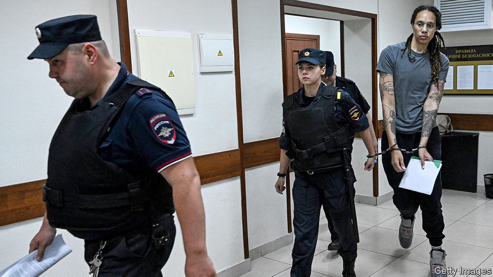

###### The prisoner dilemma

# What to do about an uptick in Americans unjustly held abroad 

##### Are carrots or sticks the right way to bring them home? 

 

> Nov 30th 2023 

“My husband Ryan has been wrongfully detained by the Taliban in deplorable and inhumane conditions for 461 days,” Anna Corbett told a congressional committee in November. “His crime: being a US citizen in Afghanistan.” For years Mr Corbett had run a microfinance and consulting firm to help Afghan businesses, but his family fled the country amid the withdrawal of Western forces in 2021. He hoped his work could continue under Taliban rule, but authorities detained him during a visit in August 2022. 

Only Mrs Corbett has spoken publicly, but at least six Americans have been detained in Afghanistan, according to a Republican congressional aide. Other hostile nations hold dozens of Americans hostage, though exact numbers are hard to come by. It can be difficult to define a wrongful detention, and some cases are kept quiet to help facilitate a potential release.

The James W. Foley Legacy Foundation, which works on behalf of Americans unjustly held abroad, estimates there are 64 publicly disclosed hostage and wrongful-detention cases. Twenty-one Americans were released in 2022, but recently some of those who watch the issue closely have noticed an uptick in detainees. No wonder: they can be lucrative bargaining chips.

Bringing unjustly held Americans home is a laudable, bipartisan goal, but offering overly generous terms risks encouraging more detentions. Venezuela has sought sanctions relief. Other rogue states see a way to earn hard currency. The Taliban is seeking the release of an Afghan held at Guantánamo Bay whom America considers a threat to national security.

The Biden administration exchanged Brittney Griner, a basketball star held in Russia for possessing small amounts of cannabis oil, for Viktor Bout, a Russian arms-dealer convicted in 2011 of conspiracy to aid a terrorist organisation and to kill Americans. In September the US and Iran agreed to swap five Americans spuriously held in Tehran for five Iranians charged with sanctions violations among other crimes. America also agreed to unfreeze $6bn in Iranian funds, but reneged on this after the Hamas attack on Israel in October. 

How much to give is a tricky question, and hardliners argue that sticks are anyway preferable to carrots. “Some in the Biden administration have treated the Afghanistan cases as something that complicates their greater policy priority of befriending and legitimising the Taliban,” says Michael McCaul, chairman of the House Foreign Affairs Committee. “I am concerned the Taliban continues to take American hostages because they have never been held responsible.”

China, Iran, Russia and Venezuela are the most prolific bad actors, according to a report released in September by the Foley Foundation. It is no coincidence that all are autocratic regimes that maintain poor relations with America, where the rule of law prevents retaliatory detentions. Yet sanctions, diplomatic isolation and other offensive actions could send a message that holding Americans comes with a price rather than a prize. 

The release of some Americans also raises questions about which ones are left behind and why. Paul Whelan, wrongfully detained in Russia for nearly five years, was understandably disappointed after a famous athlete was released after less than a year behind bars. Some families of Americans held in China find the situation particularly difficult. “I’ve heard excuses from people in the government saying, ‘Oh, yeah, you know, the US-China relationship is complex.’ I think that’s a cop-out,” says Harrison Li, whose father Kai has been held since 2016. “The administration has gotten Americans out of countries with whom we don’t even have consulates or formal diplomatic relations.”

Katherine Swidan’s son Mark has been detained in China since 2012. In April a court upheld a death sentence for alleged drug trafficking despite America considering him wrongfully detained. His mother expressed frustration that Joe Biden neglected his case during a recent meeting with Xi Jinping. “I am cried out and I’m prayed out,” she says. “Now I’m pissed.” ■


