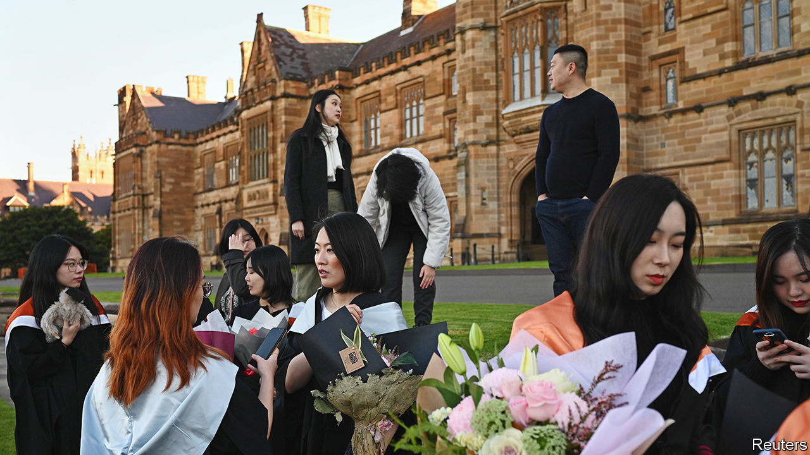

###### Campus politics

# Foreign students are pouring back into Australia 

##### Its universities are becoming a bit less dependent on China 

 

> Dec 7th 2023 

THE first international student, from China, enrolled at the University of Sydney a century ago. Now its sandstone buildings hum with foreign languages: almost half the university’s students are from overseas. “For Asian kids, we value the rankings a lot,” says one of its Chinese students, who asks not to be named. Australian universities perform well in them; the University of Sydney is one of nine ranked among the world’s top 100 institutions. Australia also has better weather than Britain or Canada, and less gun crime than America. When the student enrolled in 2015, it “seemed like one of the friendliest countries in the Western world.” 

Over the past two decades the number of international students in Australia has risen nearly fourfold, to 440,000 in 2019. Its universities now attract more foreign talent than those of any country except America and Britain. Education is Australia’s fourth-biggest export, worth around 3% of GDP. This has made its universities dependent on the higher fees foreigners pay—a worry when Australia closed its borders in 2020 and again later that year when a trade war erupted with China, which supplies about a third of the incomers. Yet most of the universities have managed these shocks fairly easily. And this year foreign students have returned in droves, with 425,000 now in Australia.

The universities were largely unaffected by the trade spat. While slapping curbs on Australia’s exports from wine to coal, China did not deter its citizens from attending the country’s universities. When the pandemic struck, Chinese students were also more willing than others to stick with online learning, notes Peter Varghese, chancellor of the University of Queensland. “One of the ironies was that the universities which were least impacted financially were those that had the highest concentrations of Chinese students,” he says. Mark Scott, vice-chancellor of the University of Sydney, agrees: “A point of vulnerability emerged as a point of strength.” 

Public investment in Australian tertiary education is among the lowest in the OECD. This makes the universities especially reliant on the revenue foreign students provide, including A$41bn ($27bn) in fees and other spending in the year to September. There is also value in “the enduring diplomatic benefit of building constructive relationships” with some of the world’s brightest citizens, notes Professor Scott.

But there is a downside. Some universities have been accused of suppressing criticism of China. Chinese student spies are alleged to be snooping on campuses and intimidating classmates. In 2019 scuffles broke out in several universities between Chinese nationalists and pro-democracy campaigners. Universities have been subject to a “sustained campaign of intimidation, harassment, censorship and intelligence gathering”, thundered a conservative senator, James Paterson, last year. 

Partly as a result, the universities are becoming just a bit less dependent on China. Scandals over foreign interference were a big wake-up call, says Rory Medcalf of the Australian National University. Vice-chancellors are now wooing new markets. The University of Sydney is taking record numbers from Malaysia and Vietnam. Since 2018 the number of Indians studying down under has risen by a third. Chinese students now represent 33% of the foreign cohort, down from a peak of 38%.

Continued geopolitical tensions are meanwhile leading to more scrutiny of university research and partnerships. Foreign-interference laws passed by the former conservative government require universities to inform security agencies about “arrangements” with “foreign entities”. When, in 2019, Monash University signed a partnership with the state-owned Commercial Aircraft Corporation of China to develop aviation technology, there was an outcry. A parliamentary review last year called for it to be cancelled, as the work could have military applications.

A more heated debate over security on campuses is brewing. Through AUKUS, a trilateral security pact, America and Britain will share nuclear-propulsion technology with Australia. The pact will also lead to collaborations on emerging technologies such as artificial intelligence and quantum computing. Australian officials say this will make the country’s universities a bigger target for espionage. The Labor government led by Anthony Albanese has drafted legislation that would make it illegal for academics to share sensitive research with any foreigner, except Americans and Britons, without government approval. Universities fear a stifling of their academic freedoms. Yet, for the moment, such measures seem a fairly modest curb on their impressive openness. ■

