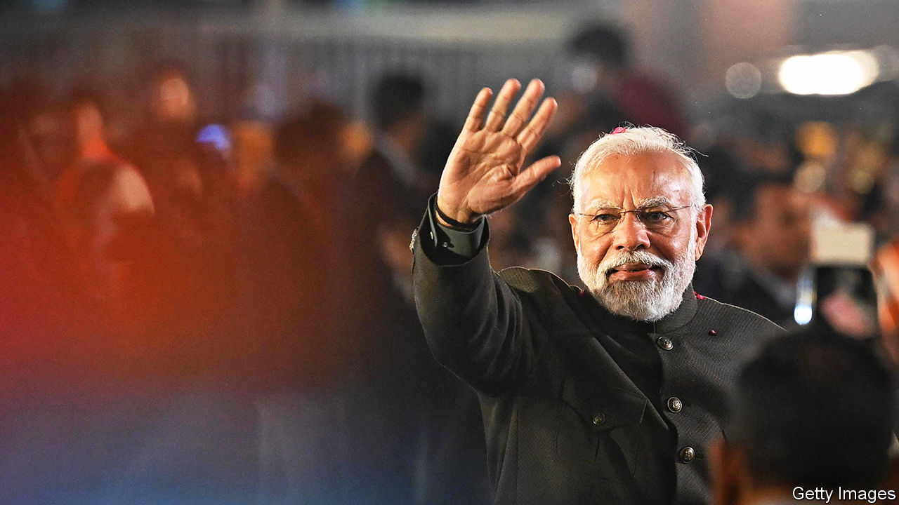
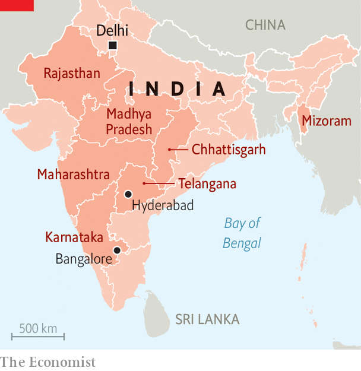
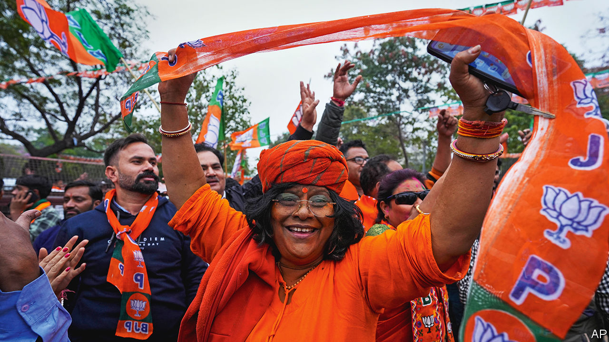

###### Cow-belt elections

# Narendra Modi’s party sweeps in north and central India 

##### A bundle of state polls suggests the Bharatiya Janata Party is well-placed for the general election 

 

> Dec 3rd 2023 

The political divide between India’s poor heartland and richer south has got . In five state polls, the last big tranche ahead of a  due by next May, the Bharatiya Janata Party (BJP) won emphatic victories in northern Rajasthan and in the central states of Madhya Pradesh and Chhattisgarh. In both Rajasthan and Chhattisgarh, India’s ruling party thereby unseated its main national rival, the Congress party, dashing its hopes of a revival in the Hindi-speaking “cow belt” where around half a billion Indians live.

In the south, meanwhile, Congress won in the prosperous state of Telangana (whose capital is the  of Hyderabad). The incumbent party there was a regional one, not the bjp. Even so, the Hindu nationalist party’s failure to bag Telangana will compound its loss to Congress last May in the neighbouring state of Karnataka (which is home to Bangalore, another tech hub). It is another indication of the limited appeal to southerners of the BJP’s Hindu-centric ideology.

Rajasthan and Madhya Pradesh are by far the most populous of the five states that went to the polls. Together they command 54 of the 543 seats in the lower house of the national parliament. In the fifth state, small, north-eastern Mizoram, one regional party ousted another; neither of the big national parties did well.

 


Overall, the state results are excellent news for Narendra Modi, the bjp prime minister. In power since 2014, Mr Modi is campaigning for a third term on a platform that combines the BJP’s “Hindutva” ideology, a Hindu-first view of Indian culture and identity, with a pledge to transform India into a developed country by 2047, the centenary of its independence. BJP leaders credit Mr Modi with India’s recent strong economic growth and impressive progress on infrastructure development. They also praise him for taking action against corruption and other problems long neglected by former Congress-led regimes.

“The results in Chhattisgarh, Madhya Pradesh and Rajasthan indicate that the people of India are firmly with politics of good governance and development,” Mr Modi wrote on X (Twitter, as was) on December 3rd. He predicted support for the BJP would grow in Telangana. Despite its failure to win the state, the bjp’s vote share there was double the 7% it won in Telengana’s previous state election, in 2018.

Conversely, the results are a blow to Mr Modi’s opponents. They accuse him of undermining India’s secular constitution by pandering to Hindus, who represent 80% of the population, and fomenting discrimination and violence against minorities, especially Muslims, who account for about 14%. Critics allege that Mr Modi’s government has eroded judicial independence, muzzled local media and used law enforcement agencies to harass opponents. (The government denies doing any of that.) 

Mr Modi’s opponents worry, too, that he wants to change the constitution to give more power to the executive branch. A revision of electoral boundaries, due in 2026, would probably make it relatively easy for him to make such changes. It could see the lower house expanded to around 753 seats, with most new ones going to northern states, where the BJP is popular. Mr Modi has also proposed holding simultaneous national and state elections, which many see as another move to centralise power.

The five state polls are not straightforwardly predictive of next year’s general election result. In 2018 Congress won control of Chhattisgarh, Madhya Pradesh and Rajasthan, and then was trounced in all three states in the general election that followed. Congress’s vote share in all three this year was roughly the same as in 2018, while the BJP’s rose at the expense of smaller parties. Yet given that the bjp tends to do better in national than state-level polls, these results look bad for its opponents. The party’s greater success nationally is based on the popularity of Mr Modi, whose image as a strong, charismatic leader is sustained by the BJP’s media operation.

The BJP performed especially strongly in India’s north and north-west in the general election held in 2019, and probably needs to do so again next year to win another majority. India’s south seems to be “out of bounds” to it, says Rahul Verma of the Centre for Policy Research, a Delhi-based think-tank. “With this kind of performance, the BJP is sitting in a much sweeter spot than it was a couple of months ago and the road for Congress has become very, very difficult.” 

Congress will now face pressure to cede more ground in negotiations over strategy and candidates with the other 27 opposition parties it joined in July in a coalition called the Indian National Developmental Inclusive Alliance, or INDIA. The alliance also looks unlikely to accept as its prime ministerial candidate a Congress leader, such as 53-year-old Rahul Gandhi (whose father, grandmother and great-grandfather were all Indian prime ministers). Mr Gandhi said in a posting on X that he accepted Indians’ latest bruising verdict. “The ideological battle will continue,” he added.

 


The BJP’s victories in Rajasthan and Chhattisgarh were due, in large part, to Congress’s internal divisions. The government of Rajasthan, which Congress had controlled since 2018, had a good record, particularly on delivering welfare programmes. But its rule was marred by a bitter two-year-long power struggle between the chief minister, 72-year-old Congress stalwart Ashok Gehlot, and his ambitious 46-year-old deputy, Sachin Pilot. 

In Chhattisgarh, again governed by Congress since 2018, the party was also undermined by feuding between its chief minister and one of his deputies, as well as by a failure to fulfil election promises. In Madhya Pradesh, Congress’s inability to exploit dissatisfaction with the incumbent BJP government was attributed largely to its selection of another ageing and controversial Congress veteran, 77-year-old Kamal Nath, as its candidate for chief minister. He had taken that post after Congress won the last state election in 2018 but his government collapsed 15 months later.

Beyond such local factors, the BJP’s success was down to superior strategies, organisation and message discipline. In Madhya Pradesh, Mr Modi’s party worked hard to promote an image of collective leadership, sending several national figures to campaign and largely sidelining its 64-year-old chief minister, Shivraj Singh Chouhan, who may now be replaced. That helped offset public frustration with Mr Chouhan’s leadership and focus attention on Mr Modi. The BJP also concentrated on women voters, who have been voting in larger numbers in recent polls. Congress may be cheered by its win in the south. It has little to be encouraged by elsewhere. ■


