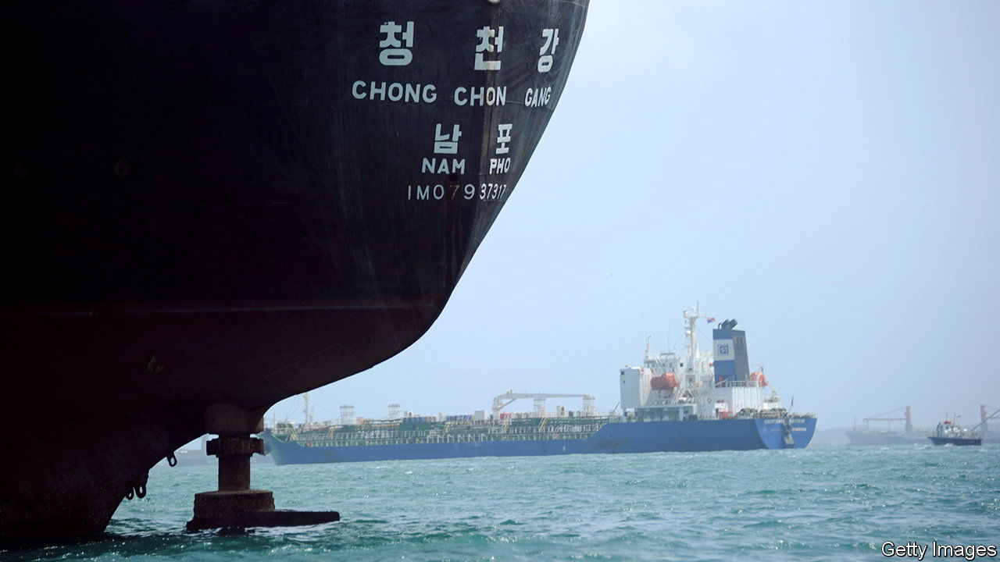

###### Rusty buckets

# North Korea is getting new ships 

##### Many come from China, which continues to enable sanctions violations 

 

> Dec 7th 2023 

Last Christmas Eve the  was docked in Yantai, a Chinese port just across the Yellow Sea from the Korean peninsula. Then on January 2nd the Chinese cargo vessel switched off the transponder that reports its movements and disappeared. It was not seen again until early February, when it was spotted offloading cargo in Nampo, North Korea’s main port. A month later it had a new name, the , and was flying a North Korean flag. 

Between January and May this year North Korea’s commercial fleet grew by 14 ships, according to the latest report by the UN panel of experts that is tasked with monitoring the sanctions regime placed on the country. Transferring vessels to North Korea is forbidden under it. Yet since 2020 the hermit kingdom has acquired 52 ships. The sanctions-busting they facilitate is a lifeline for the economically isolated country, in particular by connecting it to its main patron, China.

The fleet had been shrinking, to about 200 ships in 2016. But several rounds of sanctions following a North Korean nuclear test in 2016 have made it more economically significant. After a long covid-19-instigated shutdown, North Korea’s ports have reopened and trade with China, by far the country’s largest trading partner, is approaching pre-pandemic levels. With fewer foreign ships entering North Korea’s ports, its vessels have more responsibility for ferrying goods in and out.

Increased trade left North Korea needing new ships. China was willing to help. The UN panel found that ten of North Korea’s recent acquisitions were previously Chinese-owned. Most return to China with North Korean goods—the trade is mostly between Nampo in North Korea and Dalian, in China’s Liaoning province. 

Many of the vessels import grain or fertiliser. They also bring in sanctioned goods, such as luxury cars. These are often transferred between ships on the high seas at night, with transponders switched off or transmitting a false location. Huge floating cranes are used to load containers from one vessel to another. 

Such smuggling brings in essential goods and revenue. North Korea is only permitted to import 500,000 barrels of refined oil a year, yet imports more illicitly. Much of it comes from criminal networks that smuggle subsidised Taiwanese oil—North Korean tankers have recently been seen loitering in the Taiwan Strait. An authority that monitors shipping activity via satellite told the panel of experts that North Korea may have exceeded its annual import limit as early as April. 

Its fleet also helps it export coal, mostly to China, with help from Chinese barges. Though the pandemic curbed this trade, it is reported to have grown fourfold between the first quarter of 2022 and the same period this year. And North Korea exports textiles and seafood to China, though both are under sanctions. China told the un it had no information on North Korea’s new ships. It also claimed to be “fully and strictly implementing” the sanctions, despite the evidence to the contrary. 

While “the Chinese are showing contempt,” says Hugh Griffiths, a former boss of the panel of experts, “what the Russians are doing is far worse.” In October America accused North Korea of sending 1,000 containers of weapons to Russia for its war in Ukraine. North Korean arms exports are also banned under the sanctions regime. ■

