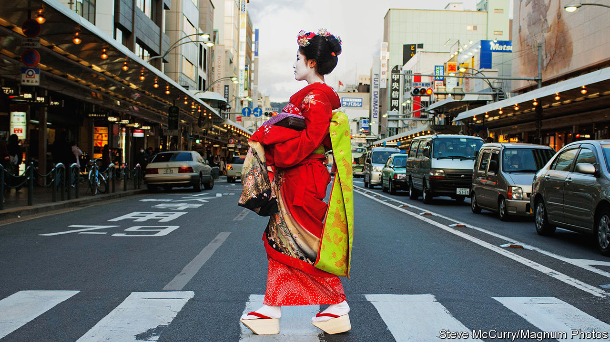

###### Available on Zoom

# The new geishas 

##### Japan’s celebrated women entertainers are innovating to survive 

 

> Dec 7th 2023 

AT first blush Azuha and Seiko, two geishas in Tokyo’s Asakusa neighbourhood, are paragons of Japanese decorum. With white-painted faces and silky black hair, they dance elegantly in silk kimonos for a small crowd. But then they slip into relaxed goofiness. During a drinking game, Azuha crawls like a tiger. Seiko pretends to be an old crone with a walking stick. When they lose, they down glasses of beer.

This informal geisha behaviour is a response to hard times. In the late 1920s there were around 80,000 of these skilled women entertainers. Only 1,000 remain. Most Japanese men prefer more informal and often cheaper hostess bars. Few teenage girls are willing to commit to the arduous education in music, dancing and etiquette on which the 18th-century geisha tradition is based. “Japanese are losing touch with geisha culture,” laments Suzuki Takeshi, who manages a union of geishas in Asakusa. This has prompted some of the remaining geishas to rethink.

During the covid-19 shutdown, some launched crowdfunding projects and Zoom drinking sessions. Others have opened cocktail bars. Traditionalists find these innovations jarring. Yet they are consistent with geisha history. The service was for centuries flexible. Geishas have played board games with clients and, during the post-war boom, golf. Geisha entertainment was always closer to today’s hostess bars, or , than the purists admit.

Even before the pandemic, geishas were targeting a more mixed crowd, including women and tourists. Many have dispensed with the practice of , or “no entry without introduction”. Shiomi Fumie, another geisha in Tokyo, started holding geisha “livehouse” events that omit the lavish meals traditionally consumed in hours-long geisha parties, in favour of short performances for as little as 8,000 yen ($54). By making geisha shows accessible, she hopes to woo younger customers—and maybe recruit some geishas. 

Such changes are helping to correct some misconceptions. Geishas have been over-romanticised and mischaracterised as prostitutes in Japanese as well as Western culture—from “Memoirs of a Geisha”, a book by Arthur Golden, to “In the Realm of the Senses”, a film by Oshima Nagisa. By pushing back on that, the innovations have helped win recruits. Ms Shiomi once worked for an IT company. She loves her new profession’s beautiful kimonos, dances and songs. “You can’t earn lots of money as a geisha,” she says. “But it’s incredibly cool.”■

