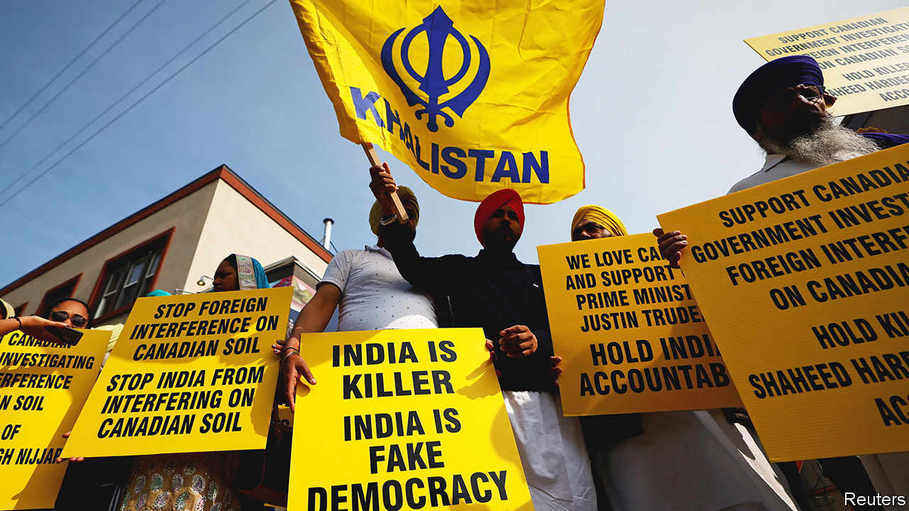

###### Kill list

# Will US-Indian relations be hurt by India’s assassination scheme? 

##### American prosecutors have published devastating allegations about India’s attempted hit jobs 

 

> Dec 5th 2023 

IT IS A plot worthy of John le Carré. A shadowy figure in India recruits an international arms-and-drugs smuggler to organise a hit-job in New York. The smuggler recruits an assassin. The assassin turns out to work for America’s Drug Enforcement Administration (DEA). The man behind the foiled plot? An Indian government official.

The indictment America’s Justice Department unveiled on November 29th is an astonishing read. It lays out in bracing detail an alleged plot by an Indian official to kill Sikh activists in America (unsuccessfully) and Canada (successfully). It also describes the equally gripping ruse employed by American spies to foil the plot. This brings to a head a month-long diplomatic scandal over India’s alleged hitman schemes in North America, which began after Canada’s prime minister, Justin Trudeau, first raised them in that country’s parliament. The indictment has made India’s earlier denials ring hollow. It will also put stress on the improving relationship between India and the West, on intelligence co-operation in particular.

American prosecutors say that in May a person described as “CC-1” hired Nikhil Gupta, the alleged smuggler, to kill a Sikh separatist understood to be Gurpatwant Singh Pannun, an American citizen. CC-1 had worked in intelligence as a “senior field officer” and “was employed at all times…by the Indian government”. The agency is left unspecified, though the job description is consistent with the Research &amp; Analysis Wing (RAW), India’s foreign spy service.

There are hints that this chief plotter was acting on behalf of more senior Indian officials. Mr Gupta told the hired assassin that “his co-conspirators directing the assassination plot from India had extensive resources.” The Indian official allegedly got Mr Gupta off the hook for a criminal charge at home. Most tellingly, he urged the assassin to avoid carrying out the killing in June during sensitive US-India diplomacy, including a visit to Washington by Narendra Modi, India’s prime minister.

The indictment corroborates the Canadian allegations in some ways. Mr Gupta, the smuggler, is said to have told the DEA agent Mr Pannun was one of “many targets”, also including Hardeep Singh Nijjar, the separatist killed in Vancouver in June. The official allegedly provided photos of Mr Nijjar’s body to Mr Gupta with an exhortation to hurry up with killing Mr Pannun.

These machinations have sent ripples through the intelligence world, where disputes are normally handled with quiet rebukes. Canada publicly expelled RAW’s representative from Ottawa. India kicked out his Canadian equivalent from New Delhi. Praveen Swami, an Indian journalist, reported in the Print, a website, that America had also expelled RAW’s top official in San Francisco and refused to allow a replacement for RAW’s outgoing station chief in Washington, and that Britain had kicked out RAW’s number two in London.  could not verify those reports.

Ties between America and India have been through rough patches before. In the 1990s India bristled at American criticism of its conduct in Kashmir. In 1998 America imposed sanctions after India tested nuclear weapons. In 2004 Rabinder Singh, a RAW official, vanished from Delhi. He is believed to have been recruited and whisked away by the CIA. In 2013 warming bilateral ties were interrupted when America prosecuted Devyani Khobragade, India’s deputy consul-general in New York, for visa fraud and mistreatment of staff.

The difference today is that both countries are deeply invested in their bilateral relationship, which now spans defence, trade and technology. Both sides are therefore treading delicately. America’s top intelligence and security officials have all confronted Indian counterparts in private. But the indictment carefully avoids blaming India’s government as a whole.

Many influential Indians are defiant. Some are outraged that Mr Pannun and Mr Nijjar are described as activists, not extremists, seeing this as symptomatic of Indian interests being misrepresented in the West. Vikram Sood, a former head of rAW, describes the indictment as part of an American plot to undermine Mr Modi’s drive for self-reliance in defence. “The US wants to discipline us,” he wrote. “So something that could have been sorted out across the table has been splashed everywhere. They nurtured a terrorist.”

Yet the Indian government’s response to the indictment has been “diminuendo in contrast to the crescendo with Canada”, notes Nirupama Rao, who served as India’s ambassador in Washington a decade ago. India’s foreign ministry, which had described Mr Trudeau’s accusations as “absurd and motivated”, said the American ones were “a matter of concern” and that assassination would be “contrary to government policy”. It convened a high-level committee to look into the matter.

Notably, Samant Goel, RAW’s chief at the time of the plot, retired at the end of June. One option for India could be to blame him for the intrigue and absolve Mr Modi. That would allow America and India to put the row behind them and get back to containing China. “My hunch”, says Ms Rao, “is that the situation will be handled in a manner that tensions are defused.” ■ 


