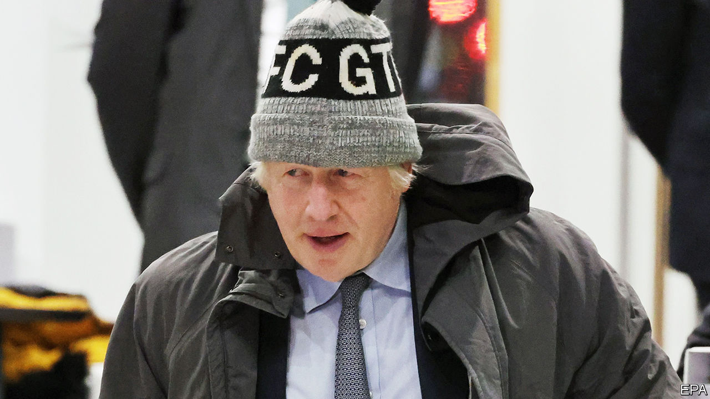

###### The covid-19 inquiry

# Boris Johnson: star turn at Britain’s covid inquiry 

##### Tears and testiness, but no new information 

 

> Dec 6th 2023 

Hugo Keith KC is the silkiest of silks. Mr Keith does not shout. He does not bark. He does nothing so crass as grilling. He merely asks. He is interested. He sympathises: difficult decisions, he says, rested on Mr Johnson’s shoulders. Mr Johnson and his shoulders do not do well before Mr Keith. Boris’s bonhomie has gone; his shoulders sag. Beneath the table, one shiny foot taps. He apologises for the pain. At one point he is testy; at another, close to tears. 

Britain’s  is not a trial. It might have silky smooth Mr Keith. It might have a (retired) judge and King’s Counsels and grieving relatives and serried ranks of serious people with laptops doing opaque, important things. It might have dialogue peppered with “All rise” and “my lady” and “my learned friend”. It might look in every way like a trial. But it is not a trial. 

It cannot be a trial; because the pandemic was a calamity, not a crime. It was caused by a virus, not by villainy. Once, perhaps, vengeance might have been sought for such a thing: medieval Europe merrily put everything from pigs to worms on trial (in 1587 in France, weevils were tried for eight months for damage to vineyards). The modern world is more moderate. It puts Boris on the stand instead. And Boris is better value than a virus. 

For whatever else this may or may not be, one thing is clear: it has been entertaining. “Boris” was born before a televised audience on “Have I Got News For You”, a jokey tv show, so it feels fitting that his final act will be before one too. Even before he appeared the inquiry had been a good show. It had offered heroes (scientists); boo-hissable baddies (Matt Hancock); some cracking lines (“Let the bodies pile high”) and so much swearing (“fuckpigs”) that it now carries a “May contain strong language” warning. It had offered, for many, the promise of vengeance. 

Now the star act, Boris Johnson himself, is onstage. More than a touch of the theatrical has attended Mr Johnson throughout the pandemic: he has been likened to Falstaff; Carrie Johnson has been likened to Lady Macbeth. Allegedly, Shakespeare made Mr Johnson not merely allusive but elusive. As the pandemic began, he was said to be finishing “Shakespeare: The Riddle of Genius.” This book, some claimed, was not unrelated to “Boris: The Riddle of Why He is Nowhere to be Seen.” 

For many, a more pressing puzzle is “The Inquiry: The Riddle of What the Point of It All Is.” The covid-19 inquiry is clear: it is “to examine the uk’s response” to covid and “learn lessons for the future”. Though whatever this inquiry learns, it will learn slowly. By the time its public hearings finish in 2026, it will have lasted four-odd years—almost twice as long as the period that it covers. Four years is slow in human years (Sweden finished its inquiry in 20 months). In viral terms, it is glacial. 

A single coronavirus can produce 1,000 progeny in ten hours. If a single coronavirus started replicating when Mr Johnson took to the stand on November 6th, by the end of his testimony the following day it could have produced a billion-odd more. The coronavirus dwarfs the efforts of its investigation. The inquiry has collected 38,200 evidence documents for its current module. That is a lot, in human terms. In viral ones, it is nothing. It requires at least 2,500 coronaviruses to span the full stop at the end of this sentence. 

Not that the covid-19 inquiry seems overly interested in such numbers. Mr Johnson, one scientist remarked, “struggled with [the] whole concept of doubling times…just couldn’t get it.” When Lady Hallett, the inquiry’s chairwoman, was shown a graph of forecast deaths, she was underwhelmed. She did not, she confessed, find it “electrifying”. 

The inquiry wishes to learn lessons for the future. This is a noble aim. And if Britain is hit by a fresh covid-19 pandemic and Mr Johnson is once again prime minister, its findings will doubtless prove invaluable. It has already taught politicians never to communicate over WhatsApp ever again. Whether its findings will be of use in a different sort of pandemic remains to be seen. But in Paddington, the hearings continue, slowly. And beyond, the world’s viruses replicate. Quickly. ■


