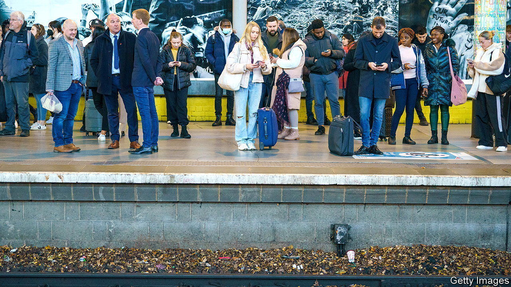

###### Off track

# Britain’s marathon rail strikes may be nearing an end 

##### But don’t expect more reliable services soon 

 

> Dec 7th 2023 

Passengers on britain’s railways have grown accustomed to strikes. On December 2nd the train drivers’ union, ASLEF, began a week of regional walkouts: the latest in a  that began in June 2022. There was a glimmer of light at the end of the tunnel, though. On November 30th the RMT, another union that represents rail workers, finally agreed a new pay deal. But even if strikes become rarer, the railways’ performance is likely to remain sub-par. 

 


More than 50 days have been lost to strikes during the current dispute. Overtime bans have made Sunday services especially patchy. Unions have opposed job losses and fought for pay rises to match inflation, against a backdrop of funding pressures. During the covid pandemic rail companies were effectively nationalised, with public subsidies surging to make up for plunging revenues (see chart). Ministers are trying to claw back some of that money. Yet operators’ revenues remain almost a third below their 2019 level in real terms due to increased remote working. 

Mick Lynch, the boss of the RMT, said his deal proved that “sustained strike action and unity gets results.” That is generous. True, Mr Lynch won an assurance of no job losses next year. The government also dropped a controversial plan to close thousands of ticket offices. Yet RMT members settled for a one-year, well-below-inflation deal: a 5% pay rise backdated to 2022-23. That will not even make up for the days they have spent on the picket line. The union has long had a reputation for toughness but its members had been running out of patience. 

The dispute with ASLEF is trickier. Train drivers are paid more than other rail workers—the average one earns £60,000 (or $76,000) for a 35-hour week—so they may feel able to hold out for longer. Ministers—who shape negotiations while not being directly involved—complain that train drivers are already well paid. But a similar deal to the rmt’s will probably be reached eventually. All rail unions have found their power to disrupt blunted because office workers can stay at home on strike days. For many passengers, the bigger problem is uneven services the rest of the time.

That is unlikely to change. Performance worsened between April and June, according to the latest data. Out of 24 operators, 12 had fewer than two-thirds of their services running on time. Punctuality worsened on all but three routes. Platform woes are hard to escape anywhere but the worst performers are in the Midlands and the North. Strikes have not helped, but staffing problems, poor morale and creaking infrastructure are also to blame, says Christian Wolmar, a rail expert. Delaying reforms won’t help.

What could be done? Since covid, rail companies have been paid a fixed management fee alongside performance incentives. But the transport department keeps a tight grip on costs, meaning they have little freedom to innovate. Ministers want to prod operators to boost passenger numbers. Some quieter services could be cut. The sector has been waiting on a planned overhaul—centred on a new body called Great British Railways—to provide clarity over long-term strategy. That is now unlikely to happen before the next election. Labour says it will bring remaining commercial franchises in-house as they expire (most will come up in the next parliament). As with those currently in charge, it has yet to offer much of a plan for getting the railways back on track. ■


