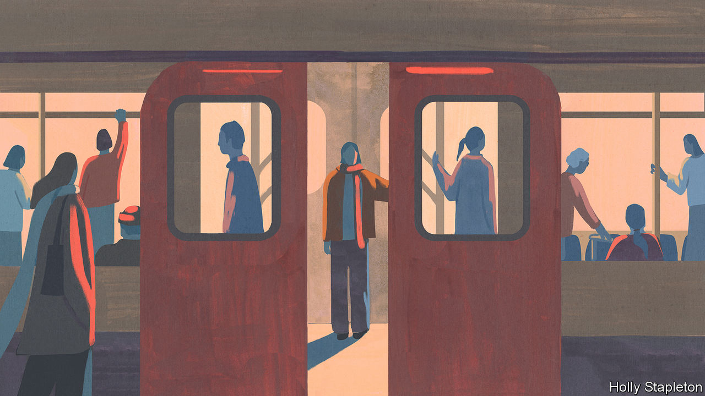
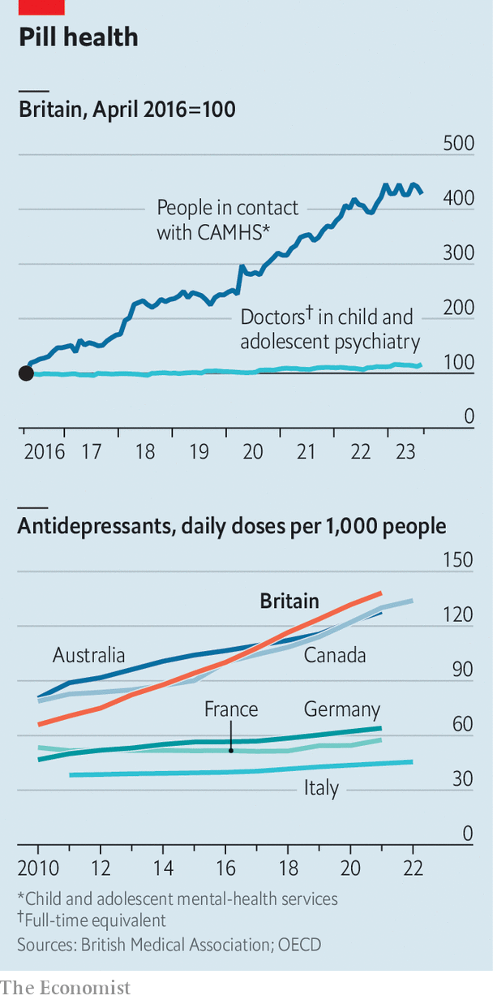
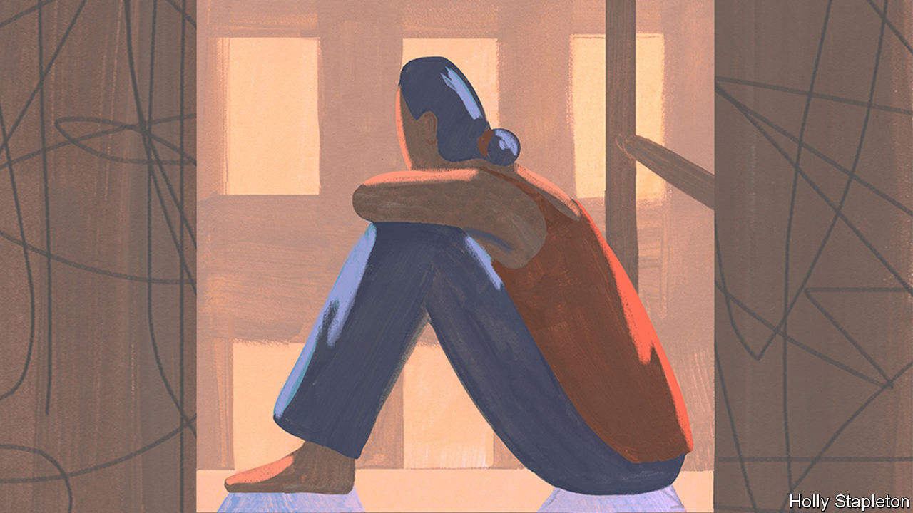

###### Time to rethink

# Britain’s mental-health crisis is a tale of unintended consequences 

##### Rising awareness appears to be hurting the people with the most serious conditions 

 

> Dec 7th 2023 

IT HAS BOARD games, club nights until “silly o’clock” and bouncy castles. But Open Door, a social enterprise for youngsters on the Wirral peninsula, has still not achieved peak fun. Its founder, Lee Pennington, plans soon to move the charity to the “Joy Building”, an ex-council property that will be adapted so that visitors can whizz between floors on slides. Not that long ago, the charity would have called itself a youth club. Now it uses a different argot. “We’re rebranding mental health,” says Mr Pennington. “We’re trying to engage the disengaged, normalise the conversation and ultimately have a good time doing it.” 

Mr Pennington is not alone in trying to get more Britons to open up about their mental health. Visitors to Open Door have included the Prince and Princess of Wales, who have spearheaded mental-health awareness campaigns in recent years. Such efforts have been very successful in destigmatising mental-health problems. In a survey in 2019 more than three-quarters of Britons said that mental illness is an illness like any other, the highest of all 29 countries polled. Awareness has only increased since the covid-19 pandemic. 

That is in many ways welcome. Britain may be the home of the stiff upper lip but there is nothing wrong with it wobbling. Conditions such as anxiety and depression, to say nothing of more severe forms of psychosis, can and do blight lives; early interventions can stop problems spiralling out of control. But some now fret that things have gone too far. “We’re starting to wonder whether it’s time to scale down our mental-health awareness,” says Simon Wessely, a professor of psychiatry at King’s College London. Lucy Foulkes, a psychologist at the University of Oxford, is blunter. “The campaigns are alienating the very people they are meant to help,” she says.

The case to re-examine the way that mental health is talked about and treated in Britain rests on two arguments. First, that demand for mental-health services has been artificially inflated. Second, that this increased demand is inadvertently harming people who most need help. 

On the first argument it is beyond dispute that demand for mental-health services has gone up in recent decades. The last big study of adults by the (NHS), in 2014, found that one in five women and one in eight men had anxiety or depression (a follow-up survey was stymied by covid-19). In the decade to 2021 rates of antidepressant use grew more in Britain than in any other European country; only the Portuguese and Icelanders take more antidepressants. 

 


There are reasons to think that mental suffering could be increasing, particularly among the young. “It’s not easy to be a young person at the moment,” says Dr Jon Goldin, a consultant child-and-adolescent psychiatrist at the Soke clinic in London. For Dr Goldin, the factors which contribute to a mental-health problem are typically predisposing (ie, genetic), precipitating (ie, the pandemic) and perpetuating (ie, financial hardship). Factors that protect mental health include supportive relationships and a sense of meaning; British teenagers are more likely to say these are absent than peers in other rich countries.

The pandemic will have triggered some illnesses. Covid infections have had a direct impact on the brains, and mental health, of some. Eating disorders, usually associated with anxiety, have exploded among young women. An NHS survey in 2023 found that a fifth of 8- to 16-year-olds and a quarter of 17- to 19-year-olds in England had a probable mental disorder, up from 12% and 10% in 2017. 

But these arresting statistics are also a reason to question what exactly is going on with the nation’s mental health. They typically come from self-reported surveys, which produce less reliable results than clinical interviews; in 2023 they were based on the “Strengths and Difficulties Questionnaire” (SDQ), a short online survey. Youngsters (or their parents) were invited to respond to 25 statements such as “I usually share with others (food, games, pens, etc)“ and “ Other people my age generally like me”. They were categorised as having a probable mental-health condition if their scores exceeded a threshold. 

A survey cannot exercise the judgment of clinicians or determine if an “abnormal” result reflects a mental disorder or a normal response to an abnormal event. During the pandemic a girl who preferred to “play alone” and was “easily scared” would have been adhering to official guidelines and cultural expectations. On the SDQ these statements would push her closer to a threshold for a mental disorder. 

The official definitions of mental disorders have also broadened. The fifth and latest edition of the Diagnostic and Statistical Manual of Mental Disorders (DSM), a widely recognised resource for psychiatrists worldwide, was released in 2013. It lowered the thresholds for some of its 298 listed disorders, meaning that fewer symptoms are required for a diagnosis. For attention-deficit hyperactivity disorder (ADHD), for example, DSM-5 reduced the number of symptoms from six to five. Impairments once had to be “clinically significant”; now they need to “reduce the quality of social, academic or occupational functioning”. 

Shifting diagnoses are not unique to psychiatry. But without objective biomarkers, the boundaries demarcating mental illness look arbitrary. This is particularly so when cultural definitions of mental-health disorders are changing. A study published in 2019, measuring the effect of a mental-health awareness campaign in England, showed that public understanding of what constitutes a mental illness has widened to include normal responses—like stress and grief—to life experiences. 

When the mental-health net expands in this way, more and more people are likely to get scooped up in it. In one survey in 2022 some 57% of British students reported having a mental-health issue. According to a recent government study, 76% of parents with school-aged children sought help or advice for their child’s mental-health concern from 2021 to 2022. “You’re going to lose any sense of what mental illness is if you start to apply it to 30%, 50% of the population,” says Adrian Massey, author of a book called “Sick-Note Britain”. 

Clinicians see these changes in their own practices. “We’re getting more and more expert parents and families coming in [who] know what they need to access,” says Dr Ramya Mohan, a consultant psychiatrist who works in the private sector as well as the NHS. Mersey Care, an NHS trust, is carrying out 400% more ADHD assessments for adults than it was four years ago; Dr Noir Thomas, its chief medical officer, notes that the increased awareness has resulted in more people presenting with “subthreshold diagnoses”. 

In a recent co-authored paper, Dr Foulkes suggests that while awareness may indeed help some people to recognise previously unreported symptoms, it may also lead to some people self-diagnosing, or pushing for diagnoses, thereby relabelling milder forms of distress as mental-health problems. Increased prevalence in turn drives more awareness, creating a perpetual upwards cycle.

Relabelling can be easy. Your correspondent took an online self-assessment for ADHD offered by Oxford CBT, a private mental-health clinic, in which the highest possible score is 48. She answered first as she normally would (19/48) and then took the test again in order to deliberately score zero. In both cases the tool concluded that she “may be experiencing low-level signs of ADHD or another difficulty”. 

The medicalisation of milder problems is not necessarily helpful for individuals. A student with low-level anxiety who is exempted from a class presentation, for example, might end up exacerbating the symptoms through avoidance. 

Mental-health treatments are not always productive. A study from the University of Cambridge found that volunteers were happier when they learned to suppress negative thoughts, not bring them up as they might in psychotherapy. Another study, of mindfulness courses in 84 British schools, found no evidence that they helped pupils’ mental health more than normal teaching. “There is a need for much better, more rigorous science about what works for whom and when,” says Miranda Wolpert, director of mental health at Wellcome, a charitable foundation.

Yet incentives work with the grain of medicalisation. A diagnosis can mean more time for a child to sit an exam; evidence of a condition is needed to unlock welfare payments. Of the record 2.6m Britons who are not working or actively looking for jobs because they are sick, half report having depression, bad nerves or anxiety (these may not be their primary health condition). “For the individual, certification is necessary as a means of legitimising their inactivity to society,” writes Dr Massey. Jeremy Hunt, the chancellor, is making work-capability assessments more stringent (as well as announcing more talking-therapy places to help those with anxiety and depression to work). 

It can also be easier—and cheaper—for institutions to pass structural problems off as medical ones. Stress and erratic behaviour may be symptoms of mental-health problems but they may also indicate toxic workplaces or wider deprivation. Poverty, family trauma and isolation are by far the biggest risk factors for mental illness; among children, kids from the poorest households are the biggest users of NHS mental-health services. 

Greater awareness is good in principle: it enables people who are suffering to get help and to have their struggles recognised. But “there is a very real risk of us going too far, especially because we’ve been flooded with information from all sources,” notes Dr Mohan. Which leads to the second argument: inflated demand is bad for those who most need treatment.

Serious problems

The drive to raise awareness of mental health has tended to focus on common disorders like anxiety and depression, conditions which, terrible as they can be, do not seem any more prevalent in Britain than other rich Western countries. Less attention is paid to conditions like schizophrenia and bipolar disorder, even though Britain has the highest rates of severe mental illness Europe. 

One study by academics at King’s College London found that the probability that a newspaper article would stigmatise depression dropped significantly between 2008 and 2019, but stayed about the same for schizophrenia. “All the oxygen is being taken up by the milder, more palatable problems which can be described by broadly high-functioning people,” says Dr Foulkes. That in turn has an impact on the allocation of resources. When you inflate diagnoses, “you end up diverting resources away from smaller numbers of people who need them to larger numbers of people who don’t,” says Professor Wessely. 

On paper the NHS operates under a “stepped care” model, in which care is allocated according to need. Family doctors, known as general practitioners (GPs), usually act as the first port of call for mental-health concerns, as they do for all non-emergency illnesses. Patients can be referred (or self-refer) onto talking therapies, usually consisting of cognitive behavioural therapy. GPs can also refer into secondary care, either in the community or, as a last resort, in hospital. 

The extra demand for mental-health services is being funnelled into a system that has long needed more staff, more money and better spending decisions. In September some 6.7m people waited more than two weeks to see their GP. In August NHS mental-health services received almost 390,000 referrals, a third more than they did four years ago. More than 720,000 young people received support from NHS-funded community services in the year to March, a 26% increase from two years ago. At least 1.8m people are waiting for mental-health treatment.

People who can afford to are able to jump the queues by  After an initial consultation costing £300 ($380), Oxford CBT charges £1,200 for an ADHD assessment. An appointment is available the following week; in the NHS it could be a multi-year wait. (If a diagnosis is issued, it can be used to oblige an employer or school to provide “reasonable adjustments” to ensure that those with disabilities are not disadvantaged.)

A vibrant private market sucks in clinicians as well as clients. “[In the private sector] I could be doing less for more money but I could also not be putting my physical body at risk,” says Jessica Valentine, a psychologist who used to work in the NHS and now provides private therapy. You “need to learn breakaway techniques and what happens if someone strangles you,” she recalls of her NHS experience. Another psychologist who trains new salaried clinicians says that of the 31 trainees she supervises each year, all used to stay in the NHS; now half go part-time to work privately. 

 


There are not enough NHS doctors to keep up with demand, particularly in child and adolescent psychiatry (see chart). The Royal College of Psychiatrists says there are 6% more consultant psychiatrists in the NHS in England than there were a decade ago, compared with 86% more consultants in emergency medicine and 72% in gastroenterology. A similar trend goes for mental-health nurses. 

As a result, NHS care is not readily available for the most acutely ill. A decade ago, Danni, now 28, feels she was “saved” by an early-intervention psychosis team in her local NHS, which helped her to stop believing that classmates were spying on her. When she visits her GP now, he is often “at a bit of a loss” to find a team that will take her. Another patient waiting for treatment for bipolar disorder was told to download an app with an NHS logo, which directed her to private providers. “Services have moved away from treatment into signposting,” says one psychologist. 

 


The NHS often leave emergencies to the police, who in England spend around 1m hours a year with mental-health patients in A&amp;E departments (some forces, including the Met in London, are now pushing back). “We unfortunately have something of a two-tier system where people who can afford it can access services quicker than those who can’t,” admits Dr Goldin. 

Even as mental-health awareness has risen, those living with severe mental illness have been faring worse. They were five times more likely to die prematurely during the pandemic than the rest of the population, a mortality gap that was widening long before then. Conditions often get attention only once they have become acute. In Wirral 29% of inpatients this year were not known to mental-health services before they were hospitalised for their problems; that is up from 8% in 2019. 

Some who cannot get help end up being criminalised. At least 50,000 people are detained each year under the Mental Health Act, a punitive law that enables the compulsory detention and treatment of the mentally ill in England and Wales. A bill to reform the act has been shelved. 

Cuts to local-government budgets have withered treatment services for drugs and alcohol as well as housing projects for those vulnerable to serious mental-health problems. In Wirral 1% of inpatients being treated in hospital for mental-health problems were homeless in 2019, a figure which has now increased to 8%, notes Simon Banks, a local NHS director. Although the NHS has specialist programmes to support the homeless in Wirral, they do not manage to reach everyone. 

In 2022 the government announced a ten-year plan to look, among other things, at this wider context for mental-health disorders. This year the government scrapped it. Instead it released a strategy to reduce suicides (such as by controlling sales of paracetamol) and performed stunts. In the summer the farming minister drove a tractor around Parliament Square for rural mental health. “We were asking for money to plug up the system during the pandemic,” says Paul Spencer of Mind, a charity. “Instead we got more focus on the benefits of talking about your mental health.” ■

