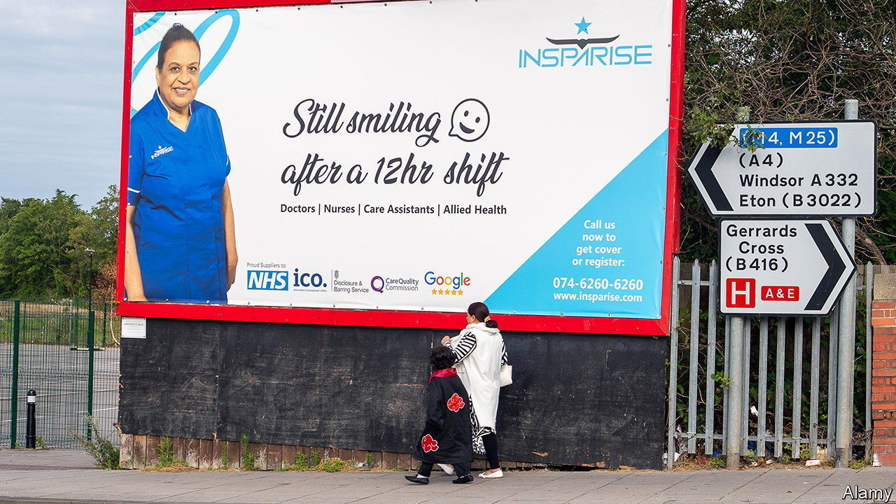

###### Immigrants and the economy

# How Britain plans to cut immigration 

##### New measures will make it harder for companies to hire workers 

 

> Dec 5th 2023 

When the Conservatives came to power in 2010 they promised to reduce net migration to below 100,000 a year. Since the Brexit vote in 2016, there has been much talk of “taking back control” of Britain’s borders. The 2019 Tory manifesto pledged to reduce immigration, though it did not give a number. Yet immigration has continued to climb, and the battle to rein it in continues to have wider consequences. 

Illegal migration is the cause of bitter Tory infighting. On December 6th James Cleverly, the home secretary, unveiled new legislation designed to get round a ruling by the Supreme Court last month, which found that its cherished scheme to  to Rwanda was unlawful. The bill orders the courts to ignore bits of domestic and international human-rights law; a new treaty with Rwanda, unveiled by Mr Cleverly earlier in the week, is meant to reassure judges that asylum-seekers sent there would be safe. That is not enough for hardliners who want to see Britain override a host of legal obligations, including the European Convention on Human Rights, in order to get flights to Kigali under way; Robert Jenrick, the immigration minister, promptly resigned. 

If the political costs of the immigration debate are mounting, so too are the economic ones. Mr Cleverly’s busy week had started with the announcement of measures to cut net legal migration (immigration minus emigration) by 300,000 people. From next spring those hoping to get a work visa will have to earn at least £38,700 ($48,800) a year, up from £26,200; visa exemptions for sectors where there are labour shortages will be reviewed; and the rules on bringing in foreign spouses and dependants will be tightened. 

These measures were prompted by the publication of official figures from the Office for National Statistics (ons), showing a net 672,000 people moving to Britain in the year to June. The figures for the full year of 2022 were revised up from 606,000 to 745,000—a record high. 

Business has not welcomed the new measures. Although the number of unfilled job vacancies has fallen over the past year, it remains high: at 957,000 according to the ons. Firms continue to report recruitment difficulties. While most of the Home Office’s estimated 300,000 will reduce the number of dependants and students rather than workers it will tighten the labour market at the margins.

Businesses also fear that the higher salary requirements for a work visa will give an advantage to firms in London and the south-east of England. The £38,700 is 13% below the median full-time salary in the capital but 17% above the median earnings in the north-west and 22% higher than in the East Midlands. The abrupt shift in policy has also raised corporate eyebrows, with bosses comparing it to recent U-turns on the  and the . A government that talks up the importance of long-term stability is increasingly making short-sighted and politically driven changes.

 


Health and social care, which have been major drivers of immigration for work reasons, are exempt from the new salary rules. Both sectors have faced especially acute recruitment challenges. Yet new rules mean workers will not be able to bring dependants. The Home Office say that 205,000 health and care visas were issued in the two years to September along with 236,000 visas granted to those workers dependants (see chart). This change will certainly lower net migration. It will also make it more difficult to attract workers to Britain. 

Mr Cleverly also announced that the government will make it harder for Britons to get a visa for family members. The minimum income required to bring a foreign spouse into the country will rise from £18,600 to £38,700. Under the old threshold, more than nine in ten Britons in full-time work could do this; under the new rules more than half will not be able to. Marrying someone from overseas will be especially tricky for the poor, the young and those outside the south-east. 

Immigration does matter to voters. According to polling from YouGov, a research firm, 40% of Britons consider immigration and asylum-seekers among the most important issues facing the country, up from under 20% in early 2021. But the new rules on dependants for health and social-care workers will make recruitment in hard-pressed sectors tougher. The overall package to restrict legal migration is likely to reduce economic growth. And Rishi Sunak’s promise to restore stability to government is foundering on the issue. Even champions of a tougher line on migration should recoil at all that. ■


