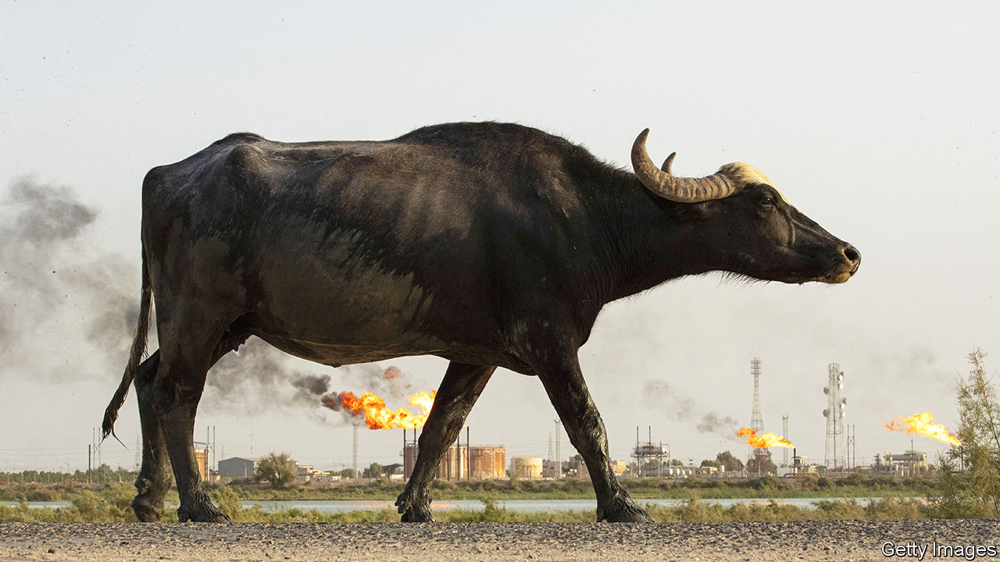

###### Step on the gas

# Big oil agrees to slash methane emissions 

##### About time 

 

> Dec 7th 2023 

Methane is responsible for perhaps 45% of current global warming. In debates over climate change the short-lived but highly potent greenhouse gas is nevertheless typically upstaged by carbon dioxide, which hangs around the atmosphere for hundreds of years. Not at this year’s annual UN climate summit, hosted by the United Arab Emirates (UAE) in Dubai. “Methane is taking its rightful place as the single biggest and fastest way to slow warming,” declares Durwood Zaelke, a renowned methane-warrior at the Institute for Governance and Sustainable Development, a think-tank. 

On December 2nd some 50 big hydrocarbon firms pledged in Dubai to all but eliminate the methane emissions associated with the exploration and production of fossil fuels by 2030. They also pledged to end routine flaring of methane, which is the principal component of natural gas. Although farming releases more methane (via belching ruminants and upturned land), the energy sector is more concentrated and thus easier to corral. Drillers also have a bigger incentive than farmers to prevent leaks. After all, the gas that doesn’t leak can be sold for a profit.

Critics were quick to denounce the deal as greenwashing. Some argued that it would not lead to a phase-out of fossil fuels, something that campaigners want to see agreed in Dubai. These sceptics suggest that a methane deal could be seen as giving the oil-and-gas industry, which they want to kill off, a “get out of jail free” card. One green group complains that the deal is voluntary and worries that the promised cuts will not be honoured. 

That is a reasonable concern, given the fossil-fuel industry’s dismal record of climate denial and regulatory obstruction. Still, the deal represents a breakthrough of sorts. The companies involved account for some 40% of global oil production, and include not just Western supermajors like ExxonMobil and Shell but also 29 national oil companies, among them Saudi Aramco, the mightiest of them all, and ADNOC of the UAE. The state giants, which are responsible for the majority of the industry’s methane emissions, had long resisted joining any such agreement, or even acknowledging that the leaks existed. Their participation is therefore a big win.

The adopted target, to cut methane emissions by an order of magnitude, to a mere 0.2% or so of oil and gas production by the end of the decade, is both ambitious and precise. Progress will be independently verified by third parties, including the UN Environment Programme. Helpfully, the third-party verifiers have a growing toolkit at their disposal, from methane-sniffing satellites to ground-based sensors. Any methane-miscreants should have nowhere to hide. ■


