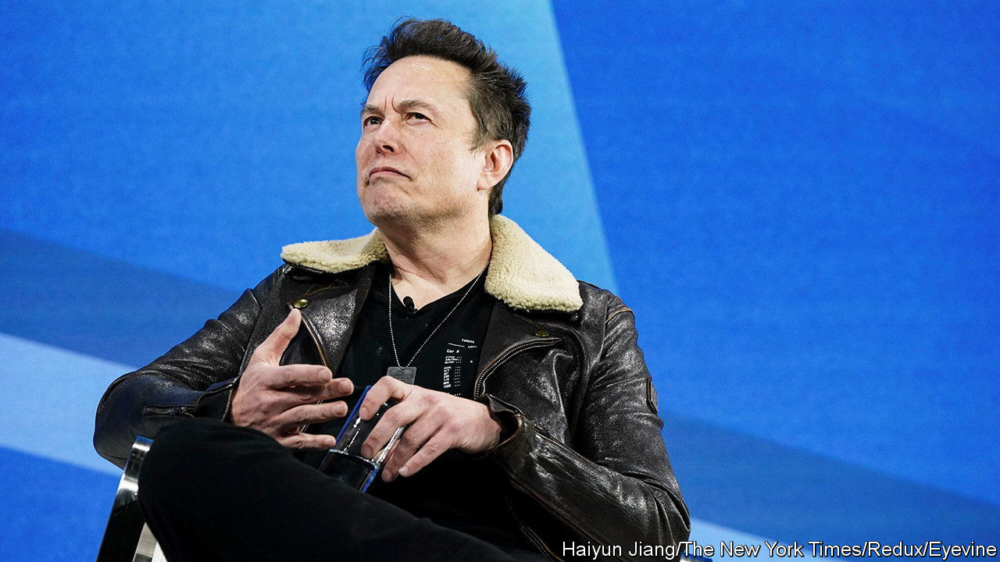

###### Mad man v mad men

# Elon Musk’s X is especially vulnerable to an ad boycott 

##### The perils of telling advertisers to clear off 

 

> Dec 6th 2023 

For someone who despises the advertising industry,  has a way with viral slogans. At a  event on November 29th the world’s richest man was asked how he felt about firms pulling ads from X, the social network he bought last year when it was known as Twitter. “If somebody’s going to try to blackmail me,” he replied, “go fuck yourself.” The “GFY” approach, as he dubbed it, may come naturally to billionaires. But it is bold for a company that last year made 90% or so of its revenue from ads. Those that have pulled ads from X include Apple and Disney, whose presence Mr Musk previously cited as evidence that X was a safe space for brands.

Advertisers are worried about unsavoury content on the platform. Since Mr Musk fired 80% of X’s staff, including many moderators, more bile seems to be leaking through the filters. Last month Media Matters for America, a watchdog, reported that ads for brands such as IBM had appeared alongside posts praising Adolf Hitler (X disputes this and is suing Media Matters). 

Social networks are freer than mainstream media to tell advertisers to get lost. Whereas a typical TV network in America gets most of its ad revenue from fewer than 100 big clients, social networks can have millions of small ones. A year ago the largest, Facebook, was getting 45% of its domestic sales from its 100 biggest advertisers, reckons Sensor Tower, a research firm; a boycott against it in 2020 by more than 600 firms, including giants like Unilever and Starbucks, had little effect on sales. But X lacks Facebook’s sophisticated ad-targeting apparatus, and relies on campaigns by big brands. In October 2022, when Mr Musk bought Twitter, its 100 top clients accounted for 70% of American ad sales. 

 


Half of them have since left X, Sensor Tower says. On December 1st Walmart said it had gone, owing to its ads’ poor results on X. The impact has been severe. In September Mr Musk said that X’s American ad business was down by 60%. Advertisers in other regions may be less bothered by the culture wars that Mr Musk is fighting. But X is unusually reliant on America. Whereas Meta, Facebook’s parent company, makes most of its money abroad, 56% of Twitter’s revenue came from America before Mr Musk bought it. Even before GFY, Insider Intelligence, another research firm, expected X’s worldwide ad sales to fall by more than half this year (see chart). 

Mr Musk’s fans insist being rude to air-kissing admen and “woke” brands delights X’s everyman users. X still has nearly five times as many as Threads, a newish rival from Meta. Yet Sensor Tower reports that the X app is being downloaded less often than a year ago, and estimates that it has lost 15% of monthly users. 


Some observers put this down to a purge of bots and fake users. Still, X must monetise the users it has in new ways to make up for the declining ad dollars. One idea is X Premium, which offers extra features and fewer ads for between $3 and $16 a month. So far there seem to be few takers: Sensor Tower estimates that X has sold $60m-worth of subscriptions in the past year, equivalent to 1% of pre-Musk annual ad sales. Mr Musk has talked of turning X into an “everything app”, handling payments, calls and more. But even optimists concede this would take years.

Until then, the aim is to replace the departing big advertisers with an army of little ones. X is said to be working on its ad technology for smaller firms, eyeing a Facebook-like long tail of clients. There is no time to lose. Further drops in ad sales could necessitate a bail-out from investors, or from Mr Musk himself. X’s employees have their work cut out to attract advertisers faster than their boss repels them. ■


