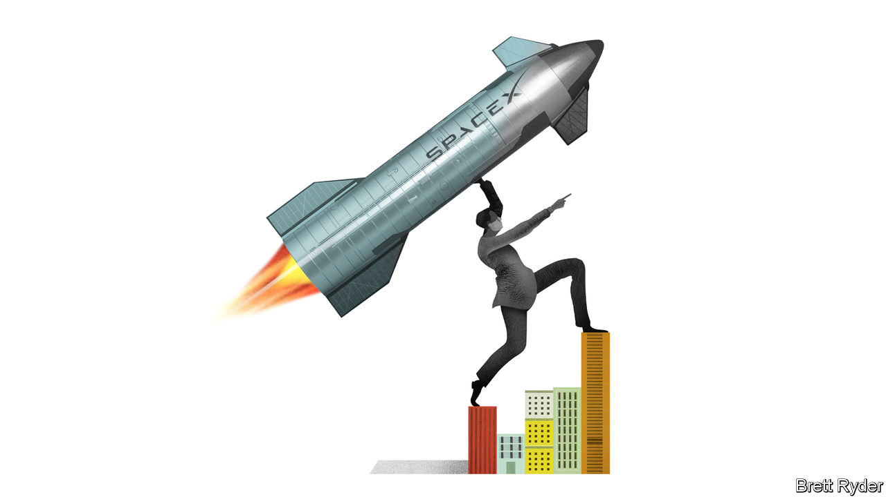

###### Schumpeter

# Elon Musk’s messiah complex may bring him down 

##### Saving humanity is all the rage right now 

 

> Dec 5th 2023 

Every few days a  takes off to ferry satellites into orbit. You might think it would feel commonplace by now. Not for the crowds gathered at Vandenberg Space Force Base in California on December 1st. First came the exhilaration. The sight of the rocket blazing through the sky, then dropping its reusable first stage, with Mary Poppins-like grace, onto the launch site provoked gasps of awe, as did the sonic boom that followed. “It never gets old. It’s like being at an AC/DC concert,” a bystander murmured. Then came the realisation of the accomplishment. This spacecraft had a geopolitical payload: it carried South Korea’s first spy satellite, trying to catch up with North Korea days after the hermit state reportedly  into orbit. It also had a scientific one: it took Ireland into the space age, by carrying the country’s first satellite, built by students at University College Dublin. 

It was lost on no one that they had Elon Musk to thank for the spectacle. At the same time, the almost unwavering reliability of the engineering marvels the founder of SpaceX, the firm behind the Falcon, has fathered—SpaceX has launched and recovered its rockets 250 times—stands in stark contrast with the unhinged, error-prone remarks that in recent weeks have made him sound like a petulant space cadet. These included: appearing to endorse an antisemitic tweet on X, his social-media platform (an act he later called “foolish”); a cringeworthy trip to Israel that he said was to promote peace but looked more like an apology tour; a barrage of “Go fuck yourself”s to advertisers such as Disney at a  summit, after they pulled their ads from X; and crass self-mythologising like his comment that he has “done more for the environment than any single human on Earth”.

One attendee at the rocket launch sighed that Mr Musk, for all his genius, now reminded him of the messed-up Tony Soprano, from the mobster TV series. But another, a young British physics buff, put his finger on why the entrepreneur still enjoyed a cult following. “He’s clearly a very troubled man. But being strong and turning a troubled past into a successful future is attractive. He’s a mega-leader. He has to make people believe he can walk on water.”

This points to the quandary at the heart of the Musk phenomenon. Is the braggadocio just the showmanship of a business pioneer? Can a man who has challenged conventions of engineering, energy and economics to revolutionise land and space travel get away with defying rules of human decency because of the importance of his mission? Or has the mission itself gone to his head, creating a saviour complex that could eventually bring him down?

The answer is a combination of all three. Mr Musk’s provocative humour, from boyish fart jokes to pranks like smoking pot in public, have helped burnish his reputation as a business maverick. Often he goes too far, riling regulators and raising concerns about the state of his mental health. But his rule-breaking also thrills his fans and, though his main marketing technique has been to sell great products, helps his brands get noticed; until this year, Teslas sold themselves by word of mouth, rather than by advertising. His showmanship has a Willy Wonka quality to it; it is hard to know where the magic ends and the madness begins, but you can hardly tear your eyes away. 

To be sure, now that Tesla, worth $750bn, is the most valuable carmaker in the world and SpaceX is reportedly valued at $150bn, his motives for continuing to behave obnoxiously are murkier. An anecdote in Walter Isaacson’s recent biography suggests they may be compulsive. Mr Musk’s friends once took his phone and locked it in a hotel safe to stop him tweeting overnight. At 3am he ordered hotel security to unlock the safe. Yet however toxic his tweets are for X, which lives off ads, they do not matter much to customers and investors of Tesla and SpaceX. Though his X antics have caused periodic drops in Tesla’s share price, over the years it is up spectacularly. If SpaceX goes public, investors will dive in, even if some hold their noses while doing so. For all his flare-ups, it is mostly thanks to his vision and drive that the company has such a head start in both rocketry and satellite communications. 

Most troubling is the messiah complex. From Tesla and SpaceX to artificial intelligence (AI), Mr Musk acts as if he is on a mission to save humanity, by preventing climate catastrophe, providing an exit route via interplanetary travel, stopping machines from out-thinking man, or averting nuclear Armageddon (last year he stymied Ukraine’s efforts to strike back against Russia by refusing to extend its access to his Starlink satellites to Russian-occupied territory, on the grounds that such an attack might lead Vladimir Putin to retaliate with nukes). At times he sounds like a capricious Greek god who believes he holds the fate of the world in his hands. “Finally the future will look like the future,” he bragged when launching Tesla’s Cybertruck pickup on November 30th. 

Saving humanity is in vogue right now. It is a dangerous fetish. Last month a charter to protect the world from the dangers of rogue AI almost destroyed OpenAI, maker of ChatGPT. A year ago Sam Bankman-Fried, now a convicted fraudster, claimed that the disastrous risks he took with his FTX crypto-exchange were in service of humanity. Such missionary zeal is not new in business. It pushed Henry Ford, inventor of the Model T, to raise workers’ living standards. But his saviour complex got the better of him and he ended up spewing antisemitic bile.

X post

Mr Musk’s hubris, too, may end badly. For all the futuristic twaddle about the Cybertruck, drivers struggled to find its door handles. Yet in the grand scheme of things, his technical accomplishments will probably outweigh his all-too-human imperfections. For pioneering electric cars and reusable rockets, he has earned his place in history. Future generations will probably judge him the way today’s judges Ford: a handful will decry his flawed character; most will remember the majesty of his creations. ■


