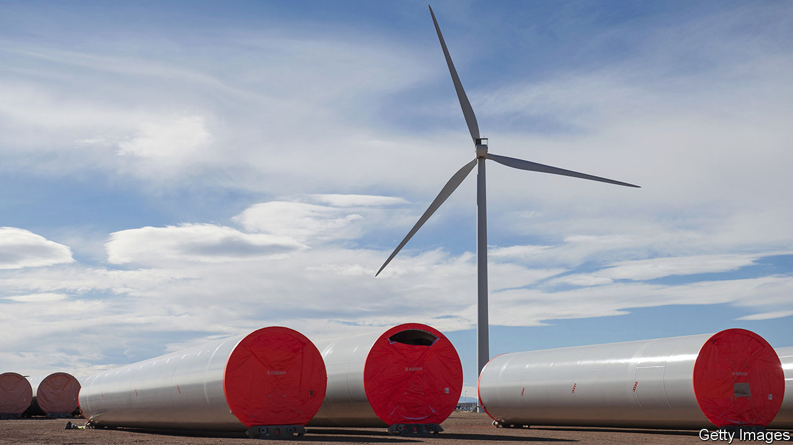
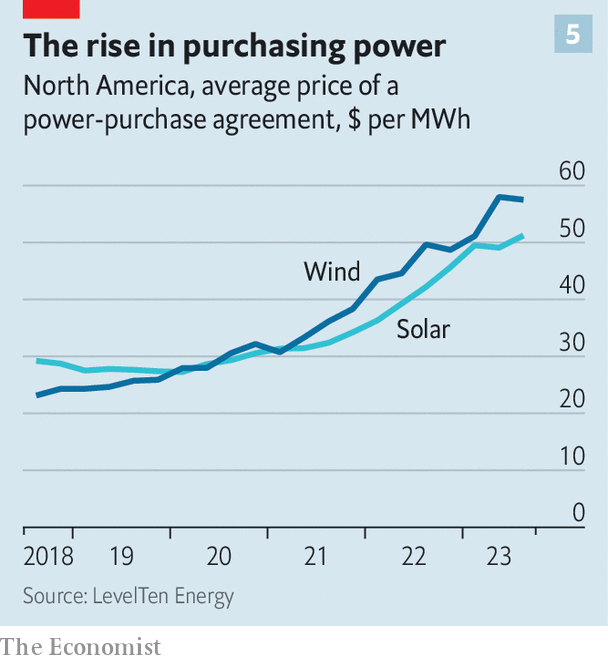

###### Unsustainable developments

# The renewables business faces a make-or-break moment 

##### Supply-chain dysfunction, rising interest rates and protectionism are making life tough 

 

> Dec 4th 2023 

A FEW YEARS ago renewables were having their .  lowered the cost of clean power, which is expensive to deploy but runs on sun and wind that come free of charge. The price of solar panels and wind turbines fell as technologies matured and manufacturers gained scale. These developments brought the levelised cost of electricity (LCoE)—which accounts for capital and operating expenditures per unit of energy—for solar, onshore wind and offshore wind down by 87%, 64% and 55%, respectively, between 2010 and 2020 (see chart 1). Clean energy became competitive with dirty alternatives, and was snapped up by big corporate power-users directly from developers. 

 


Infrastructure investors such as Brookfield and Macquarie made big renewables bets. So did some fossil-fuel firms, such as BP. Utilities such as EDP and Iberdrola in Europe and AES and NextEra in America poured money into projects. Average returns on capital put to work by developers rose from 3% in 2015 to 6% in 2019, a similar level to oil-and-gas extraction but with less volatility. The industry’s prospects looked so bright that in October 2020 the market value of NextEra briefly eclipsed that of ExxonMobil, America’s mightiest oil giant, making it America’s most valuable energy company.

 


Today these prospects look considerably dimmer. Over the past two years the economics of renewables have been hit by rising interest rates, supply-chain snags, permit delays and, increasingly, the protectionist instincts of Western governments. The “green premium” in stocks has turned into a “green discount”. The S&amp;P global clean-energy index, which tracks the performance of the industry, has declined by 32% over the past 12 months, at a time when the world’s stockmarkets have risen by 11% (see chart 2). AES has lost more than a third of its value. NextEra is worth roughly a third as much as ExxonMobil, which has been buoyed by a surge in the oil price. Manufacturers of wind turbines went from just about profitable to lossmaking (see chart 3).

 


That is a problem, and not just for the renewables companies and their shareholders. On December 2nd, at the annual UN climate summit being held in Dubai, 118 countries pledged to increase their combined renewable-energy capacity to 11,000 gigawatts (GW) by 2030, up from 3,400GW last year, as part of their decarbonisation efforts. That will require adding some 1,000GW a year, three times what the world managed last year. For this to happen, renewables must once again look like a business to bet on.

The industry’s recent troubles are the result of a confluence of factors. One problem is rising costs along the supply chain. The price of polysilicon, a key material in solar panels, rocketed from $10 per kilogram in 2020 to as much as $35 in 2022, thanks to pandemic-era supply-chain problems in China. The price of solar modules jumped in response. 

Costs related to wind turbines have soared, too. Russia’s invasion of Ukraine pushed up the price of steel, an important input of which both countries are big producers. What is more, to create longer and more powerful blades, their makers have pushed into new technological territory, including experimenting with materials like carbon-fibre composites rather than fibreglass. To capture stronger winds at bigger heights, the average tower is now almost 100 metres tall. In 2018 GE unveiled a 260-metre offshore wind turbine, not much shorter than the Eiffel Tower. Suppliers of the 8,000-odd parts of a wind turbine have struggled to keep up. Ships and lorries are having trouble transporting parts the size of football pitches. 

All this has led to delays and manufacturing failures for wind turbines. In October a turbine made by Vestas, a Danish firm, caught fire in Iowa. Around the same time the blades on a GE turbine in Germany snapped and fell into a field. Warranty provisions in sales contracts make manufacturers bear the cost of such incidents. In the past 12 months such warranties cost Vestas €1bn ($1.1bn). Quality problems at Siemens Gamesa, including creases in its blades, drove annual operating losses for its parent company, Siemens Energy, to €4.6bn. On November 14th the parent was granted a loan guarantee by the German government to help it avert a crisis.

Can green stay out of the red?

To stem the bleeding, equipment-makers have been raising their own prices. Western ones now charge a fifth more than they did at the end of 2020, according to S&amp;P Global, a data provider. These price rises have combined with higher interest rates to push up the LCoE for American offshore-wind projects by 50% over the past two years, calculates BloombergNEF, a research firm—even after including subsidies wrapped up in the Inflation Reduction Act (IRA), President Joe Biden’s mammoth climate law. 

Developers that locked in electricity prices with customers before locking in costs have found themselves stuck with unprofitable projects. In America they have either cancelled or sought to renegotiate contracts for half the offshore-wind capacity being built in the country, according to BloombergNEF. 

In October Orsted, a Danish company that is the world’s largest offshore-wind developer, took a $4bn writedown when it cancelled two large projects off the coast of New Jersey. In Britain, a government auction in September to provide offshore wind power to the grid at a maximum guaranteed price of £44 ($56) per megawatt-hour (MWh) received no bids.

Renewables bosses also grumble about bureaucratic delays. In America it takes on average four years to get approval for a solar farm and six for an onshore wind one. An EU rule that approval times for renewable projects in the bloc should not exceed two years is honoured mostly in the breach. Because solar and wind farms typically produce less energy than conventional power plants and, with easy-to-connect sites already taken, are being built in increasingly remote places, they often need new transmission lines. These, too, need to be approved. In America the interconnection queue for renewable energy is 2,000GW long and growing.

All this is made worse by rising green protectionism. America has, in effect, locked out Chinese solar manufacturers with hefty anti-dumping duties and the Uyghur Forced Labour Prevention Act of 2021, which bars American developers from importing modules containing polysilicon from the Xinjiang region, source of half of the global supply. As a result of such policies, solar modules are more than twice as expensive in the United States as elsewhere, according to Wood Mackenzie, a consultancy. 

Those costs may rise further. In August the Department of Commerce found that some South-East Asian suppliers were merely repackaging products from China, and would thus also be slapped with the same anti-dumping duties from the middle of next year. The Biden administration is using the IRA’s domestic-content requirements to lure production home. First Solar, the biggest American maker of modules, is expanding its domestic production capacity from 6GW this year to 14GW by 2026. Yet that is a tiny fraction of what America will need to meet its decarbonisation goals. It will also do little to lower prices in the industry as a whole.

 


Europe is sending mixed signals. The EU has dropped earlier anti-dumping duties on Chinese solar panels. But on November 22nd the European Parliament passed the Net Zero Industry Act, which will introduce minimum domestic-content requirements for public renewable-energy contracts. The European Commission is also mulling a probe into China’s subsidies for its turbine manufacturers, which sell their gear for 70% less at home than Western rivals charge elsewhere in the world (see chart 4). Chinese firms are already gaining traction outside their home market. They are now bidding more regularly on projects around the world, notes Miguel Stilwell d’Andrade, chief executive of EDP. 

Trade restrictions will not just keep out cheap Chinese solar panels and wind turbines. They will also affect the availability of parts. Siemens Gamesa plans to outsource more of its supply chain to trim costs. Western turbine manufacturers already purchase nacelles, towers and other components from China, which dominates their production. For offshore-wind projects, America will need to import the majority of components to meet its 2030 targets, according to the Department of Energy. Supply shortages are likely as the world races to deploy more renewable power. Tariffs and local content regulations could make the problem worse.

There are few signs of the protectionist mood lifting. But the industry is at least starting to get a grip on some more immediate challenges. Polysilicon prices have fallen and production capacity is increasing up and down the solar supply chain. Western turbine manufacturers may be turning a corner, too, helped by a fall in commodity prices and greater technological and financial discipline. The industry is realising that “bigger is not always better” for turbines, says Henrik Andersen, chief executive of Vestas. On November 8th the Danish firm reported that it returned to profitability in the third quarter. 

 


Developers, for their part, are managing to raise prices without hurting demand. In the past two years prices for solar and wind power received by developers in America under power-purchase agreements have increased by nearly 60%, according to figures from LevelTen Energy, an energy marketplace (see chart 5). Andres Gluski, chief executive of AES, says that his company is on track to put more than twice as much renewable-energy capacity into service this year as in 2022. Returns are holding steady, he adds. In next year’s offshore wind auction Britain will lift the maximum price from £44 per MWh to £73. Germany, too, has been raising ceiling prices for solar and wind auctions. 

“No one enjoys seeing prices go up, but they are accepting it,” says Mark Dooley of Macquarie. If approval rules are not relaxed and protectionism goes unchecked, a lot more acceptance will be necessary. ■


