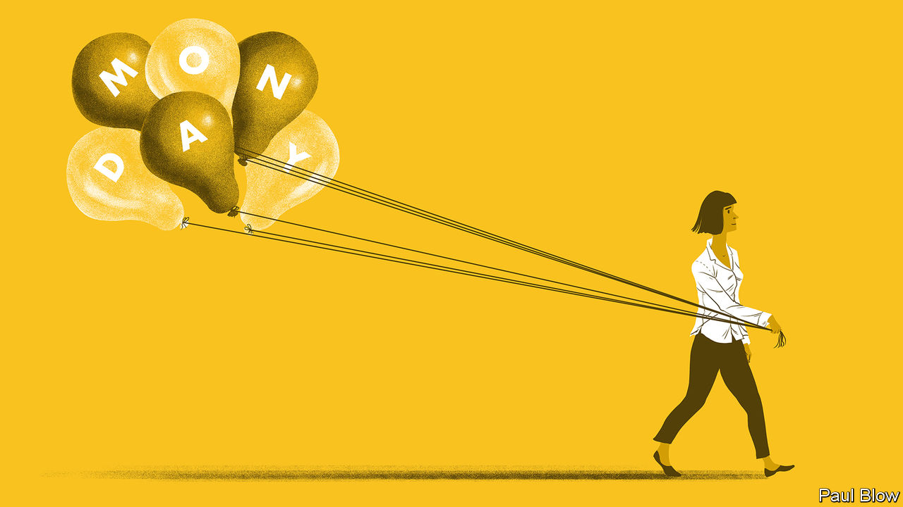

###### Bartleby

# Why Monday is the most misunderstood day 

##### What’s wrong with the start of the workweek? 

 

> Dec 7th 2023 

WHEN THE Boomtown Rats, an Irish band, released “I Don’t Like Mondays” in 1979, the song became an instant hit. The inspiration behind it was the Cleveland Elementary School shooting in San Diego that year. The 16-year-old perpetrator listed “not liking Mondays” as her main reason for firing 36 shots, killing two adults and injuring eight children and a police officer. This is not, though, why the song resonated with millions of people around the world; most of them are in all likelihood unaware of its tragic origins. What many do recognise all too well is the difficulty of summoning the energy to get out of bed on Monday mornings in order to face the week ahead. 

Many bosses argue that starting off the week in person in the office creates good energy. Plenty of employees beg to differ. A paper published in 2021 by the , found that people tend to be more ill-mannered on Mondays, and grow more courteous as the week unfolds. 

A paper from 2015 by Yun Tae Hwang and Amy Kang published in the  goes so far as to diagnose a new condition, Mondayitis. The authors define it as “a systemic illness with a non-specific constellation of symptoms including fatigue, lethargy or asthenia, dysthymia, irritability, light-headedness, photophobia, dry mouth, myalgia and headache in the absence of another focal or systemic illness”. 

These symptoms typically appear on the first working day after a period off work, which could be a weekend or a longer holiday. They can lead sufferers to call in sick, decide to work from home or, if they do show up in the office, come across as detached and unavailable. So much for good energy.

Mondayitis appears to be contagious, infecting other days of the week. Some Americans now complain of “Sunday scaries”, when pre-Monday dread sets in as the weekend draws to a close. Both conditions can be aggravated by a weekend hangover, a looming deadline or painful memories (double science in secondary school first thing in the morning?). They are likely to be particularly acute among the nearly half of American workers who, according to a poll from 2022 conducted by UKG, an HR-software company, hate their jobs.

Still, the sudden shift from non-work to work affects everyone, not just those who despise what they do for a living. The covid-19 pandemic has led many people to re-evaluate their work-life balance. A barrister in London who spends weekends working on cases likes to ease into the formal workweek with an elegant breakfast at The Delaunay and lunch in Inner Temple Hall. A broader movement is promoting the idea of a four-day workweek, one permutation of which would make Monday part of the weekend (though this may lead to an epidemic of Tuesdayitis instead). Less ambitiously, and more realistically, a social-media campaign for “bare-minimum Mondays” argues for a gentle start to the week. 

All this reflects a deep human instinct towards self-indulgence and procrastination; there is a reason why “Thank God it’s Monday” does not feature on many bumper stickers or T-shirts. Still, on that first day of the week employees do not have to be mired in apathy, weariness and desire that things were otherwise. As Robert Frost counselled in his poem, “A Servant to Servants”, “the best way out is always through.” 

The preceding 60 hours or so were probably spent with people who have nothing to do with your job. You may have prepared—or merely enjoyed—a more elaborate meal than an  sandwich. You may have gone for a walk in the park or simply lounged in bed. Either way, you almost certainly cleared your head. Unless you capped the weekend off by going on a bender, this means that the following morning could be your most productive time of the week. 

For one banker, Monday is the day to cross items off their to-do list. Your columnist, a guest Bartleby, feels crisp and invigorated on Monday mornings (which is when the editorial meetings take place at , planning and discussing the coming week’s issue). The first shower, coffee and commute after the weekend do not have to feel like a hike with a rucksack full of stones. They can instead be imbued with a renewed sense of purpose and, as such, act as a tonic. It is on Friday afternoons when Bartleby feels depleted and cannot wait to go home—until Monday morning, when revived and spirited, she is ready to do it all over again. ■


