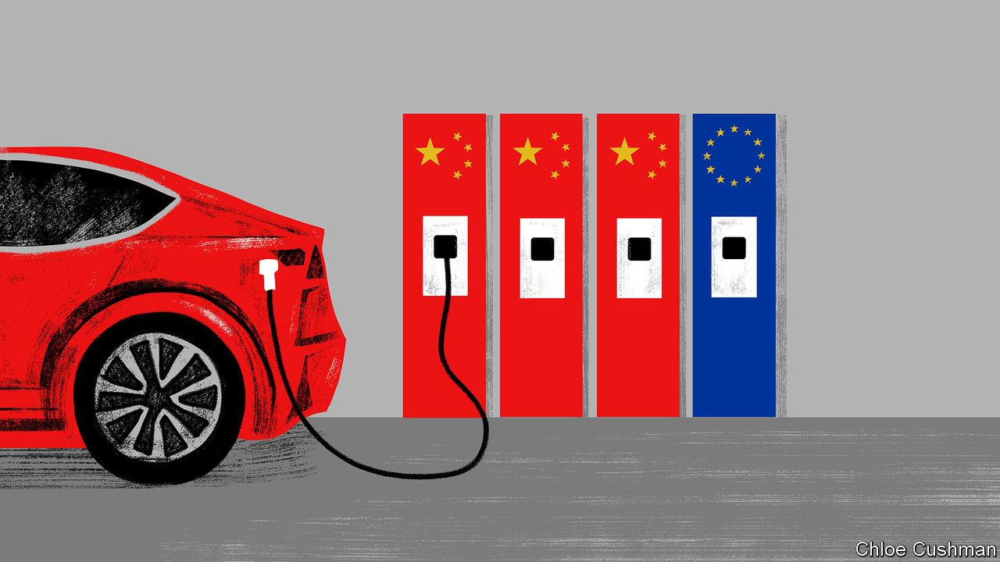

###### Chaguan

# China and the EU risk a trade war 

##### Massive Chinese overcapacity in electric cars is a giant political risk for Europe 

 

> Dec 7th 2023 

China and the European Union could not have set expectations much lower for their summit on December 7th in Beijing. Before Xi Jinping hosted Charles Michel, president of the European Council, and Ursula von der Leyen, head of the European Commission, EU officials warned that substantive agreements on trade, climate change or geopolitical differences were unlikely.

The EU visitors were expected to raise China’s closeness to Russia and to ask about alleged sales by Chinese companies of dual-use items, such as semiconductors or drone parts, that help Russia’s war effort in Ukraine. Alas, China’s line on Ukraine has hardened in recent months. Chinese officials have left Western diplomats with the impression that they expect Vladimir Putin to avoid a humiliating defeat, and to see Western unity crumble, making a frozen conflict a likely outcome. Just in case China’s indifference to moral pressure was not clear enough, on December 4th Mr Xi hosted Alexander Lukashenko, the president of Belarus, for the second time this year. Mr Xi spoke of strengthening political trust with Mr Lukashenko, a Putin ally and pariah in EU circles.

Arguably, the China-EU summit was not as urgently needed as last month’s meeting between Mr Xi and President Joe Biden in California. For months the Chinese government had severed channels of communication with America. In contrast China-EU dialogues and working groups never stopped. That said, recent high-level China-EU contacts are described as “talking about everything, without concrete results”.

Yet the lack of drama should not be mistaken for calm. A giant confrontation over trade looms. Tensions are high because, as so often before, Chinese state planners and local officials have subsidised overcapacity in a promising sector. Over the years, Europe’s industrial landscape has been reshaped several times by China opening far more firms and factories than markets need. Whereas in the past the threat involved basic commodities such as steel, lately China has achieved dominance in advanced sectors which European firms once led, like wind turbines or solar energy.

Another such sector is cars, an industry with a powerful grip on public hearts and minds. China has focused on battery-powered electric vehicles. Even after consolidation in the sector, over a hundred firms still produce such cars. A few brands are world-class. Most are cheaper than Western rivals. Chinese firms became dominant through a mixture of subsidies and coercive transfers of foreign technologies, but also hard work and foresight, as they leap-frogged slow-to-change foreign firms. Between them they make far more cars than China’s market demands.

Some European governments are ready to resort to crude protectionism. In October the European Commission launched an investigation into Chinese electric vehicles and whether their makers receive subsidies that break international trade laws and harm EU firms. The probe could see punitive tariffs imposed. It has already angered China. German carmakers—whose China operations remain huge, though less profitable than before—are anxious about retaliation. In a recent speech, Ms von der Leyen retorted to German politicians that Europe faces unsustainable competition. “There is clear overcapacity in China, and this overcapacity will be exported. Especially if overcapacity is driven by direct and indirect subsidies,” she said. “This will worsen as China’s economy slows down, and its domestic demand does not pick up.”

In early December Chaguan attended the Stockholm China Forum, a private gathering in Singapore of American, Chinese and European officials and scholars convened by the German Marshall Fund, a think-tank, and Sweden’s foreign ministry. One theme was Chinese overcapacity in manufacturing and its potential to disrupt European attempts to “de-risk” relations with China.

When considering the European perspective, it helps to think about EU goals as sides of a triangle. On one side is the bloc’s determination to embrace green, low-carbon technologies. On another is its desire to end damaging dependencies on Chinese products and inputs. And on the third side is its goal of preserving industrial jobs. As of now, Europe cannot have all three sides of its triangle.

Hard to square

The EU could prioritise the first goal, focusing on the environment by importing Chinese-made electric vehicles and other clean tech. But that would ignore fears about lost businesses and jobs. European officials worry that millions of subsidised Chinese cars could be dumped on its markets each year, especially as tariffs and other rules close American markets to batteries from China. Of course, guarding European jobs and businesses by blocking Chinese vehicles would raise the opposite problem: Europe would be less green than it wants to be. Such protectionism would also harm drivers.

A bigger challenge pertains to the second side of the triangle. China is determined to keep the EU reliant on its supply chains. Indeed, in 2020 Mr Xi called such dependencies a “powerful counter-measure” for controlling foreigners. Since then China has imposed export controls on critical minerals, including a form of man-made graphite that European firms need to make advanced batteries. The EU could work to avoid dependencies on Chinese technologies while trying to keep factories humming at home. But without Chinese minerals, for instance, those same factories cannot produce electric cars or batteries at scale, forcing Europe to forgo or delay its low-carbon revolution. For years to come, then, Europe must choose between the planet, independence from China and shielding industry at home.

China, for its part, continues to invest heavily in manufacturing. Chinese officials appear to believe that their country’s market power and control of clean technologies will force Europe to back down. They hope that Ms von der Leyen’s commission lacks support from key EU governments. Perhaps they are right. If they are wrong, this could end with a trade war. ■


 (Nov 30th)


