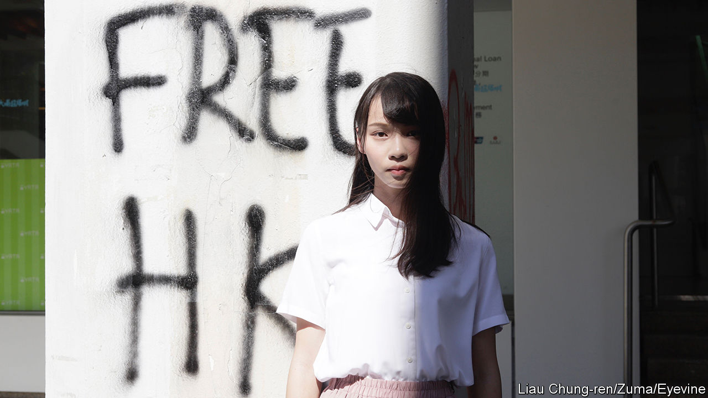

###### More and more like the mainland

# Why Agnes Chow fled Hong Kong and isn’t likely to return 

##### She and other activists resent the government’s coercive tactics 

 

> Dec 7th 2023 

On the eve of her 27th birthday this month, Agnes Chow updated her Instagram feed for the first time in two and half years. The former activist (pictured) was jailed in 2020 for taking part in pro-democracy protests in Hong Kong a year earlier. Upon her release on bail in 2021, national-security agents in the city confiscated her passport. She is still under investigation. On Instagram she said that she lived in fear, avoiding politics and struggling with anxiety and depression.

She also outlined the extraordinary steps that the authorities in Hong Kong took in an effort to change her views. She was forced to write a letter expressing regret for her actions and vowing not to contact other activists. In August five agents escorted her to Shenzhen, a city in mainland China. They took her to an exhibit touting the country’s achievements since it began to reform its economy. She was made to pose for photographs at the headquarters of Tencent, a technology giant. In the end, she had to write a thank-you letter to the police for showing her “the motherland’s great development”. 

Ms Chow had to do all that in order to get her passport back. Earlier this year she was accepted into a master’s programme in Canada. In September, a day before she was due to leave, the document was returned to her. Now in Toronto, she has decided not to go back to Hong Kong, perhaps for the rest of her life. “I don’t want to be forced into doing things against my will any more,” she wrote on Instagram. “My body and spirit will collapse.”

As the story of Ms Chow shows, the police and officials in Hong Kong are adopting tools often used on the mainland to control residents. These range from forced confessions and so-called “patriotic tours” to re-education campaigns in prisons. Young people are a particular target. Even as the city tries to woo back tourists and businesses under the banner of “Happy Hong Kong”, its leaders are planning to expand the use of such tactics.

Officials in Hong Kong have condemned Ms Chow for jumping bail. “Fugitives will be pursued for life unless they turn themselves in,” said John Lee, the city’s chief executive. He added that Ms Chow is a “liar” and a “hypocrite” who is suspected of “collusion with foreign forces to endanger national security”, a vague charge often used to punish activists. Those foreign forces are still trying to infiltrate Hong Kong, said Mr Lee, so the local government intends to enact new security-related measures next year. Article 23 of Hong Kong’s constitution, the Basic Law, mandates the government to form such legislation, but public opposition has delayed the task until now.

Radical measures

In order to control people like Ms Chow the government has also developed what it calls a “deradicalisation” programme. This usually takes place in prison. According to officials, hundreds of detainees have taken part. Most were protesters. A young participant called Tsang Chi-kin was recently interviewed for a television series sponsored by Hong Kong’s police. Shot during a pro-democracy protest in 2019 and later arrested, Mr Tsang said the programme taught him to manage his emotions. “We must think clearly before acting to avoid being incited and instigated by others.”

The programme involves meeting a psychologist, studying Chinese history and culture, and attending career-planning sessions. One government video shows detainees playing the drums. They perform a song called “Chinese People”. “I am proud to be Chinese,” says a detainee. “Chinese drums were invented by us Chinese people. I feel very accomplished to be a part of the People’s Republic of China.”

Hong Kong officials seem to think the deradicalisation programme is working. There have been no big protests since 2019. But the pandemic and China’s broader crackdown on dissent in Hong Kong are the main reasons for that. Released detainees say they resent the attempted “brainwashing”. Such coercive methods are good for one thing, though: pushing young people like Ms Chow away. ■


