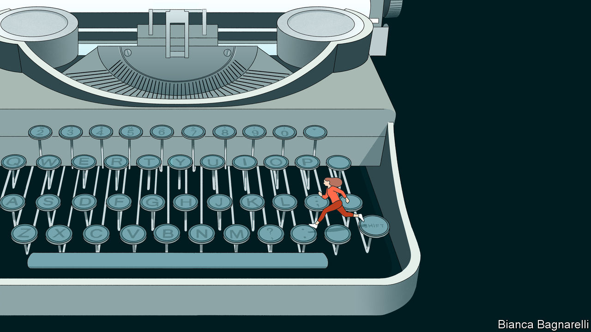

###### Write on

# Books by The Economist’s journalists in 2023 

##### From our desks to your library 

 

> Dec 1st 2023 

By Tom Lee-Devlin and Ian Goldin. 

One of our business correspondents examines how cities came to dominate the global economy and explains how they will solve issues, including climate change and inequality, in the years ahead. Richard Florida, an urban theorist, called it “the book we need now.”

Edited by Rachel Lloyd and Simon Akam. 

A compendium of writing advice, co-edited by our deputy culture editor. Celebrated authors, including Ian McEwan and Elif Shafak, reflect on their careers and creative process. “An invaluable repository of wisdom that you can return to over and again”, said the 

 By Daniel Knowles. 

A polemic against the dominance of automobiles, by our Midwest correspondent, which argues that cars threaten the climate, undermine cities and make people economically worse off. “Briskly written” and “well researched”, according to the 

 By Ann Wroe. 

Our obituaries editor reflects on 20 years of recording the lives of other people in a collage of prose, poetry and memoir. “Astonishing” said the. Named a book of the year by the London , the and the 

 By Alix Christie. 

A novel about the North American fur trade in the 19th century, by one of our regular contributors to the Culture section. An “original, truly epic and memorable saga”, said the .

By Michael Reid. 

An account of Spain’s democratic achievements since Franco, by a former correspondent and senior editor. “Reid has a gift for making the abstruse accessible,” said the. 

By Richard Cockett. 

One of our senior editors traces Vienna’s rich intellectual history from psychoanalysis to Reaganomics. This book looks at how history, science and culture have been shaped by the city of Sigmund Freud and Gustav Mahler. The thought it was “illuminating”.

By Lane Greene. 

Our guide on how to write with style, updated by our language columnist. “A succinct yet comprehensive distillation of The long-standing philosophy of language,” said 


