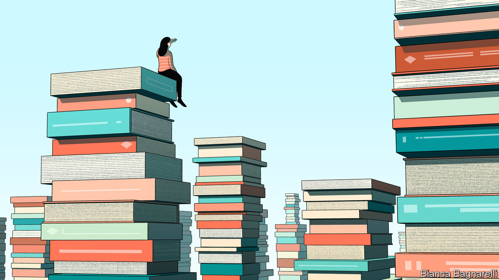

###### Shelf help

# The best books of 2023, as chosen by The Economist 

##### This year’s picks transport readers to mountain peaks, out to sea and back in time 

 

> Dec 1st 2023 

Current affairs and politics

By Murong Xuecun. 

In 2020, at the start of the pandemic, a celebrated Chinese writer interviewed people in Wuhan about their experiences during lockdown. His  follows eight people, including a doctor at a small hospital, an unlicensed driver of a motorcycle taxi, and a citizen journalist, whose daring efforts resulted in a prison sentence.

 By Azam Ahmed. 

Since the early 2000s, the number of Mexicans who have disappeared and not yet been found has risen from a handful to more than 100,000. A journalist for the  tracks Miriam, whose youngest daughter is kidnapped and then killed by the Zeta gang. By focusing on one mother’s extraordinary story, the author evokes the cartels’ painful toll. 

 By Hawon Jung. 

A  of South Korean feminists’ struggle for equality with global resonance. It describes how many South Koreans still see women only as cooks, cleaners and “baby-making machines” and tells tales of misogyny, from spycams in public toilets to bigots in public office.

By Tim Alberta. 

This chronicle of the modern evangelical movement in America is a horror story told from the inside. Its author, a staff writer for the  is angry and heartbroken as he watches the religious community in which he was brought up being hijacked by power-hungry hucksters and right-wing nationalists. 

By Patricia Evangelista. 

A rigorously reported look at Rodrigo Duterte’s campaign against illegal drugs from a Filipina journalist. It is also a story of lost innocence, as she learns that the vast majority of people in the Philippines supported their president’s lawless war on drugs, in which perhaps 27,000 people were killed extra-judicially.

 By Ian Johnson. 

A Pulitzer-prizewinning journalist describes the valiant efforts of , a motley and persistent group of academics, artists, film-makers and journalists attempting to correct the official record and provide truthful accounts of history. An insight into the risks that some Chinese take to illuminate the darkest episodes of Communist Party rule.

Business and economics

 By Yepoka Yeebo. 

This is the story of one of the con artists. Ghana’s John Ackah Blay-Miezah bilked investors on several continents by promising he knew where lost gold was hidden. Exhaustive reporting by the author makes this a riveting addition to the canon on great swindlers. 

By Bjorn Lomborg. 

A forceful argument to replace the sprawling and vague Sustainable Development Goals from the United Nations with 12 cost-effective policies to help the world’s poor. “Some things are difficult to fix, cost a lot and help little,” the author writes. Others are solved “at low cost, with remarkable outcomes”. 

 By John Cochrane. 

An economics professor at Stanford University  for how government debt, not interest rates, ultimately determines prices. Not for the faint-hearted, this book is provocative to economists and well-timed for an age of big deficits and high inflation. 

By Andrew McAfee. 


A technology-and-business guru at MIT explains how the mindset that inspires Silicon Valley could be usefully applied in life and in other fields of business, with a focus on teamwork, producing prototypes quickly and avoiding bureaucracy through individual accountability. 

By Bent Flyvbjerg and Dan Gardner. 

Megaprojects often turn into megasnafus. , co-written by an academic at Oxford University and a journalist, looks at why ambitious schemes so consistently miss deadlines and budgets and what can be done about it. Project management has never been more fun. 

By Ed Conway. 

The economics and data editor of Sky News in Britain travels the world in this study of how six crucial materials—copper, iron, lithium, oil, salt and sand—have altered human history and underpin the modern economy. As countries seek to decarbonise, a battle is raging to control their supply.

By Victor Haghani and James White. 

A compelling book dealing with an  in finance: not what to buy or sell, but how much. Even sophisticated professionals tend to answer this question badly, leading to lost fortunes. But financial theory provides the answer. Mathematical but not excessively so, this will appeal to anyone with an interest in markets. 

 By Claire Hughes Johnson. 

Good books about the nuts and bolts of management are vanishingly rare. A former executive at Google and Stripe  to everything from giving feedback and delegating to running a meeting and building teams. 

 By James Stewart and Rachel Abrams. 

A  of the final years of Sumner Redstone, an American media mogul who died in 2020. Like a lot of reality TV, “Unscripted” is riveting because its cast is so awful. It delves into (sometimes excruciating) detail about his domineering character and extraordinary antics.

Biography and memoir

By Daniel Finkelstein.  

Both sides of the author’s family were remarkable. His maternal grandfather, Alfred Wiener, was a prominent German Jew who created the most extensive archives documenting the Holocaust; Alfred’s wife and daughters were deported to a concentration camp. The author’s paternal grandmother was transported to a gulag in Siberia. A tale of survival, eloquently told.

 By Nicholas Shakespeare. 

Almost everyone on Earth has heard of James Bond. But fewer know the details of how exciting and tormented the life of 007’s creator, Ian Fleming, was.  has flaws, but it will still be remembered as definitive, tracing Fleming’s childhood, military service, espionage, love affairs and writing career. 

 By Larry Rohter. 

Cândido Rondon, an orphan from Brazil’s poor hinterland, rose to become a military officer who oversaw monumental engineering works in the Amazon and pioneered a non-violent approach to local indigenous groups. A vivid look at a hero whose humanism was ahead of his time, by a journalist for the .

By M.W. Rowe. 

Most people are lucky if they enjoy one distinguished career: J.L. Austin had two. He shook up the study of philosophy at Oxford. And, as this scrupulous and engrossing biography shows, he played a crucial role as an intelligence analyst in the Allied invasion of France in 1944. 

By Jonathan Eig. 

 is an overdue attempt to grapple with Martin Luther King in all his complexity. The author, an American journalist, makes the civil-rights leader’s courage and moral vision seem all the more exceptional for having come from a man with so many ordinary human flaws. 

By Jennifer Burns. 

The most complete biography of the economist who did more than any other to inspire free-market reforms around the world in the 1980s. It documents Friedman’s role in shaping laissez-faire economic policies and libertarian thought and shows his enduring relevance, despite the world’s protectionist turn.

 By Jackie Wullschläger. 

 by the chief art critic of the , this is the first account in English of the much-loved artist’s life and work. Monet was a tempestuous man, whose most lasting relationship—in art as in life—was with water. 

 By Janet Malcolm. 

A kind of  in which a writer (who died in 2021 and once compared journalists to con-men) probes memory, childhood and storytelling itself. “Do we ever write about our parents without perpetrating a fraud?” she asks, with characteristic incisiveness.

 By Tahir Hamut Izgil. Translated by Joshua Freeman. 

A memoir from a  in America. He recounts how Xinjiang was transformed into a panopticon of state control, as the Chinese government began the detention and torture of Uyghur Muslims. An urgent tale of survival and subversion.

 By Anna Funder. 

In this into the life of Eileen O’Shaughnessy, George Orwell’s long-suffering wife, the author’s aim is not to “cancel” Orwell, a thinker she deeply admires. Instead, by imaginatively resurrecting Eileen, she explores patriarchy and asks why women still vanish into subordinate roles. 


History

By Nathan Thrall. 

An American journalist in Jerusalem examines the events that led up to a bus crash in the West Bank in 2012 that killed six Palestinian children and one of their teachers. Part history, journalism, diatribe and lament, builds a relentless case that this crash and the ensuing trauma must be remembered.

 By Jonathan Healey. 

A  of the 17th century in revolutionary England. This account of a time of religious and political turmoil, intellectual ferment, scientific innovation and media upheaval is accessible and abounds with contemporary resonances.

 By Mary Beard. 

A much-loved Cambridge professor, known for her passion for unearthing the “real” Rome, describes a chariot-load of extraordinary characters,  over 250 years. Readers will enjoy learning about the lives of these blood-splashed, technicolour rulers. Prepare to be shocked and entertained.

 By Rachel Hewitt. 

For hundreds of years women have had to fight for space to pursue outdoor sport. This inspiring book interweaves the author’s personal story of loss with the hidden history of trailblazing women who became cyclists, hikers, mountaineers and runners. 

 By Gary Bass. 

A  account of efforts to prosecute and punish Japanese generals and politicians deemed responsible for some of the horrors of the second world war. The author, a former writer for , looks at why attempts to produce a shared sense of justice failed.

By Stuart Reid. 

An editor at recounts the rise and demise of Patrice Lumumba, who was prime minister of post-independence Congo for less than three months in 1960 before he was assassinated, establishing the playbook for future CIA interventions. A shameful story, . 

By Christopher Clark. 

A historian at Cambridge traces the —the year revolutions spread to almost every country in Europe. “Hierarchies beat networks. Power prevailed over ideas and arguments,” he writes. This scintillating book features a compelling cast of idealists, thinkers, propagandists and cynics and argues that their sacrifices were not wholly in vain.

By Caroline Dodds Pennock. 

An  of indigenous peoples in 16th-century Europe. Using archival documents and oral histories, the study shatters the Eurocentric assumption that, half a millennium ago, people and ideas flowed in only one direction, from the old world to the “new”.

By David Grann. 

A thrilling account of a shipwreck off the coast of Patagonia in 1741 from the author of “Killers of the Flower Moon” (recently adapted into a film by Martin Scorsese). It revolves around three complex figures. Those who love yarns involving cannon fire, sea-chests and mainmasts  as will those less intrigued by the age of sail. 


Fiction

By Paul Murray. 

The story of one unhappy family told from multiple perspectives. Paul Murray is a confident, stylish writer: he convincingly evokes a teenage girl’s rage, a boy’s fear, a father’s secrets and a mother’s disappointments and grief. 

 By Zadie Smith. 

 centres on a butcher’s claim to be the heir of an English aristocrat. It focuses on an ex-slave who backs his story and on a woman who, fascinated by the case, becomes a writer. Slavery, populism and women’s roles are serious themes in an often funny book. 

By Jenny Erpenbeck. Translated by Michael Hofmann.

A tale of an affair gone sour between a middle-aged male academic and a young female student in East Berlin in the dying days of the German Democratic Republic. It brilliantly weaves the personal with politics and history and does a fine job of 

 By Daniel Mason. 

 in the forests of Massachusetts, the interconnecting stories of this enthralling novel span four centuries. It offers a timely musing on what and who are lost to history. 

By Paul Lynch. 

The winner of this year’s Booker prize is a cautionary tale of war, parenthood and loss. Tender and terrifying at once, it follows a mother-of-four trying to keep her family together in an imaginary dystopian Ireland, where the government has succumbed to authoritarianism and is trampling on civil liberties. 

By Claire Kilroy. 

A skilful and disquieting exploration of motherhood. In limpid, brisk prose, Claire Kilroy describes the difficulty of completing everyday tasks when accompanied by an infant, including making breakfast and going to the supermarket. 

By Chetna Maroo. 

After her mother dies, Gopi, the 11-year-old narrator, takes up the game of squash at the urging of her bereft father. A slim, subtle debut novel of grief and growing up that conjures a powerful panoply of emotions .

Culture and ideas

By Gloria Dickie. 

Wonder, fear and friction characterise the relationship between bears and people. The author, a journalist for Reuters, travels the world in search of eight surviving species of bruin, including grizzlies and pandas, bringing readers on a riveting and 

 By Greg Berman and Aubrey Fox. 

A the idea that humanity has grown more prosperous by making a long series of only modest improvements. Revolutionaries promise paradise but tend to bring about bloodshed, breadlines and book bans. Gradualism works. 

 By Tom Parfitt. 

This gripping travelogue recounts the author’s hike across the Caucasus mountains from Russia’s Black Sea coast to the Caspian. A meditation on the role of memory in a fascinating place with a tumultuous, tragic past, it is liable to instil an unexpected urge to visit Dagestan. 

 By Yascha Mounk. 

A from a political scientist at Johns Hopkins University. The left’s swerve towards authoritarianism is “oddly unexplored territory” in intellectual history, Yascha Mounk contends. Bold and timely, this book asks questions about identity politics that many on the left are too afraid to ask. 

By Nicholas Spencer. 


The common misconception that science and religion are at odds is revised in a  of the interplay between the two ways of understanding the world. Religion produced the critical thinking that welcomed scientific knowledge, and science was often inspired by appreciating forces beyond our ken. 

 By Peter Biskind. 

A  about television, which argues that the risky, rule-breaking shows that defined the golden era for TV in the early 21st century are giving way to less original fare. 

 By Richard King. 

An engaging, beautifully written book that asks what possesses an ever-growing number of people to get into a small boat andacross the world’s seas. Both wimps and thrill-seekers will delight in this literary voyage. 

By Mark O’Connell. 

In this scrupulous, , the author tries “to understand the darkness and violence that run beneath the surface of so many lives”. His subject is Malcolm Macarthur, who committed an infamous double murder in Ireland in 1982.

Science and technology

By Mustafa Suleyman, with Michael Bhaskar. 


A  at the potential of AI to transform the economy and society, along with the risks of misuse and surveillance. By a co-founder of DeepMind, a leading AI company, and board member of s parent company.

By Jeff Goodell. 

A  of the many ways that rising temperatures threaten environments and societies. The author, a climate journalist, tells his story through intrepid reporting and memorable characters. It is one of the rare books on climate change that anyone can pick up and understand.

By Peter Attia. 

A longevity expert shows just how behind the times much of modern medicine is, partly because it so often seeks to cure rather than prevent chronic disease. There are very simple things people can do to live longer and more healthily.

By Hannah Barnes. 

This book focuses on a medical scandal at a paediatric gender clinic in Britain, but it also tackles a controversy that is playing out across the rich world: how to treat gender-identity dysphoria in children. A journalistic and sobering take on a divisive subject. 

By Chris van Tulleken. 

There is much to cheer about calories being cheap and abundant, when for most of history they were neither. But the cheapness and abundance of “ultra-processed” food comes at a cost. (Warning:  the joy of junk food.)

By Jennifer Ackerman. 

A natural-history writer draws on recent research to explain the magic and allure of owls. An  of the raptor that Mary Oliver, a poet, called the “god of plunge and blood”. ■


