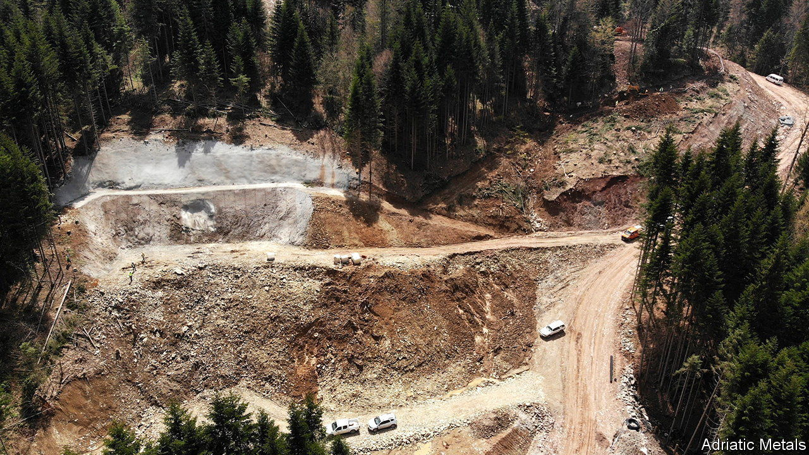
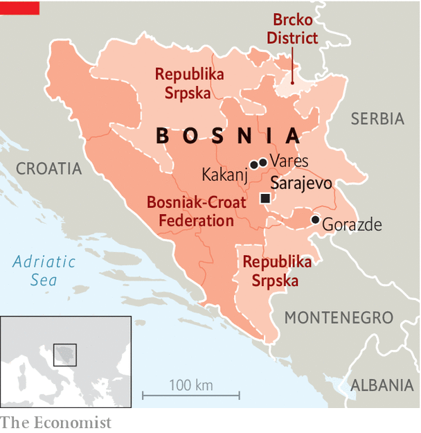

###### Prospects of hope

# A mining project revives a dying Bosnian town 

##### A country paralysed by ethnic divisions gets a big investment 

 

> Dec 7th 2023 

“If you write that, they will kill you,” says an interviewee after explaining how local politics is connected to crime and corruption. Your correspondent would hardly be the first to address the topic. On November 8th the European Commission issued a scathing report on Bosnia-Herzegovina, writing of “criminal infiltration” in the country’s politics, courts and economy. It also attacked a Putinesque draft law in the Republika Srpska, the Serb-dominated part of the country, which would classify many civil-society groups as “foreign agents”. 

The commission nonetheless recommended that the EU open accession negotiations with Bosnia if certain conditions are fulfilled. There is no chance they will be in the foreseeable future. On the 28th anniversary of the peace deal ending the war in Bosnia, politics is still war by other means. 

Since September a battle of flags has been fought in Sarajevo, the capital. A giant Bosnian wartime banner was raised close to the Republika Srpska’s boundary. Now a telecoms tower overlooking the city is lit up in Serbian colours; it sits on the mountain from which Serbs shelled the mostly Bosniak (Bosnian Muslim) capital during the siege of 1992-95. Last month Milorad Dodik, the Bosnian Serb leader, reiterated that all Serbs should live in one state, which would spell Bosnia’s disintegration.

 


All hope is not lost. You just have to look for it. The small town of Vares, 50km north of the capital, has suffered as much as anywhere from the failure of politicians to put country ahead of ethnic and personal interests. Now, however, there is a buzz: in January a British mining firm is set to begin production, extracting silver, lead and zinc. Since 2017 Adriatic Metals has been prospecting here. When it completes its planned investment of $250m in the project, says Paul Cronin, its managing director, it will be the largest single post-war private investment in Bosnia. 

In 1991 Vares was home to 22,200 people. Today, says Zdravko Marosevic, the mayor, there are barely 8,000. War and the collapse of the mining industry led to an exodus. With few jobs, Vares has far more old than young. In 2022 91% fewer babies were born here than in 1991. 

The town is surrounded by bucolic hills and forests, and mining is as controversial here as anywhere. Critics say the company is paying low concession fees. Ecologists and officials from neighbouring Kakanj charge that pollution from the mine is beginning to poison their water supply. Mr Cronin rejects these claims, which he says government inspectors have refuted. In Bosnia, political action is often a way for different groups to angle for their own cut.

So far 750 jobs have been created, two-thirds filled by locals. Every direct job creates up to two more indirectly, says Mr Cronin. Empty flats are being refurbished to house workers from other parts of Bosnia and from abroad. Dario Dodik, who runs a local restaurant, has hired six new staff who came home from abroad, four of them to work on his contract to cater for miners. The revival shows that when political and ethnic interests are put aside, investment comes, jobs are created and local decline is halted. That has already been the case in towns such as Gorazde, which has a thriving car-parts industry, not to mention Sarajevo, which has a booming IT sector. 

Mr Marosevic was elected mayor on the slate of Bosnia’s largest Croat party. All of Bosnia’s big parties are ethnically based. In power they dispense jobs and contracts to cronies. Fed up with this, Mr Marosevic quit his party in September. “This is a state of thieves,” he says angrily. Few Bosnians disagree. Once the mine gets going, he says, “all the other wheels that were stopped for the last 30 years will start spinning too.” That means jobs, income and a future for a town that was dying. ■

