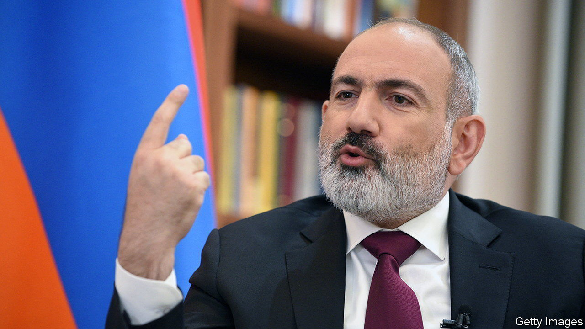
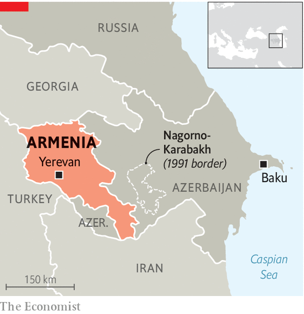

###### Poking the bear

# Armenia is turning against its erstwhile guardian, Russia 

##### The Western-leaning prime minister, Nikol Pashinyan, has few good options 

 

> Dec 7th 2023 

RUSSIA is close to losing one of its last old friends: Armenia. The Kremlin is irritated by the country’s recent overtures to America, Europe and Ukraine. Armenia says Russia has abandoned its pledge to protect it from Azerbaijan. In October, Nikol Pashinyan, the prime minister, accused Russia of trying to overthrow his government. Moscow did little to deny it: its state media quoted an anonymous high-ranking source accusing Mr Pashinyan of “following in the steps of [Ukraine’s President Volodymyr] Zelensky”. 

 


Mr Pashinyan, a critical journalist, came to power in 2018 after protests overthrew a Russia-friendly regime. But he tried to keep the Kremlin onside, even sending Armenian forces to co-operate with Russia’s interventions in Syria and Kazakhstan. Relations nevertheless began to sour in 2020, when Russia stayed largely neutral while Azerbaijan bested Armenia in an attack on Nagorno-Karabakh, an ethnic-Armenian enclave. Still, after that war Russia sent 2,000 peacekeepers.

Afterwards Azerbaijan carried out repeated incursions. That should have activated the mutual-defence provisions of the Collective Security Treaty Organisation (CSTO), a Russia-led pact to which Armenia belongs. But Russia dithered. In September 2023 Azerbaijan launched a lightning offensive to capture the rest of Nagorno-Karabakh. The Armenian authorities surrendered, nearly the entire population fled, and the Russians just watched.

As Russia failed to help, Armenia looked elsewhere. It used to buy nearly all its weapons from Russia. But lately it has signed deals for rockets and ammunition with India and for armoured vehicles and radars with France. In February it welcomed an EU border-monitoring mission. Mr Pashinyan seems determined to goad Russia. In September his wife personally delivered an aid package to Kyiv. In October the parliament ratified the Rome statute of the International Criminal Court. Since the court has indicted Vladimir Putin, Russia’s president, this requires Armenia to arrest him, if he seeks to visit.

Some Armenians think Mr Pashinyan is going too far. “I’m arguing to be a little more prudent,” says Richard Giragosian of the Regional Studies Centre, a think-tank in Yerevan, Armenia’s capital. “We’re poking the bear.” But as long as the overtures to the West remain symbolic, Russia’s responses will too, he argues. Mr Pashinyan rules out serious steps such as leaving the CSTO or expelling the Russian army from its base in Armenia.

Armenia’s room for manoeuvre is slim. Russia is its biggest trading partner by far and provides nearly all its grain and energy imports. Many Armenians depend on remittances from family members working in Russia. In November Russia began turning away Armenian lorries for “phytosanitary” (plant-health) reasons, which Armenia sees as a shot across the bow.

Armenia’s choices are unpromising. America’s credibility was hit when a State Department official told Congress that it would “not tolerate” an attack on Nagorno-Karabakh, yet when Azerbaijan invaded five days later the American response was limited merely to critical statements. The head of the EU’s monitoring mission in Armenia recently admitted that, in a war, the unarmed monitors would flee. “They cannot be human shields,” said a Western diplomat in Yerevan. The main problem, he said, was that the Armenians themselves “don’t know what the endgame is”. ■


