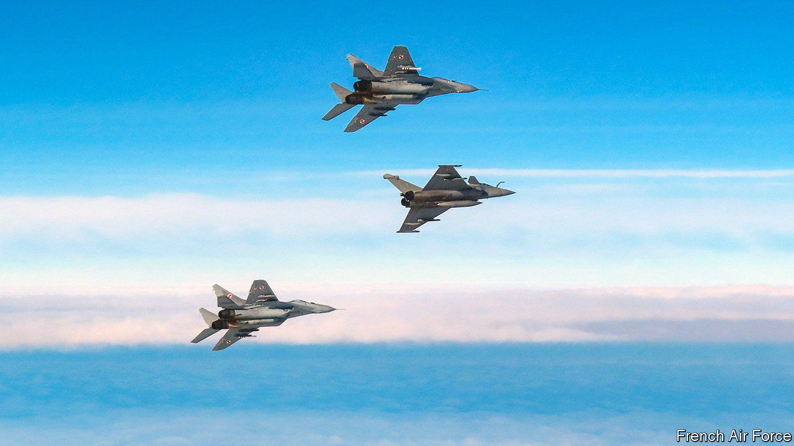
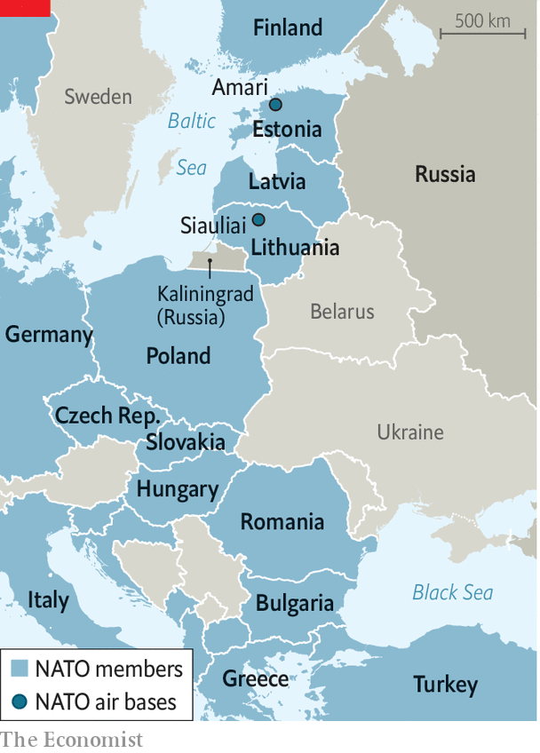

###### Patrolling Baltic airspace

# French fighter jets join the Baltic mission 

##### How to intercept Russian aircraft approaching NATO airspace 

 

> Dec 3rd 2023 

Shortly after dawn on a recent weekday morning four Mirage 2000 fighter jets took off from their French military base. They were heading on a 1,600-kilometre trip to the Siauliai air base in Lithuania, where on November 30th France (along with Belgium) took over from Italy for a four-month NATO air-policing operation. Accompanying them on the journey was a French air-to-air refuelling tanker, which left the same morning from Istres, near Marseille. Mid-flight, with the fighter jet’s nose hovering just 10m from the tanker’s wing tip, the French aircraft released its refuelling hose for the Mirage to hook on to and fill up. Later, over the Baltic Sea, the tanker took up a holding pattern to do the same for four Finnish F/A-18 fighter jets, newly patrolling the region under the banner of NATO, which  this year.

 


Air policing by NATO air forces over the Baltic Sea has been going on for nearly two decades. None of the three Baltic states—Estonia, Latvia and Lithuania—has a serious air force, and each relies on the alliance to . After Russia invaded Ukraine in 2022, NATO beefed up these air-policing operations. Fighter jets on the ground are on 24-hour alert. They can be scrambled in minutes to check out and identify non-NATO aircraft—for which, read Russian—approaching Baltic air space with neither radio contact nor filed flight plan or with their transponder switched off. In parallel, allies take part together in air-shielding activities along the length of the eastern flank, from the Baltic Sea to the Black Sea. The French refuelling of Finnish (American-built) fighter jets, which can use the same air-to-air attachment, was part of one such operation, underlining the interoperability of NATO assets. 

During his stint, says Colonel Federico Sacco Maino, the Italian in charge at Siauliai before he handed over to the French on November 30th, the Russian aircraft his fighter jets intercepted behaved “professionally”. By this he means in a non-escalatory way. In contrast, Russian jets in the  have recently fired missiles at British planes and dumped fuel on American drones. All the same, in the four months to November 2023 his forces intercepted no fewer than 60 Russian aircraft. His team was so busy scrambling to check out these non-communicating aircraft, he says, that they had little time for anything else. The list included Russian fighter jets, bombers, intelligence-collection aircraft and transport aircraft. When the British air force completed its own four-month spell at NATO’s base in nearby Estonia in August, its tally of intercepted Russian aircraft was also high, at 50.

As the French take over in Lithuania, they are fully expecting a similar pace of interception. The base is not far from the Russian enclave of , on the Baltic Sea. Tensions there have risen in recent months, after a spate of  incidents. The alliance stepped up maritime patrols in October in response. NATO’s posture is defensive, so the aerial interceptions are designed primarily to gather information and feed it to NATO command.

The number of intercepts has been broadly stable; but the large number raises eyebrows about what exactly Russia is up to. The Russian approaches are sometimes intended as practice runs for long-range bombers; at other times Russian intelligence aircraft seemingly want to test NATO’s radars and interception times. Most approach, but only very rarely enter, NATO airspace.

For France, the four-month air-policing stint in Lithuania—its seventh in the country and tenth in the Baltics—comes at a time when a full battalion of its forces have also been dispatched to Romania as part of NATO’s defence of its eastern flank. In addition French-crewed aerial surveillance flights have been deployed on the western Black Sea coast, watching over the route taken by . “It used to look as if NATO was a sideshow for France,” says an ex-alliance official; “Now it is one of the few allies present on the ground, air and sea from the Baltics to the Black Sea.”

France’s increased contribution to the defence of NATO’s eastern flank since February 2022 happens to coincide with a progressive shrinking of its military counter-terrorism presence in its ex-colonies of the . Following a series of military coups in ,  and , and the hiring of  in Mali, French forces have been kicked out of the first two countries and are on the way out in the third. Emmanuel Macron, the French president, has ordered all his troops to be out of Niger by the end of 2023. From a peak of over 5,000 troops in the Sahel in 2020, France now maintains only 1,500, most of them at its base in Chad. “It’s not a pivot,” says Colonel Pierre Gaudillière, spokesman for the French chief of the defence staff, who considers the two operational trends to be “simultaneous but unrelated”. Politically, however, they do very much appear to be connected. Not only is the contrast striking, it could point to the future shape of France’s priorities as it reassesses its military footprint in Africa.

In Siauliai, meanwhile, after landing their fighter-jets the French pilots are swapping notes with their Italian counterparts. Besides dealing with sub-zero temperatures, the watchword is the “Alpha scramble”, or quick-reaction alert. From the moment the alarm is sounded pilots are expected to be in the cockpit, strapped in and in the sky within ten minutes. In reality, says the lead French pilot on the ground with a grin, “we can do it much faster”. ■

