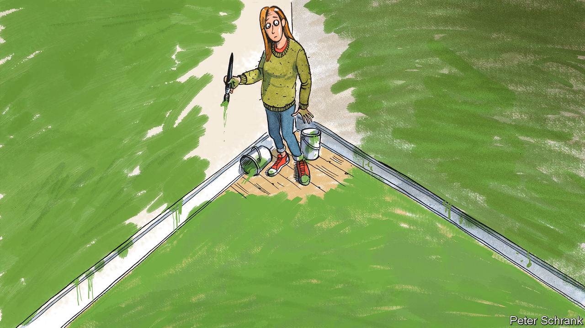

###### Charlemagne

# In Europe, green policies rule while green politicians struggle 

##### Reshaping the continent’s economy is easier than winning votes 

 

> Dec 7th 2023 

Imagine a scantily clad woman suggestively wiggling her behind in your direction, then inviting you to dance like a feverish chicken. You might think you have somehow landed in a bachelor party, circa 1995. The reality is odder still: this is a rally organised by the French green party in Paris. On December 2nd members of  were invited to a 20-minute session of “la booty therapy”, involving raunchy twerking and encouragements for the bemused crowd to “let their buttocks fly”. After this unexpected interlude, normal service resumed: appeals to smash the patriarchy, pleas for a kinder sort of politics, and (almost as an afterthought) alarm over carbon emissions. On the same day but in another political universe, the German chancellor and the French president were among those at the COP climate jamboree in Dubai, hammering out a global deal to avoid frying the planet.

The green movement in Europe is a paradox. On one hand, the policies espoused by environmentalists sit squarely at the centre of today’s political agenda. The European economy is being overhauled to mitigate climate change, nuclear plants in Germany have been shut and new cars running on petrol or diesel will be illegal by 2035. By contrast with America, denying humans are responsible for climate change is considered kooky. But the green parties dedicated to promoting these ideals are in a rut. At their best they have struggled to win votes beyond organic-food-munching urbanites in Europe’s rich northern bits. Now eco-politicos are discovering that, even there, caring for the planet turns out to be more popular on paper than in practice. Having voted for virtuous policies, Europeans are balking at the cost of them. Green policies endure; the political relevance of greens might not.

Parties defending the environmental cause appeared in Europe over 40 years ago, a variant of the counterculture movements of 1968. Battling pollution was only part of the appeal: taking on the warmongering, capitalist pigs who had wrecked the planet in the first place mattered just as much. By the 1990s greens had mellowed somewhat, ditching their attachment to pacifism and the overthrow of market economies. They found their way into national parliaments, occasionally nabbing ministerial posts. As an independent movement, they are unique to Europe (only in New Zealand have they had comparable success). Nowadays greens are in a handful of national governments, including in Germany, Ireland and Belgium. A surge of support in European elections in 2019 saw the Greens’ parliamentary group (which includes a slew of regionalist parties) control 72 of the 705 seats in Brussels, their best result ever. Not coincidentally, an ambitious Green Deal unveiled soon after committed the EU to cut its carbon emissions to “net zero” by 2050, with a 55% reduction on 1990 levels by the end of the decade. “There would not have been a Green Deal if there had not been a green wave in 2019,” says Mélanie Vogel, a French senator who co-chairs the European Green Party.

Alas, waves tend to crash. The backlash against greens is now in full swing. In Germany, it was a case of going too far too fast. Most notably, a push by  to make climate-friendly heat pumps mandatory before sufficient skilled labour was at hand to install them backfired. Having once—briefly—been Germany’s most popular party, the Greens now languish in fourth place. Their co-figurehead, Robert Habeck, is the economy minister at a time when people are feeling the pinch: once Germany’s most popular politician, he languishes in 16th place now. In provincial elections earlier this year Dutch voters rebelled against nature-protection rules that were throttling economic activity, propelling a farmers’ party bashing green rules into first place; in national elections last month Geert Wilders, a hard-right populist who denigrates environmentalism, beat Frans Timmermans, the architect of the EU’s Green Deal himself. At the EU level, where much eco-regulation is crafted, polls suggest the Greens will lose around one-third of their seats in the European Parliament next year. From being the fourth-biggest group they may fall to sixth.

Already the signs of the environmentalists’ diminished standing can be seen. Bits of the Green Deal package that are still being legislated now struggle to get through parliament. Balking centrists, notably on the conservative right, are fed up. Emmanuel Macron, who as French president took in erstwhile greens as ministers, has called for a “pause” in new environmental rules, no doubt remembering how the , led by rural drivers who felt sneered at by the city-dwelling elite, nearly paralysed the country in 2018. The EU’s flagship ambition to cut carbon emissions looks safe for now; indeed Europe is the only place whose emissions are much lower than in 1990. But the talk in Brussels is of the need to implement existing rules, not craft fresh red tape. 

Green shoots themselves in the foot

As cheery about politics as they are glum about the state of the planet, party leaders put a rosier gloss on things. “Green policies today are one of the dividing lines of the political spectrum…We are at the centre of the debate,” says Thomas Waitz, an Austrian MEP who also co-chairs Europe’s greens. But limited progress is being made in expanding beyond their heartlands in the Benelux, Scandinavia, France, Germany and Austria. Voters in southern Europe are not keen on the militants’ post-materialist values (green plans to “de-grow” the economy on purpose will sound ominously familiar to Italians well used to “no growth”). As in central Europe, few voters think of environmental protection as a priority. 

All parties whose ideas are enacted get less popular in time, especially junior coalition partners. But the problem is most acute for greens. Not only does their nagging tone galvanise their foes, the exercise of power annoys starry-eyed activists who resent the compromises required to run bits of government. The flagship policies of the greens, or at least their environmental ones, push in the right direction. But good luck convincing voters of that. ■


