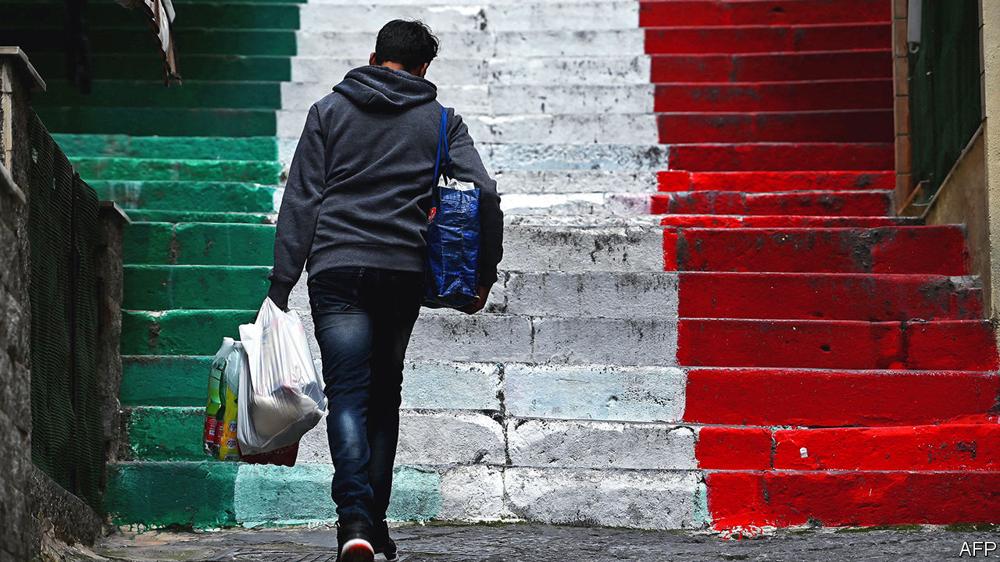
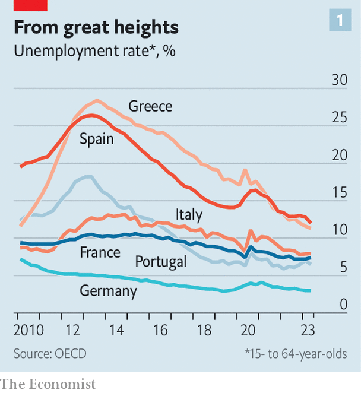
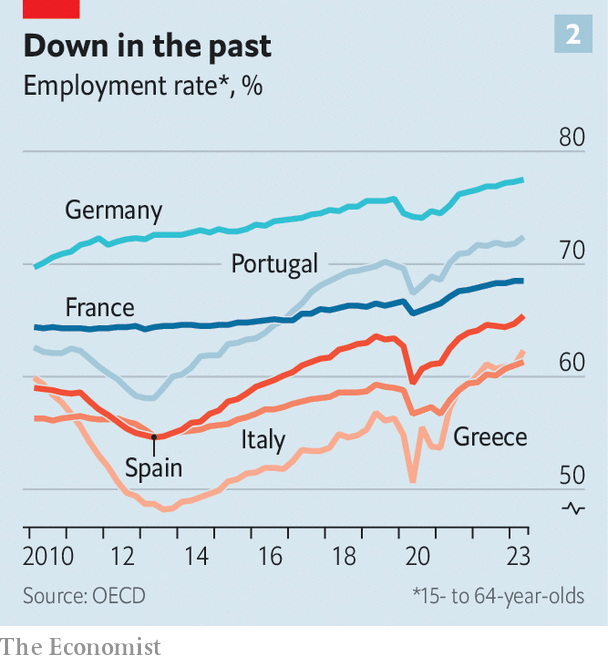
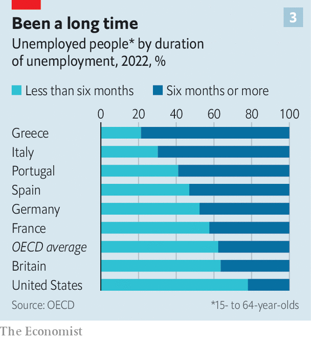

###### The southern exception

# Southern Europe’s employment boom is not strong enough 

##### Structural problems keep unemployment in Europe’s sun belt too high 

 

> Dec 6th 2023 

AH, TO BE YOUNG and in Spain. A record 21.3m people are in work, and the unemployment rate is at its lowest in over a decade (see chart 1). More youngsters are working or studying: the rate of those aged 15-29 who are doing neither fell from 22.5% in 2013 to 12.5% in 2022. Indeed, across southern Europe (including France, which is partly southern), more and more people are employed (see chart 2). For the part of the continent that has always had high unemployment, even before the euro crisis, these are very good numbers. 

 


But on closer inspection, the boom is less impressive than it seems. For a start, employment has been growing across the rich world, not just in Europe. Spain still holds the top spot for unemployment in the OECD, a club of mostly rich countries, followed by Greece. Italy and France are not far behind. Youth unemployment is above the EU average in all of southern Europe, apart from Portugal. The region remains the exception in a world of very low unemployment. 

 


Nor is it likely to get better. The south’s post-pandemic recovery, fuelled by a tourism rebound and large public deficits, is coming to an end. The EU covid-recovery fund’s generous transfers will start to fall after 2024. France’s unemployment rate ticked up from 7.3% to 7.4% in the third quarter, which is bad news for President Emmanuel Macron’s promise of full employment by 2027. 

 


The south’s higher unemployment is partly a hangover from past crises. In Spain many workers left school to profit from a construction boom in the first decade of the century, before the financial crisis destroyed it—and their job prospects. More recently the pandemic hit tourist destinations hard. Hence in Italy, Greece and Portugal an unusually large share of the unemployed have been jobless for more than six months (see chart 3). 

But crises are only part of the answer. When a good bit of the working-age population is consistently unemployed, structural factors are at fault. Three things need to come together for workers to find jobs. 

First, they need the right skills. Portugal, Italy and Spain lead Europe in their shares of low-educated workers: 35-40% of those aged 25-64 have only a lower secondary-school education or less, compared with around 17% in Germany (or France). Those who do go on to university often receive questionable benefits. Few public universities in Spain and Italy place high in global rankings, and most have only spotty connections to the job market. The sort of vocational education that might provide more useful skills is underdeveloped and sniffed at. France subsidised apprenticeships to the tune of €20bn ($22bn) in 2022 alone, according to a study, to emulate the German system of on-the-job training. But critics say most of those who benefited would have done well anyway. 

The second requirement is that workers be where the jobs are. That is not always the case. In Italy and Spain, unemployment rates are still consistently higher in the south than in the north. In Cádiz and Granada the rate is above 20%, compared with 6% in some of Spain’s northern regions. Workers hesitate to move for temporary contracts, which are too common in southern Europe. Selling a home in the cheaper south may not bring in enough to buy one in the expensive north. And if grandparents provide child care, leaving them behind creates new problems. 

Finally, many firms in southern countries have problems with the hiring process. Each country has its own issues. In Spain, temporary contracts are widespread because permanent employees have long been overly regulated and are hard to fire. Firms have as little incentive to invest in the skills of temps as workers do to move for a short-term gig. Recent reforms have made permanent contracts less burdensome, and the share of part-time contracts is falling. That is a start. In France centralised wage bargaining and high minimum wages and generous unemployment benefits have long depressed employment. Recent changes modelled on Germany’s reforms in the early 2000s have helped, but have not gone far enough. 

As for Italy, its many small firms tend to have low productivity and hence low wages. Red tape discourages them from growing bigger. The current government wants to cut taxes on lower-earning workers and boost temporary contracts. The latter might improve employment numbers, but will worsen conditions for workers unless permanent contracts are also deregulated. In any case, a country that has generated almost no economic growth for decades will continue to struggle to create jobs. 

Politicians in southern countries do not seem unduly bothered by any of this. That may be because some of the “unemployed” are actually working in southern Europe’s large shadow economy. With employment rising anyway due to the post-covid recovery, there has been little pressure to tackle thorny structural issues. That may change now that the recovery is coming to an end. “The rising numbers are a huge problem for Macron, after he promised 5% unemployment,” reckons Phillipe Martin, head of France’s Council of Economic Analysis, an independent body. 

Unemployment is partly an unfortunate side-effect of an otherwise good aspect of southern Europe: its communities and families are tight-knit. Rather than moving elsewhere to find work, young people tend to live with their parents and keep looking. That is bad for growth, economic efficiency and jobs. But not all parents, or children, seem to mind. ■

