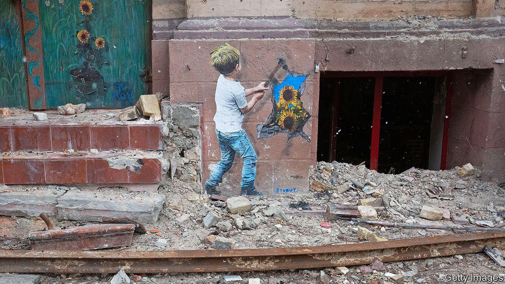

###### War child

# “Grief camps” help Ukrainian children face the loss of parents 

##### Vladimir Putin’s war has created a generation of orphans 

 

> Dec 4th 2023 

YURI NECHIPORENKO couldn’t see much of the soldier who killed his father: just the eyes and nose through the balaclava. Father Ruslan, 47, and son Yuri, then 15, had cycled down Tarasovskaya Street in Bucha to check out a rumour that humanitarian aid had arrived in the famished satellite town north of Kyiv. The soldier stopped them and asked what they were doing. Hands aloft to show they were not carrying weapons, they tried to explain, but he started shooting. Ruslan fell to the ground. Yuri, shot through his arm, fell too. Two more bullets skimmed his crown, passing through his hoodie. The boy hugged the ground, playing dead, while the blood of his dying father trickled against his body. He ran when he saw the soldier had left.


Yuri is still tormented by that grey winter day, 20 months ago. Across Ukraine, tens of thousands of children like him are coping with the loss of parents in harrowing circumstances. The exact number is secret, since it correlates with the number of soldiers killed in action. But the trauma casts a devastating shadow. “It’s frightening to think what the next generation will look like,” says Oksana Lebedeva, a businesswoman turned philanthropist who has organised “grief camps” to help rehabilitate over 300 Ukrainian children.

Ms Lebedeva, who was inspired to help when she saw Yuri give an interview last year, says the scale of the problem means Ukraine has to think up its own solutions. There is no ready-made formula or international protocol. Her grief camps adapt ideas from conflicts around the globe. She has settled on a three-week residential programme, which she runs every month in Lutsk, a small city in western Ukraine. There is daily individual and group psychotherapy, as well as art therapy, dog therapy, theatre and sport. The kids are encouraged to cry and show emotion, something they may not be able to do at home. Some arrive too traumatised to speak. But if psychologists reach them quickly, progress can be rapid.

Three weeks are rarely enough. Even in the final stages of a camp  witnessed in early October, pain was never far away. War showed itself everywhere—in play, paintings, tears and mood swings. Almost all the children go to bed with torches, Ms Lebedeva says, frightened of the dark. Some of them take their anger out on a boxing bag they call “Putin”, which organisers replace every three weeks, beaten to shreds. Others mould Play-Doh into figurines missing limbs and heads.

Vladik, a delicate six-year-old boy whose anguished face at his mother’s graveside in Bucha made international front pages last year, spent one therapy class drawing “Putin”. The picture depicts various bloody forms of torture. “I’m going to kill him,” he told everyone. Vladik’s 11-year-old brother, Vova, drew someone hiding behind a smiling mask while drowning in tears. Vova is one of the camp’s success stories. After arriving in a state of shock, he can now recount his mother’s tragic end: she froze to death in an underground shelter during the Russian occupation, aged 34. He talks about her burial, the “man with the cross” who administered last rites, the exhumation, and the trip to the morgue with hundreds of other corpses. His brother is managing less well. Vladik whispers to explain why he keeps bringing coins to his mother’s grave: “She’ll need them to buy something in heaven. Like ice cream.”

As Vladimir Putin’s war grinds on, more children from military families are attending the camps. Sofia, a ten-year-old from Khmelnytsky, in the west, is still mourning the death of her father in May 2022. When he went to the front, he told her he was going to “train a soccer team”. Now she is afraid to let her mother, a military medic, out of her sight. Some children have lost both parents. Sasha, 14, lost her mother when Russians fired a missile at Kramatorsk station in April 2022. Her father went to fight and was killed six months later.

Yuri, now 16, is one of the oldest at the camp. He says younger children find it harder to process what they are feeling: “They haven’t developed their psyche or whatnot properly yet.” In the months after his father’s shooting, Yuri was consumed by a thirst for revenge. He tracked down the killer on a Ukrainian secret-service database, recognising his nose and eyes, and left a message on his social-media account: “You killed my dad but didn’t get me.” The soldier replied with the verbal equivalent of a shrug. In the age of the internet, grieving children are often only a click away from talking to a parent’s killers, or seeing a photo of their corpse.

Yuri says therapy has helped soften his anger. He now feels an intense urge to help those around him. But those closest to him are taking no chances. Ms Lebedeva has arranged for him to study at a prestigious college in New York, where he can see a way of life that is not war. “We worry his desire for revenge will push him to the front lines,” says Ms Lebedeva. “His mother told me she wouldn’t be able to cope with another funeral.” ■

