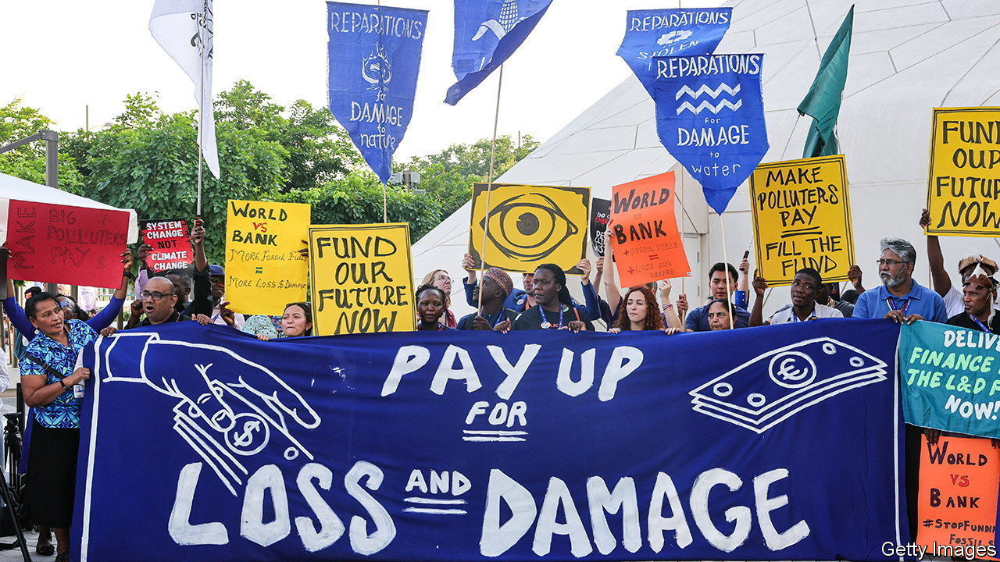

###### Making friends

# How to sell free trade to green types 

##### This year’s COP offers an opportunity to make the case 

 

> Dec 7th 2023 

Environmentalists do not get on with free-traders. Suspicion is the norm, if not the outright hostility on display at the “Battle of Seattle” in 1999, which took place between riot police and activists outside a meeting of the World Trade Organisation (wto). When Ngozi Okonjo-Iweala, boss of the wto, went to the cop climate summit in Glasgow two years ago she was the first head of the trade club to attend the portion reserved for ministers and senior officials. She is once again at this year’s summit, which began in Dubai on November 30th, to explain how trade can save the planet.

Past animosity may help explain why green policies in many countries are at odds with the principles of free trade. “Buy American” provisions in the Inflation Reduction Act (ira), Joe Biden’s flagship green policy, lock out European firms. Tariffs on European steelmakers, introduced by Donald Trump on national-security grounds, have been suspended to give negotiators time to reach a deal on “sustainable steel”, but talks have stalled. America has ratcheted up tariffs on Chinese solar panels and battery-powered cars, and the EU has announced a counter-subsidy investigation into China’s carmakers. 

The effect of these policies is to give a boost to polluters. The WTO reckons that renewable-energy equipment faces an average tariff of 3.2%, four times that on oil. Electric vehicles experience tariffs that are 1.6 to 3.9 percentage points higher than those on combustion engines. Non-tariff barriers such as domestic-content requirements, which mean a given proportion of the components of, say, a car must be made domestically, raise costs even further and slow the spread of clean technology.

Free-traders are belatedly fighting back. This year’s COP featured the first ever “trade day”. The WTO marked the occasion with a ten-point plan laying out how free trade could speed the green transition. Points range from the uncontroversial (speeding up border checks so that container ships spend less time idling) to the tricky (co-ordinating carbon pricing to stop unilateral border taxes causing trade disputes).

They will need more than the promise of efficiency to win over green types, however. Take the eu’s carbon border adjustment mechanism (cbam), which aims to charge the same carbon price on certain industrial commodities whether they are produced inside or outside the bloc. It is designed to be non-discriminatory: businesses in the eu pay the same price wherever they source their inputs from. Therefore it satisfies free-traders who think domestic and foreign producers should be treated the same. Nevertheless, despite its green credentials, many activists object to it on the grounds that the rich world should fund the green transition. The cbam will hit many poor countries hard, since their production is more polluting.

One way to get the critics on board might be for rich countries to provide more climate finance to the developing world. During COP, Ursula von der Leyen, the European Commission’s president, Kristalina Georgieva, managing director of the IMF, and Ms Okonjo-Iweala together floated using revenues from carbon pricing to smooth things out. The eu pledged $145m, on top of $100m from Germany, towards compensating poor countries for climate change, as well as support for the un’s green climate fund, which helps countries decarbonise and adapt to a hotter world.

The WTO will need to make changes as well, argues Daniel Esty, a professor at Yale University seconded to the organisation. A world of cross-border carbon taxes and green industrial policies will require a referee to set commonly agreed standards and measurements of emissions. The wto published a report that attempted to establish how to account for the embodied carbon in steel imports on December 1st, the second day of Cop. It could also start to distinguish between subsidies that distort trade but might be good for the planet, such as America’s ira, and those which are bad on both counts, suggests Mr Esty. That would represent a compromise between free-traders and environmentalists. ■


