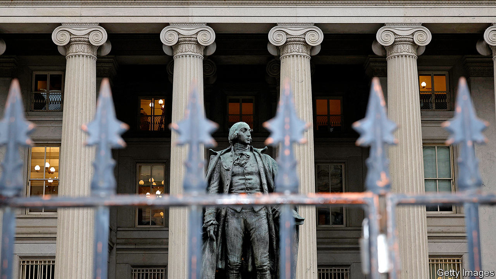

###### Fixing finance

# Is the world’s most important asset market broken? 

##### Regulators have proposed radical changes to how Treasuries are traded, to the dismay of investors 

 

> Dec 3rd 2023 

In 1790 America’s finances were precarious: debt-servicing costs were higher than revenues and government bonds traded at 20 cents on the dollar. Alexander Hamilton, the country’s first treasury secretary, wanted a deep and liquid market for safe government debt. He understood the importance of investor confidence, so proposed honouring all debts, including those of states, and offering to swap old debt, at par, for new bonds with a lower interest rate. This was controversial. Shouldn’t speculators who picked up cheap debt in secondary markets be paid less? Yet Hamilton could not be swayed: “When the credit of a country is in any degree questionable, it never fails to give an extravagant premium, in one shape or another, upon all the loans it has occasion to make.”

More than two centuries later American politicians are busy undermining Hamilton’s principles.  has pushed America towards a technical default. Rising interest rates and  have seen debt balloon: the country’s total stock now amounts to $26.6trn (96% of gdp), up from $12.2trn (71% of gdp) in 2013.  come to a fifth of government spending. As the Federal Reserve reduces its holdings of Treasuries under quantitative tightening and issuance grows, investors must swallow ever-greater quantities of the bonds. 

All this is straining a market that has malfunctioned frighteningly in the past. American government bonds are the bedrock of global finance: their yields are the “risk free” rates upon which all asset pricing is based. Yet such yields have become volatile, and market liquidity looks thin. Against this backdrop, regulators worry about the increasing activity in the Treasury market carried out by leveraged hedge funds, rather than less risky players like foreign central banks. A “flash crash” in 2014 and a spike in rates in the “repo” market, where Treasuries can be swapped for cash, in 2019 raised alarms. The Treasury market was then overwhelmed by fire sales in 2020, as long-term holders dashed for cash, before the Fed stepped in. In November a cyberattack on a Chinese bank disrupted settlement in Treasuries for days. 

Repo repair

Regulators and politicians want to minimise the potential for further mishaps. New facilities for repo markets, through which the Fed can transact directly with the private sector, were put in place in 2021. Weekly reports for market participants on secondary trading have been replaced with more detailed daily updates, and the Treasury is mulling releasing more data to the public. But these fiddles pale in comparison to reforms proposed by the  (SEC), America’s main financial regulator, which were outlined in late 2022. The SEC has invited comment on these plans; it may begin to implement them from early next year. 

The result has been fierce disputes about the extent and causes of problems in the Treasury market—and the lengths regulators should go to repair them. A radical overhaul of Treasury trading comes with its own risks. Critics say that the proposed changes will needlessly push up costs for the Treasury. Do they have a point?

The Treasury market touches almost every financial institution. Short-term bills and long-term bonds, some of which pay coupons or are linked to inflation, are issued by the Treasury. They are sold to buyers including “primary dealers” (banks and broker dealers) in auctions. Dealers then sell them to customers: foreign investors, hedge funds, pension funds, firms and purveyors of money-market funds. Many raise money to buy Treasuries on the overnight repo market, where bonds can be swapped for cash. In secondary markets high-frequency traders often match buyers and sellers using algorithms. Participants, in particular large asset-managers, often prefer to buy Treasury futures—contracts that deliver the holder an eligible Treasury at a future date—since it requires less cash up front than buying a bond outright. Each link in the chain might be a vulnerability.

The most important of the SEC’s proposals is to mandate central clearing, under which trading in the Treasury and repo markets would pass through a central counterparty, which would be a buyer to every seller and a seller to every buyer. This would make market positions more transparent, eliminate bilateral counterparty risk and usher in an “all to all” market structure, easing pressure on dealers. Nate Wuerffel of BNY Mellon, an investment bank, has written that central-clearing rules will be put in place relatively soon.

Yet the SEC’s most controversial proposal concerns the “basis trade” that links the Treasuries market to the futures market. When buying a futures contract investors need only post “initial margin”, which represents a fraction of the face value of the Treasury. This is often easier for asset managers than financing a bond purchase through the repo market, which is tightly regulated. As such, there can be an arbitrage between cash and futures markets. Hedge funds will go short, selling a contract to deliver a Treasury, in the futures market and then buy that Treasury in the cash market. They often then repo the Treasury for cash, which they use as capital to put on more and more basis trades. In some cases funds apparently rinse and repeat this to the extent that they end up levered 50 to one against their initial capital. 

The trade is mostly pretty low-risk. But in times of stress, such as in 2020, when Treasury prices swung wildly, exchanges will send out calls for more margin. If funds cannot access cash quickly they sometimes close their positions, prompting fire sales. The unwinding of trades in 2020 may have exacerbated market volatility. Thus the SEC has proposed that hedge funds which are particularly active in the Treasury market should be designated as broker-dealers and made to comply with stricter regulations, instead of simple disclosure requirements. It is also considering new rules that would limit the leverage hedge funds can access from banks.

This has infuriated those who make money from the trade. In October Ken Griffin, boss of Citadel, the world’s most profitable hedge fund, argued that the regulator was simply “searching for a problem”. He pointed out that the basis trade reduces financing costs for the Treasury by allowing demand in the futures market to drive down yields in the cash market. 

Will officials hold firm? In a sign of diverging opinions between the sec and the Treasury, Nellie Liang, an undersecretary at the department, recently suggested that the market may not be functioning as badly as is commonly believed, and that its flaws may reflect difficult circumstances rather than structural problems. After all, market liquidity and rate volatility feed into each other. Thin liquidity often fosters greater volatility, because even a small trade can move prices—and high volatility also causes liquidity to drop, as it becomes riskier to make markets. Ms Liang pointed out that “high volatility has affected market liquidity conditions, as is typically the case”, but it does not appear that low liquidity has been amplifying volatility. 

Moreover, high volatility can be caused by events, as has been the case in recent years, which have been lively. It is far from certain that periods of extreme stress, like March 2020 or the chaos caused in the British gilt market when derivative bets made by pension funds blew up, could be avoided with an alternative market structure. 

As well as the sec’s proposals, the Treasury is working on its own measures, such as data gathering, more transparency and buybacks. These would involve the Treasury buying older, less liquid issuance—say, ten-year bonds issued six months ago—in exchange for new and more liquid ten-years, which it might start doing from 2024. The Treasury has acknowledged that leverage practices, which make the basis trade possible, warrant investigation. But Ms Liang has added that there are upsides to the trade, such as increased liquidity.

Although Hamilton could not have envisaged the network of institutions that make up the modern Treasury market, he had a keen appreciation for speculators, who stepped in to buy Treasuries when bondholders lost faith. He would have been more concerned by politicians rolling the dice on defaulting and the debt stock than he would have been by enthusiastic intermediators. Plenty of his successors’ ideas have broad support. They would nevertheless do well to remember his aversion to snubbing those keen to trade. ■


