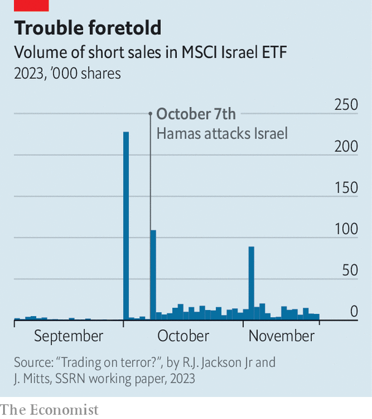

###### Caught short

# Who made millions trading the October 7th attacks? 

##### Researchers highlight suspicious activity 

 

> Dec 5th 2023 

Before its attack on October 7th, Hamas maintained . The assault blindsided Israel’s spies, and seems to have surprised even Hamas’s political leaders. But did someone know enough to profit? A new paper by Robert Jackson Jr, a former commissioner of America’s Securities and Exchange Commission, and Joshua Mitts of Columbia University suggests so.

The authors’ most striking finding is a surge in —bets that a security’s price will fall—of an exchange-traded fund (etf) listed on the New York Stock Exchange under the ticker eis, which tracks an index of Israeli shares. In September an average of 1,581 shares a day of EIS were sold short, representing 17% of the daily total trading volume. On October 2nd, five days before the attacks, a whopping 227,820 shares were shorted, representing 99% of total volume. Rather than reflecting a souring of market sentiment, the increase in activity seems to have come from just two trades. Then, on the first trading day after the attack, standard “long” transactions outnumbered short sales by a similar number of shares (248,009). If these trades were made by the same investor, they would correspond to a $1m profit. 

 


Other securities also showed suspicious patterns. During the three weeks before the attacks, the number of outstanding options contracts expiring on October 13th on American-traded shares of Israeli firms—the derivatives that would yield the greatest returns if prices moved sharply in the direction a trader expected—rose eightfold. In contrast, the number of longer-dated options on such shares, whose value depended on events beyond mid-October, barely changed. 

The paper’s authors examined other periods of turmoil in Israel, such as that prompted by the government’s attempted judicial reform earlier this year, and did not detect similar behaviour. The only match was in April—two days before Passover, which according to reporting by an Israeli tv station was the date originally scheduled for the attack.

Critics of the paper, which has not yet been peer-reviewed, suggest that the activity could reflect investors closing positions on the first day of a quarter, or have been a market-maker’s response to a trader buying up shares in the fund. Yet no surge has occurred at the start of any other quarter since 2009. The authors say that had any large purchases of eis been made to offset the shorts, such transactions would appear in their data. Another objection is that although a big short sale should in theory drive down prices, eis actually rose in value. In response, the authors note that the fund’s value is tied to the prices of the shares it contains, and that the shorts of EIS were tiny in comparison with the market capitalisation of the firms the fund tracks.

The study has prompted an inquiry by Israel’s securities authority. Assigning motives to trading activity is always hard; the authors cannot rule out benign explanations. But they argue that the most plausible account is that whoever made the trades was familiar with Hamas’s secrets. Although the millions of dollars in potential profits are small, Mr Mitts notes they are a lower limit identifiable with public data. He thinks that they could be “just the tip of the iceberg”.■


