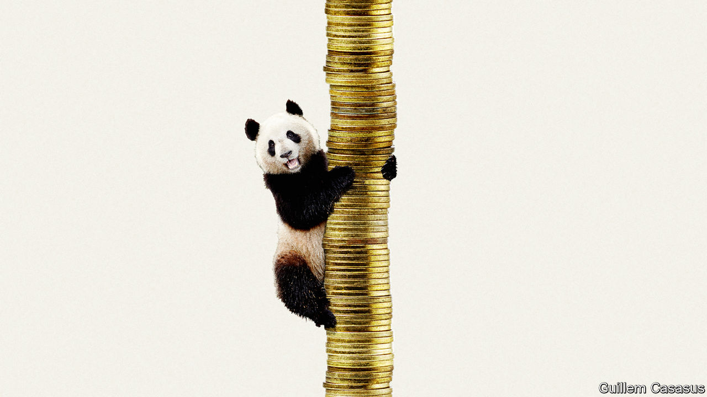
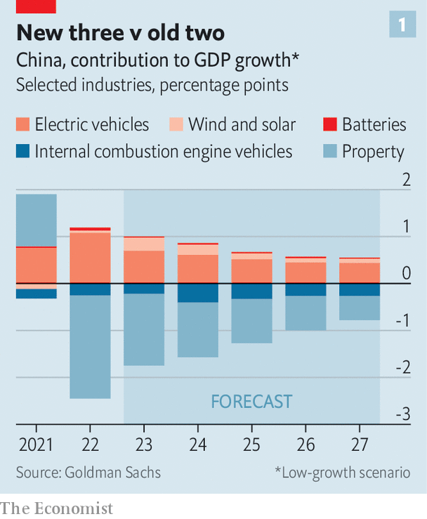

###### The 5% question

# Will China leave behind its economic woes in 2024? 

##### Xi Jinping must decide whether to set an ambitious growth target 

 

> Dec 7th 2023 

After the global financial crisis of 2007-09, economists quickly understood that the world economy would never be the same again. Although it would get past the disaster, it would recover to a “new normal”, rather than the pre-crisis status quo. A few years later the phrase was also adopted by China’s leaders. They used it to describe the country’s shift away from breakneck growth, cheap labour and monstrous trade surpluses. These changes represented a necessary evolution in China’s economy, they argued, which should be accepted, not resisted too strenuously.

After China’s long campaign against covid-19 and its disappointing reopening this year, the sentiment is popping up again. China’s growth prospects seem “structurally” weaker—one reason why Moody’s, a rating agency, said this week that it might have to cut the country’s credit rating in the medium term. Several economists have declared a new normal in China’s unruly property market. Some commentators hope for a new equilibrium in China’s relations with America following the recent meeting between the two countries’ leaders. In September Cai Fang of the Chinese Academy of Social Sciences identified a “new” new normal, brought about by a mixture of China’s shrinking population, greying consumers and picky employers.

Calibrating the new normal is a matter of some urgency. China’s leaders will soon gather in Beijing for the Communist Party’s Central Economic Work Conference. Their deliberations will help set a growth target for 2024, which will be announced in March. Most forecasters expect China’s economy to grow by less than 5%. Moody’s forecasts 4%. Officials must thus decide how strenuously to resist this slowdown. 

If they think it represents a new equilibrium, they may accept it and lower their growth target accordingly. If they think China has room to grow faster, they may stick with the 5% target they set for 2023. Meeting such a goal will be more difficult in 2024 than it was this year, because the economy will not benefit from another reopening boost. However, an ambitious target could also serve a purpose, underlining the government’s commitment to growth, and reassuring investors that more fiscal help is on its way if required. 

It is impossible to think about how the economy will grow without first considering how China’s property slump will end. Although most economists agree that the market “cannot return to its past glory”, as Liu Yuanchun of the Shanghai University of Finance and Economics has put it, there is less agreement on how inglorious its future must be. In the past, sales were buoyed by speculative demand for flats from buyers who assumed they would rise in price. In the future, the market will have to cater chiefly to fundamental demand from buyers who want a new or better home. 

How much fundamental demand remains? China now enjoys a living area of 42 square metres per person, according to the census of 2020; an amount comparable to many European countries. On the face of it, this suggests that the market is already saturated. But the European figures typically count only the useable area of a property, as Rosealea Yao of Gavekal Dragonomics, a research firm, has pointed out. The Chinese number, on the other hand, refers to everything that is built, including common areas shared by several households.

Ms Yao has estimated that China might eventually reach a living space per person of about 45-50 square metres when common areas are included. The country’s property sales might therefore have room to grow from their depressed levels of 2023, even if they never return to the glories of earlier years. Ms Yao believes that sales needed to fall by about 25% from their levels in 2019. Yet in recent months the drop has been closer to 40%. 

Property developers could also benefit from the government’s new efforts to renovate “urban villages”. As China’s cities have expanded, they have encompassed towns and villages that were once classified as rural—the cities move to the people not the other way around. This “in-situ urbanisation” accounted for about 55% of the 175m rural folk who became city-dwellers over the ten years from 2011 to 2020, according to Golden Credit Rating International, a Chinese rating agency. By some estimates, the government’s “urban villages” project could span as many as 40m people in 35 cities over the next few years.

China’s property slump has also revealed the need for a “new normal” in the country’s fiscal arrangements. The downturn has hurt land sales, cutting off a vital source of revenue for local governments. That has made it more difficult for them to sustain the debts of the enterprises they own and the “financing vehicles” they sponsor. These contingent liabilities are “crystallising”, as Moody’s puts it.

The central government would like to prevent an outright default on any of the publicly traded bonds issued by local-government financing vehicles. But it is also keen to avoid a broader bail-out, which would encourage reckless lending to such vehicles in the future. Although any assistance that the central government grudgingly provides will weaken the public finances, a refusal to help could prove fiscally expensive, too, if defaults undermine confidence in the state-owned financial system. For now, the relationship between China’s central government, its local governments and local-government financing vehicles remains a work in progress. 

 


Whatever happens, property seems destined to shrink in the medium term. What will take its place? Officials have begun to talk about the “new three”, a trio of industries including electric cars, lithium-ion batteries and renewable energy, especially wind and solar power. But despite their dynamism, such industries are relatively small, accounting for 3.5% of China’s gdp, according to Maggie Wei of Goldman Sachs, a bank. In contrast, property still accounts for almost 23% of gdp, once its connections to upstream suppliers, consumer demand and local-government finances are taken into account. Even if the “new three” together were to expand by 20% a year, they cannot add as much to growth in the next few years as the property downturn will subtract from it (see chart 1).

Under the hammer

The new three as a group are also not as labour-intensive as property, which generates a useful mixture of blue-collar jobs (builders) and white-collar careers (estate agents and bankers). A period of transition from one set of industries to another can make jobs and career paths less predictable. Mr Cai worries that this labour-market uncertainty will inhibit spending by Chinese consumers, who will anyway become more conservative as they age.

 


During erratic pandemic lockdowns, consumer confidence collapsed and household saving jumped (see chart 2). Many commentators believe that the experience has left lasting scars. Consumers still say they are gloomy in surveys. Yet they seem less stingy in the shops. Their spending is now growing faster than their incomes. They have, for example, snapped up Huawei’s new Mate 60 smartphone, with its surprisingly fast Chinese chips.

One question, then, is whether China’s new normal will feature a permanently higher saving rate. Some economists fear that further declines in house prices will inhibit consumption by damaging people’s wealth. On the other hand, if people no longer feel obliged to save for ever-more expensive flats, then they might spend more on consumer items. Hui Shan of Goldman Sachs argues that retail sales, excluding cars and “moving-in items”, such as furniture, are, if anything, negatively correlated with house prices. When homes become cheaper, retail sales grow a little faster. She believes the saving rate will continue to edge down, albeit gradually.

What do these shifts add up to for the economy as a whole? The consensus forecast for Chinese growth next year is of about 4.5%. China’s policymakers might accept this as the new normal for the economy, just as they accepted the slowdown after 2012. But should they? 

 


According to economic textbooks, policymakers can tell when an economy is surpassing its speed limit when it starts to overheat. The traditional sign of overheating is inflation. By that measure, China can grow faster than its present pace. Consumer prices fell in the year to October. And the gdp deflator, a broad measure of prices, is forecast to decline this year (see chart 3), raising the spectre of deflation.

Another potential sign of overheating is excessive lending. The Bank for International Settlements, a club of central bankers, calculates a country’s “credit gap”, which compares the stock of credit to companies and households with its trend. From 2012 to 2018 and again in mid-2020, China’s credit gap surpassed the safe threshold of 10% of gdp. Yet the gap has since disappeared. China’s problem now is not excessive credit supply to companies and households. It is weak loan demand.

Therefore neither test suggests that China’s economy is growing too fast. And growing too slowly poses its own dangers. If China’s policymakers do not do more to lift demand, they might fail to dispel deflation, which will erode the profitability of companies, increase the burden of debt and entrench the gloominess of consumers. After the global financial crisis, many economies “muddled along with subpar growth”, as Christine Lagarde, then head of the imf, put it. They resigned themselves to a “new normal”, only to instead lapse into a “new mediocre”. China could find itself making the same mistake. ■


