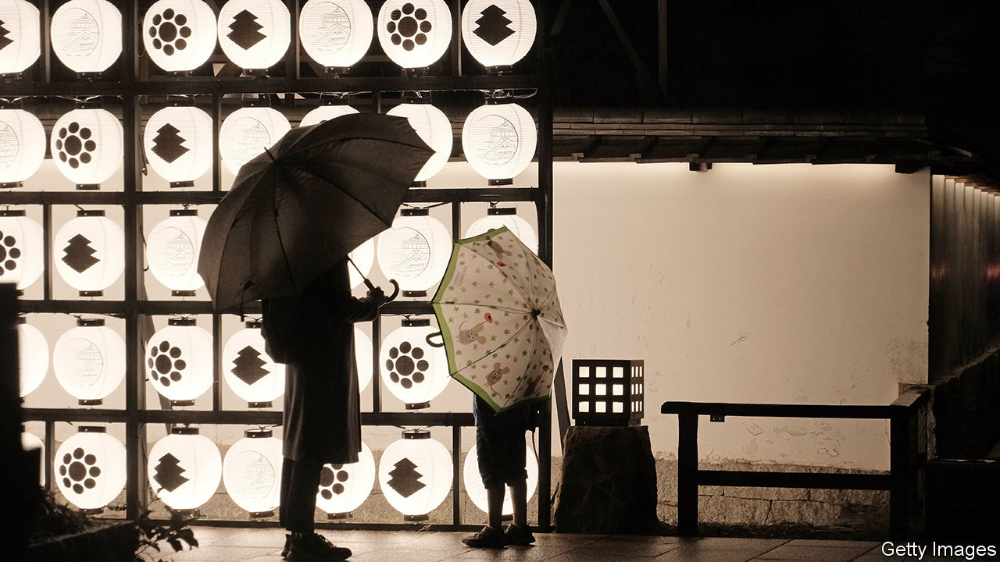

###### Tax and pretend

# Will a fiscal mess thwart Japan’s nascent economic growth? 

##### Fears first raised a quarter of a century ago may be about to come true 

 

> Dec 7th 2023 

When moody’s, a research firm, cut Japan’s top-grade credit rating and warned of a “significant deterioration in the government’s fiscal position”, Nintendo’s first colour Game Boy was taking the world by storm and Japan’s net government debt ran to 54% of GDP. Twenty-five years later that figure stands at 159%. The growth has been cushioned by a fall in government bond yields, which means that Japan paid less interest to its creditors last year than it did three decades ago. But now Moody’s warning may finally come true.

That is because refinancing is becoming more expensive. Ten-year government bond yields have risen from, in effect, zero three years ago to around 0.7% now. A rise in inflation has forced the Bank of Japan (boj) to all but abandon its policy of capping long-term bond yields. The next step may be to raise short-term interest rates for the first time since 2007. Central banks elsewhere are considering cutting rates; Japan is moving in the opposite direction.

 


Politicians seem not to have realised. Kishida Fumio, Japan’s prime minister, plans to splurge. Defence spending is set to double as a share of gdp by 2027. As the population ages, welfare payments will grow. On November 29th parliament voted in favour of temporary tax cuts worth 1% of Japan’s gdp. The decision drew a rebuke from Shirakawa Masaaki, a former boj governor, who questioned the logic of cutting taxes when the country faces inflation.

Japan’s finance ministry predicts that interest payments to bondholders will rise from ¥7.3trn ($54bn) in the last fiscal year to ¥8.5trn in the current one, the largest nominal increase since 1983. This is just the start, since payments go up only when bonds are refinanced. In 2024 ¥119trn in bonds will mature. Another ¥158trn will then mature over 2025 and 2026. 

The scale of the threat to Japan’s public finances depends on economic growth. Goldman Sachs, a bank, calculates that, with nominal growth of 2%, Japan’s persistent budget deficit will be sustainable if average interest rates on its debts stay at 1.1% or below. Since average interest rates were nearly 0.8% in the year to March, that leaves a modest buffer. A little additional growth would go a long way. With nominal growth of 3%, Goldman’s analysts think that interest rates could rise as high as 2.1% without threatening the public finances.

Even if the public finances are not imperilled, the bill from greater interest payments will mount, putting policymakers under pressure. After a decade of bond-buying, the boj owns almost half the country’s government debt. To finance the bond purchases, it created a huge volume of central-bank reserves—a sort of deposit owed to the commercial banks that sold the bonds to the boj in the first place. These reserves have floating interest rates.

When short-term rates were zero, this was hardly a problem. From April to September, the boj earned ¥807bn in interest on its holdings of government bonds, and paid out ¥92bn on its deposits. But if the boj were to pay even half a percentage point in total interest on its reserves, outgoings would run to ¥2.7trn, an amount equivalent to 40% of the defence budget. 

How should politicians respond? If the government slashes spending when monetary policy is tightening, it could ruin another opportunity for economic recovery. For now, ministers are more concerned with stimulating growth—as shown by Mr Kishida’s tax cuts. In time, though, rising interest payments may force their hand. Without the cushion of low interest rates, long-discussed risks to Japan’s finances will become uncomfortably real. ■


